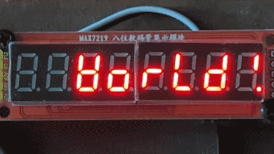

MAX7219-driven Seven-Segment Display
====================================

The `MAX7219 <https://www.analog.com/media/en/technical-documentation/data-sheets/max7219-max7221.pdf>`_ is "serial input/output common-cathode display drivers that interface microprocessors (µPs) to 7-segment numeric LED displays of up to 8 digits, bar-graph displays, or 64 individual LEDs." 
You can readily find MAX7219-driven `8-digit 7-segment display modules <https://www.google.com/search?q=max7219+8-digit+7-segment+display>`_ for a couple of dollars online. 
The mapping of bits to LEDs for this application is well-defined in the datasheet, and once the display module is properly connected to your microcontroller board, the CowPi_stdio library should work with it without any customization. 
The only "gotcha" (and this really is beyond the scope of the library) is that the MAX7219 is strictly a 5V device (with reasonable allowances), so if your microcontroller board outputs 3.3V for logic high then you will need a "level converter" in your circuit.

The 8-digit 7-segment display modules are simple enough that if you opt not to scroll the text then they have the least-compelling argument for a file stream.
Indeed, I used to have students produce the bit vectors
for hexadecimal digits on 7-segment displays as a warmup exercise.
That mastered, requiring that a program display text was more an exercise in tedium than learning anything new. 
Bypassing that tedium is why you would use this library with these display modules. 
(That, and perhaps you want scrolling text.)

..  contents:: \

Discussion
----------

Scrolling vs Non-Scrolling
""""""""""""""""""""""""""

If you need a steady display, such as for a calculator, then you should use the non-scrolling option.
In C++, use

..  code-block:: cpp

    cowpi_configure_seven_segment_display()

to generate the appropriate :struct:`cowpi_display_module_t` variable. In C, use

..  code-block:: c

    (cowpi_display_module_t) {.display_module = SEVEN_SEGMENT}

without specifying the scroll (words-per-minute) rate.

If the message can be transient, and if you need more than eight characters, then you should use the scrolling option. 
In C++, use

..  code-block:: cpp

    cowpi_configure_scrolling_seven_segment_display(scroll_rate)

to generate the appropriate :struct:`cowpi_display_module_t` variable. In C, use

..  code-block:: c

    (cowpi_display_module_t) {.display_module = SEVEN_SEGMENT, .words_per_minute = scroll_rate}

The scroll rate is expressed as an approximate number of words per minute that should pass along the display.

Font
""""

While many characters can be displayed recognizably, if imperfectly, on a 7-segment display, others leave much to be desired. 
When you run the example program, you will notice that the 'W' in "Hello World" bears almost no resemblance to the Latin letter.

ASCII Control Characters
""""""""""""""""""""""""

The non-scrolling option for the 8-digit/7-segment display allows some of the ASCII control characters to be meaningfully implemented
(though it having only one row does limit the sensibility of vertical-motion characters).
The unidirectional nature of the scrolling text forces us to ignore left-motion characters.

..  list-table::
    :header-rows: 2
    :stub-columns: 1
    :align: center

    *   -
        -   ``\a``
        -   ``\b``
        -   ``\t``
        -   ``\n``
        -   ``\v``
        -   ``\f``
        -   ``\r``
        -   0x1B (gcc ``\e``)
        -   0x7F
    *   -   ASCII
        -   bell (alarm)
        -   backspace
        -   horizontal tab
        -   line feed (newline)
        -   vertical tab
        -   form feed (newpage)
        -   carriage return
        -   escape
        -   delete
    *   -   | 7-segment display
            | (no scroll)
        -   ignored
        -   | shifts cursor left;
            | next character is
            | inclusive-ORed with
            | existing character
        -   shifts cursor right
        -   | clears remaining line,
            | then ``\r``
        -   places cursor in left column
        -   places cursor in left column
        -   places cursor in left column
        -   | next byte specifies a segment pattern;
            | see :numref:`sevenSegmentTable` and :numref:`sevenSegmentFigure`, or see `MAX7219 datasheet <https://www.analog.com/media/en/technical-documentation/data-sheets/max7219-max7221.pdf>`_, Table 6
        -   | ``\b``, then clears
            | existing character
    *   -   | 7-segment display
            | (scrolling)
        -   ignored
        -   ignored
        -   inserts four spaces
        -   allows line to clear
        -   ``\n``
        -   ``\n``
        -   ``\n``
        -   | next byte specifies a segment pattern;
            | see :numref:`sevenSegmentTable` and :numref:`sevenSegmentFigure`, or see `MAX7219 datasheet <https://www.analog.com/media/en/technical-documentation/data-sheets/max7219-max7221.pdf>`_, Table 6
        -   ignored

Literal Bytes
"""""""""""""

The file stream for a 7-segment display supports sending literal bytes to be displayed.
When the library finds ``\x1B`` (ASCII ``ESC``, gcc ``\e``), then the next byte (and only the next byte) will be sent as a segment pattern.
`MAX7219 datasheet <https://www.analog.com/media/en/technical-documentation/data-sheets/max7219-max7221.pdf>`_, Table 6, describes the mapping of bits to segments.
A blank digit is best handled with a "space" character (ASCII 0x20, ``' '``).

..  NOTE::
    If you include ``\x00`` in the format string, then ``fprintf`` will interpret it as a terminating ``NUL``.

Communication Protocol
""""""""""""""""""""""

The MAX7219 natively supports SPI.
(Technically, there is a small deviation, but not one that you'll notice.)
At a minimum, you need to specify the pin used to indicate which peripheral should latch the data in.
In C++, use

..  code-block:: cpp

    cowpi_configure_spi(the_select_pin)

to generate the appropriate :struct:`cowpi_display_module_protocol_t` variable. In C, use

..  code-block:: c

    (cowpi_display_module_protocol_t) {.protocol = SPI, .select_pin = the_select_pin}

By default, the data pin and the clock pin are those used by the SPI hardware, even if you use the library's bit-banged SPI implementation.
If you wish to use other pins, then specify them with

..  code-block:: cpp

    cowpi_configure_spi(the_select_pin, the_data_pin, the_clock_pin)

in C++, or

..  code-block:: c

    (cowpi_display_module_protocol_t) {
            .protocol = SPI,
            .data_pin = the_data_pin,
            .clock_pin = the_clock_pin,
            .select_pin = the_select_pin}

in C.

Custom Transmission Function
""""""""""""""""""""""""""""

..  TODO:: Describe custom transmission function for MAX7219

Example
-------

max7219_seven_segment
"""""""""""""""""""""

The *max7219_seven_segment* example demonstrates both the scrolling and non-scrolling option.
In general, we strongly advise against having multiple file streams pointing to the same display module, as the resulting behavior would be undefined and would unlikely be what you intended.
In this particular case, we get away with it by waiting for the scrolling display to finish before using the non-scrolling file stream.

..  code:: cpp

    FILE *no_scroll_display, *scrolling_display;

    void setup(void) {
        // The C++ approach
        no_scroll_display = cowpi_add_display_module(
                cowpi_configure_seven_segment_display(),
                cowpi_configure_spi(SS, MOSI, SCK)
        );
        scrolling_display = cowpi_add_display_module(
                cowpi_configure_scrolling_seven_segment_display(30),
                cowpi_configure_spi(SS, MOSI, SCK)
        );

        // The C approach
        /*
        no_scroll_display = cowpi_add_display_module(
                (cowpi_display_module_t) {
                        .display_module = SEVEN_SEGMENT
                },
                (cowpi_display_module_protocol_t) {
                        .protocol = SPI,
                        .data_pin = MOSI,
                        .clock_pin = SCK,
                        .select_pin = SS
                }
        );
        scrolling_display = cowpi_add_display_module(
                (cowpi_display_module_t) {
                        .display_module = SEVEN_SEGMENT,
                        .words_per_minute = 30
                },
                (cowpi_display_module_protocol_t) {
                        .protocol = SPI,
                        .data_pin = MOSI,
                        .clock_pin = SCK,
                        .select_pin = SS
                }
        );
        */

        fprintf(scrolling_display, "Hello World!\n");
        // normally, using two file streams on the same display module can have
        // undesired effects, but in this simple example, we should be okay if
        // we wait until the scrolling text is gone
        delay(8000);
    }

    void loop(void) {
        // On AVR architectures, you can use `fprintf_P` with `PSTR` to put the
        // format string in flash memory, if you want to
    #ifdef __AVR__
        fprintf_P(no_scroll_display, PSTR("Hello\n"));
    #else
        fprintf(no_scroll_display, "Hello\n");
    #endif //__AVR__
        delay(750);
        fprintf(no_scroll_display, "%8s\n", "World!");
        delay(750);
    }
