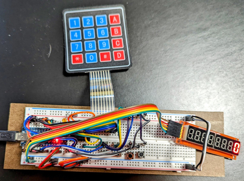
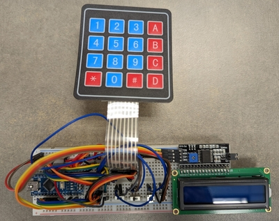
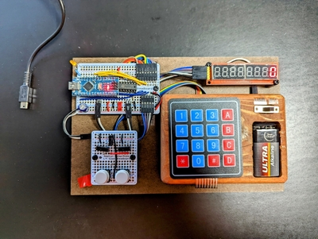
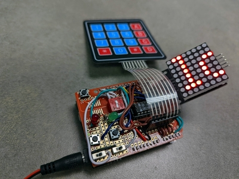
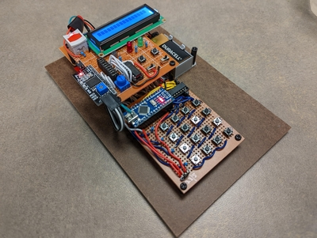
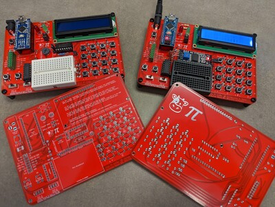
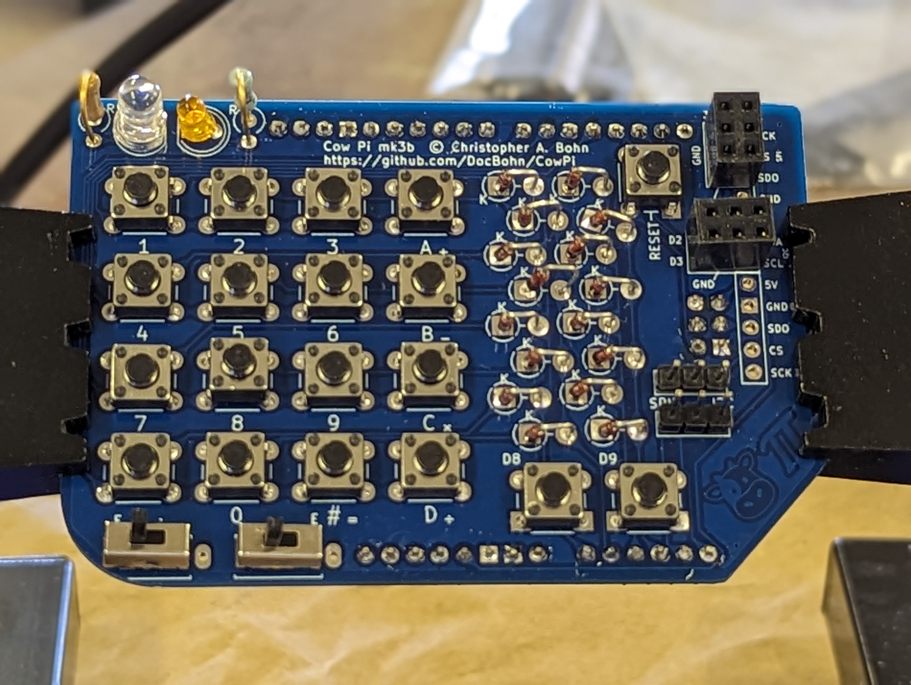
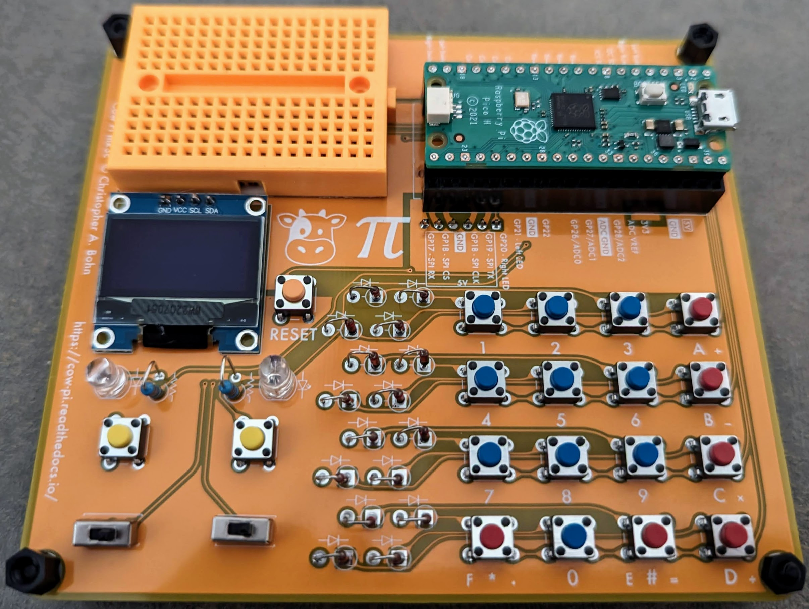
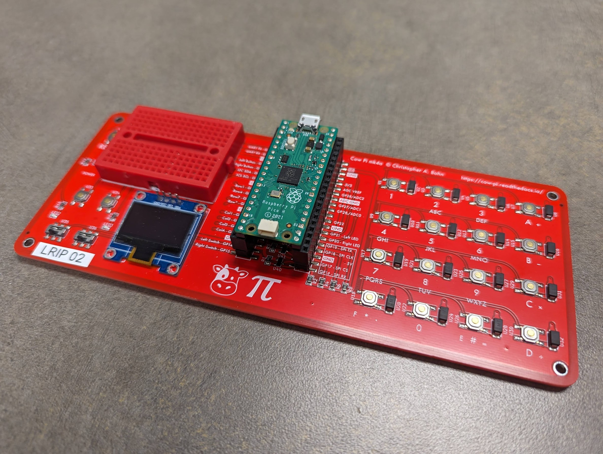
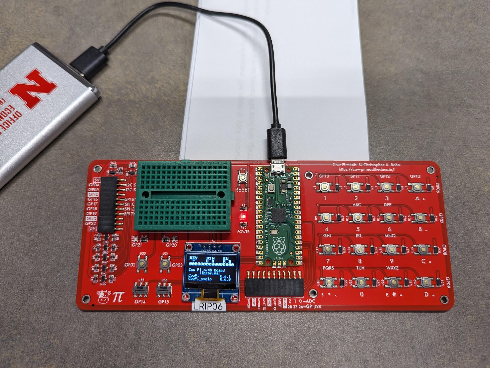

*************************************
Cow Pi Physical Assembly Instructions
*************************************

The nature of the physical assembly depends on whether you are assembling a mark 1, 2, 3, or 4 Cow Pi.

----

Cow Pi mk1 boards are assembled on solderless breadboards.
Mark 1 designs require no soldering skill but do require attention to detail.
The instructions for Mark 1 designs include checkpoints at which you should have someone else -- a second set of eyes -- check whether you followed the preceding instructions correctly.
The astute reader will notice that while the first couple of checkpoints take place as you set up your environment, most checkpoints are situated between adding new components or wires to the circuit and applying power.
While the odds of you making a catastrophic mistake are low, spending a few minutes having someone check your work can save you hours of frustration.
We also provide the *io_test* code as part of the CowPi library to further validate your progress -- but this code can, of course, be run only after applying power to your circuit.

|

Cow Pi mk2 boards are one-off designs assembled on perfboards.
Mark 2 designs require both soldering skills for both through-hole pins for wires, and Mark 2 designs also require attention to detail.
We do not provide instructions to assemble Mark 2 designs because, as we noted, they are one-off designs that served specific purposes.
The design documentation is also limited.
If you really want to heat up your soldering iron, we recommend a Mark 3 design.

an LCD character display.

|

Cow Pi mk3 boards are assembled on through-hole PCBs.
Mark 3 designs require through-hole soldering skills.
We placed links to the Gerber files are (or rather, will be) in the instructions;
you can have a small number of boards produced for just a few dollars.
The instructions for Mark 3 designs include only a few of checkpoints to have a second set of eyes check your work -- the opportunities for errors are very few.
These checkpoints are intended to make sure you don't have to include desoldering to the set of skills you'll need.

ached to the board.

|

Cow Pi mk4 boards are assembled on surface-mount PCBs.
If you have the PCBs manufactured and delivered to you unpopulated, then Mark 4 designs require surface-mount soldering skills.
On the other hand, if you have PCBs manufactured and assembled, then you will need no skills and only a small degree of attention to detail.

----

.. toctree::
    :maxdepth: 3

    construction/nano/construction-mk1e
    construction/nano/construction-mk1f
    construction/pico/assemble-mk3c
    construction/pico/assemble-mk4b
