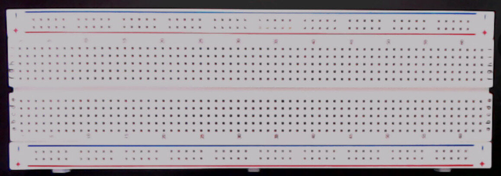

.. |i2c| replace:: :math:`\mathrm{I}^2\mathrm{C}`

***************************************
Cow Pi mark 1 Construction Instructions
***************************************

*In addition to the professor and the TAs, you may freely seek help on
this assignment from other students.*

In the I/O labs, we will use a microcontroller board with some
peripherals. In this prelab, you will assemble the hardware for the I/O
labs.

Preparation
===========

Obtaining the Hardware
----------------------

The EE Shop has prepared “class kits” for CSCE 231; your class kit costs
$30. The EE Shop is located at 122 Scott Engineering Center and is open
M-F 7am-4pm. You do not need an appointment. You may pay at the window
with cash, with a personal check, or with your NCard. The EE shop does
*not* accept credit cards.

.. _inventorying:

Inventorying the Hardware
-------------------------

Examine the contents of your class kit. It contains:

-   | One (1) full-sized solderless breadboard
    | |breadboard|

-   | One (1) Arduino Nano (or clone) microcontroller board
    | |nano|

-   | One (1) USB cable (mini-USB shown; yours may be different)
    | |usbCable|

-   | One (1) :math:`4 \times 4` matrix keypad
    | |keypad|

-   | One (1) 8-pin male-male header strip
      (might already be inserted into keypad’s female connectors;
      might have more than 8 pins)
    | |headerIn| or |headerOut|

-   | Two (2) breadboard-mount momentary pushbuttons, aka tactile switches;
      these might have two leads (which might or might not be attached to cardboard strip),
      or they might have 4 prongs
    | |buttons2Pin| or |buttons4Pin|

-   | Two (2) breadboard-mount slide switches
    | |switches|

-   | One (1) Light Emitting Diode (LED) (color may be different than shown)
    | |LED|

-   | One (1) 1k\ :math:`\Omega` resistor
    | |resistor|

-   | One (1) 40-conductor 10cm "rainbow" cable (male-to-male),
    | *or* One (1) 20-conductor 10cm "rainbow" cable (male-to-male) and one (1) 20-conductor 20cm "rainbow" cable (male-to-male)
    | |dupontCable|

-   | One (1) :math:`2 \times 16` character LCD display module
    | |lcd1602|

-   | One (1) |i2c| Serial Interface (might be attached to display module)
    | |serialAdapter| or |adafruitAdapter| or |piggypackAdapter|

-   | One (1) 4-conductor 20cm "rainbow" cable (female-to-male)
    | |fourConductor|

..  |nano| image:: construction/inventory/nano.jpg
    :height: 2cm

..  |headerOut| image:: construction/inventory/keypad-header-without-connector.jpg
    :height: 2cm

..  |buttons4Pin| image:: construction/inventory/buttons-4pin.jpg
    :height: 2cm
..  |switches| image:: construction/inventory/sliders-spdt.jpg
    :height: 2cm
..  |LED| image:: construction/inventory/led.jpg
    :height: 1cm

..  |dupontCable| image:: construction/inventory/mm-cable.jpg
    :height: 2cm
..  |lcd1602| image:: construction/inventory/lcd1602.jpg
    :height: 2cm
..  |serialAdapter| image:: construction/inventory/lcd-adapter.jpg
    :height: 2cm
..  |adafruitAdapter| image:: construction/inventory/adafruit-lcd-adapter.jpg
    :height: 2cm
..  |piggypackAdapter| image:: construction/inventory/piggyback-lcd-adapter.jpg
    :height: 2cm
..  |fourConductor| image:: construction/inventory/fm-4cable.jpg
    :height: 2cm

There may be other items in the class kit. Set these aside;
you will not need them for this prelab, though they may be used in a specific lab.

Assembling the Class Kit
------------------------

You will assemble the hardware in the following steps.
**At various checkpoints, you should pause to have a TA or classmate double-check your work.**
When you do so, update the *checkpoints.txt* file to indicate who checked your work and when they did so.

You may want to store your partially- and fully-completed kit in a plastic food container or some other container to prevent jumper wires from being pulled out while in your backpack.

..  NOTE::
    The following pages include diagrams and some photographs of the assembly.
    The wire colors in the diagrams do not match the wire colors in the assembly.
    The wire colors in the diagrams are coded by the purpose they serve, whereas the wire colors in the photographs are the colors of wires removed from the male-to-male rainbow cable.

..  NOTE::
    The circuit you build by following these instructions will look a bit like a rat's nest by the time that you are finished.
    This is because the jumper wires you remove from the male-to-male rainbow cable are not cut to length and generally will be longer than they need to be (which is much better than being shorter than they need to be).
    If you have prior experience with building circuits on a solderless breadboard, and if you have solid-core wires and wire cutters, then optionally you may build the circuit with cut-to-length solid core wires.

    ..  image:: construction/completed-kit-lcd1602.jpg
        :width: 90%
        :align: center

    \
        \
            Cow Pi mk1d that was constructed using 10cm and 20cm jumper wires.

Modified Cow Pi mk1d
====================

.. toctree::
    :maxdepth: 3

    construction/microcontroller
    construction/direct
    construction/keypad
    construction/display
