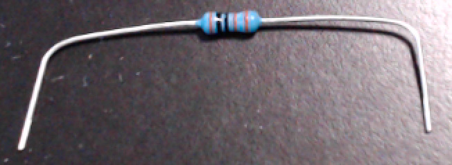

..  include:: mk1d.rst

Direct Input/Output Devices
===========================

Connect Power and Ground to Power Bus Strips
--------------------------------------------

The columns marked with red and blue stripes are the power bus strips, also known as the power rails.
You will now provide power to the bus strips so that the other components can use power.

..  IMPORTANT::
    Before proceeding further, disconnect the USB cable from the |developmentBoard|.

:\:[   ]: Take the male-to-male rainbow cable, and peel off two wires.

:\:[   ]: Insert one end of a wire into contact point |mcuFiveVoltContactPoint|
    (notice that contact point |mcuFiveVoltContactPoint| is electrically connected to the |developmentBoard|'s ``5V`` pin, which is in contact point |mcuFiveVolt|).

:\:[   ]: Insert the other end of the ``5V`` wire into the upper |power| marked with a red stripe.

:\:[   ]: Now insert one end of the other wire into contact point |mcuUpperGroundContactPoint|
    (notice that contact point |mcuUpperGroundContactPoint| is electrically connected to one of the |developmentBoard|'s ``GND`` pins, which is in contact point |mcuUpperGround|).

:\:[   ]: Insert the other end of the ``GND`` wire into the upper |ground| marked with a blue stripe.
    See :numref:`powerConnections`.

.. _powerConnections:
.. figure:: direct/power-without-template.jpg
    :height: 6cm

    Inserting the microcontroller board into the breadboard.

..  NOTE::
    The lower |power| and the lower |ground| are *not* connected to anything.
    This is because we want to keep the rat's nest of jumper wires away from the slide-switches and pushbuttons.
    If you later attempt to use the lower |power| and the lower |ground| for power & ground, that will be ineffective.

..  ATTENTION::
    **CHECKPOINT 3**
    | Before proceeding further, have a TA or a classmate verify that you have correctly connected the |developmentBoard| to the upper |power| and the upper |ground|.
    Update *checkpoints.txt* file to indicate who checked your work and when they did so.

Light Emitting Diode
--------------------

You will now connect an external LED.
An LED is a *light emitting diode*, and like all diodes it allows current to flow only in one direction.
As shown in :numref:`ledAnnotated`, one lead on the LED is longer than the other, and this tells us which direction current will flow.
When we insert the LED into the circuit, power will flow from one of the Arduino Nano's pins through the LED to ground.
Most LEDs have so little internal resistance that, unless current is otherwise limited, enough current will flow through the LED to destroy the semiconductor material.
The typical solution, which we will use, is to employ a *current-limiting resistor*.
(If you look very closely at your Arduino Nano, you will see a tiny surface-mount resistor next to each built-in LED.)

:numref:`ledDiagram` shows a diagram of the components you
will install for the LED output.

..  _ledAnnotated:
..  figure:: direct/led-annotated.jpg
    :alt: The LED's longer lead connects to power; the shorter lead connects to ground.
    :height: 2cm

    The LED's longer lead connects to power; the shorter lead connects to ground.

..  _ledDiagram:

    Diagram of component assembly for LED output.

..  _resistorBent:

    Bend the resistor's leads about 1cm from the ends.

:\:[   ]: Take the 1k\ :math:`\Omega` resistor and place a right-angle bend in each lead about 0.4in (1cm) from the ends
    (we want the remaining length to be about 1.5in (3.8cm) – you do not need to be exact; [#breadboardSpacing]_
    the leads are flexible enough that you only need to be approximate) – see :numref:`resistorBent`.

:\:[   ]: Insert one of the resistor's leads into contact point |resistorContactPointOne|
    (electrically connected to the |developmentBoard|'s |ledPin| pin in |ledPinContactPoint|)
    and the other into contact point |resistorContactPointTwo|.

:\:[   ]: Gently press along the length of the resistor, causing the leads to deform slightly, until the resistor's height above the breadboard is about the same as the Arduino Nano's printed circuit board.
    See :numref:`constructingLED`\ (a).

:\:[   ]: Take the LED and spread the leads apart slightly.

:\:[   ]: Insert the longer lead (the anode) in contact point |ledAnodeContactPoint|, and the shorter lead (the cathode) in the upper |ground|.
    See :numref:`constructingLED`\ (a).

.. _constructingLED:
.. figure:: ../blank.png

    Constructing the LED assembly.

    +--------------------------------------------------------------------------------------------------+------------------------------------------------------------------------------------------------------------------+
    | a                                                                                                | b                                                                                                                |
    +==================================================================================================+==================================================================================================================+
    | .. image:: direct/resistor-inserted.jpg                                                          | .. image:: direct/led-inserted.jpg                                                                               |
    |    :width: 24cm                                                                                  |    :width: 6cm                                                                                                   |
    |    :align: center                                                                                |    :align: center                                                                                                |
    +--------------------------------------------------------------------------------------------------+------------------------------------------------------------------------------------------------------------------+
    | The resistor run between contact points |resistorContactPointOne| and |resistorContactPointTwo|. | The LED's longer lead in in contact point |ledAnodeContactPoint|, and the shorter lead is in the upper |ground|. |
    +--------------------------------------------------------------------------------------------------+------------------------------------------------------------------------------------------------------------------+

When you have finished installing the external LED, there should be the electrical connections described in :numref:`ledElectricalConnections`.
Read each of this and subsequent tables' rows as describing which electrical components are connected to which other components.
For example, the LED's anode is connected to the resistor's right lead;
the LED's cathode is connected to ground;
and the resistor's left lead is connected to the |developmentBoard|'s |ledPin| pin.

..  _ledElectricalConnections:
..  table:: Electrical Connections for External LED.

    ======== ============= ====================== ====================
    LED lead Resistor lead |developmentBoard| pin Power/Ground Rail
    ======== ============= ====================== ====================
    Anode    Right
    Cathode                                       |ground|
    \        Left          |ledPin|
    ======== ============= ====================== ====================

..  ATTENTION::
    **CHECKPOINT 4**
    | Before proceeding further, have a TA or a classmate verify that you have correctly installed the LED and its current-limiting resistor.
    Update *checkpoints.txt* file to indicate who checked your work and when they did so.

:\:[   ]: In your IDE, load the *MyBlink* project.

:\:[   ]: In the ``pinMode()`` and the two ``digitalWrite()`` calls, replace the ``LED_BUILTIN`` argument with ``12``:

.. code-block:: cpp
    :emphasize-lines: 2,6,8

    void setup(void) {
        pinMode(12, OUTPUT);
    }

    void loop(void) {
        digitalWrite(12, HIGH);
        delay(250);   // or whatever value you used
        digitalWrite(12, LOW);
        delay(1500);  // or whatever value you used
    }

:\:[   ]: Re-connect the USB cable to your |developmentBoard|.

:\:[   ]: Compile the sketch and upload it to your |developmentBoard|.

Now, instead of the built-in LED, the external LED that you installed will blink.

Install the CowPi and the CowPi_stdio Libraries
-----------------------------------------------

TODO

Slide Switches
--------------

In this section, you will install the "slide" switches that toggle between their two positions, holding their position until toggled again.
We will wire them such that when a switch is toggled to the left, it will produce a 0, and when it is toggled to the right, it will produce a 1.
:numref:`switchDiagram` shows a diagram of the wiring for the slide switches.

..  _switchDiagram:

    Diagram of wiring associated with toggle switch input.

..  _figureSwitchSPDT:

    The slide switches, each with the center pin grounded, the left pin connected to the |developmentBoard|, and the right pin floating.

..  IMPORTANT::
    Before proceeding further, disconnect the USB cable from the |developmentBoard|.

:\:[   ]: Insert one slider switch into contact points |leftSwitchRange|.

:\:[   ]: Place the other slider switch into contact points |rightSwitchRange|.

For the two wires that will connect the switches to the |developmentBoard|, you can use 10cm jumpers (especially if that is all that you have);
however, if you use 20cm jumpers, then in Section `5 <#sec:keypad>`__ we will show how to keep some wires away from the controls.

:\:[   ]: Peel off one wire from the male-to-male rainbow cable and use it to connect contact point |leftSwitchLeftPin| (electrically connected to the left switch's left pin)
    to contact point |mcuLeftSwitchPoint| (electrically connected to the |developmentBoard|'s |mcuLeftSwitchPin| pin).

:\:[   ]: Peel off another wire from the male-to-male rainbow cable and use it to connect contact point |rightSwitchLeftPin| (electrically connected to the right switch's left pin)
    to contact point |mcuRightSwitchPoint| (electrically connected to the |developmentBoard|'s |mcuRightSwitchPin| pin).

:\:[   ]: Peel off two more wires from the male-to-male rainbow cable.

You will use these to connect the switches center pins to the upper |ground|.
Specifically,

:\:[   ]: Place the end of one wire into contact point |leftSwitchCenterPin|.

:\:[   ]: Place the other end of that wire into the upper |ground|.

:\:[   ]: Now place the end of the other wire into contact point |rightSwitchCenterPin|.

:\:[   ]: Place the other end of that wire into the upper |ground|.

The switches' right pins will not be electrically connected to anything.

When you have finished setting up the switches' wiring, there should be the electrical connections described in :numref:`tableSwitchSPDT`.

..  _tableSwitchSPDT:
.. table:: Electrical Connections for 3-pin Slider Switches.

    ========================= ======================== ====================
    Switch                    |developmentBoard| pin   Power/Ground Rail
    ========================= ======================== ====================
    Left switch's left pin    |mcuLeftSwitchPin|
    Left switch's center pin                           |ground|
    Left switch's right pin   not connected / floating
    Right switch's left pin   |mcuRightSwitchPin|
    Right switch's center pin                          |ground|
    Right switch's right pin  not connected / floating
    ========================= ======================== ====================

..  ATTENTION::
    **CHECKPOINT 5**
    | Before proceeding further, have a TA or a classmate verify that you have correctly inserted and wired the slider switches.
    Update *checkpoints.txt* file to indicate who checked your work and when they did so.

Connect your |developmentBoard| to the computer.
In the IDE's Serial Monitor, notice that
Left switch is LEFT when the left switch is toggled to the left, and it is RIGHT when the left switch is toggled to the right.
Similarly, Right switch is LEFT or RIGHT, depending on whether the right switch is toggled to the left or right.

Momentary Pushbuttons
---------------------

This note applies only to **2-lead pushbuttons**:

    .. TIP::
        If your momentary pushbuttons are attached to a cardboard strip with tape, remove them from the cardboard strip.

        If your momentary pushbuttons' leads have metal tabs at the end, you will need to snip off the tabs before inserting the pushbutton leads into the breadboard;
        ordinary scissors will suffice for this task.

        .. image:: direct/pushbutton-tabs.jpg
            :alt: Some momentary pushbuttons have metal tabs on their leads.
            :align: center
            :height: 2cm

        Regardless of whether the leads have metal tabs at the end, you may optionally trim the leads to be about ¼in (6.4mm) long – you can use the exposed lead from a jumper wire as a reference – so that the pushbuttons sit flush on the breadboard.
        It is not necessary that they sit flush;
        this is simply to keep the buttons from wiggling under your fingers.
        *Do not cut the leads shorter than ⅛in (3.2mm)!*

    .. CAUTION::
        Be sure to use eye protection in case the leads' ends fly off when you snip them.

This note applies only to **4-prong pushbuttons**:

    .. TIP::
        The four prongs on a momentary pushbutton are electrically connected as two pairs.
        If you attach the pushbuttons in the wrong orientation, it will appear to the microcontroller as though they are always pressed.
        Fortunately, there is only one orientation that will place the prongs in the specified contact points.
        As long as the prongs are in the specified contact points, your pushbuttons will work fine.

These are "normally open" momentary "switches" that close when pressed and re-open when released.
We will wire the pushbuttons such that they normally produce a 1, and when pressed will produce a 0.
:numref:`buttonDiagram` shows a diagram of the wiring for the pushbuttons.

.. _buttonDiagram:
.. figure:: ../blank.png

    Diagram of wiring associated with momentary pushbutton input.

    +-------+----------------------------------------------------+
    |       | .. image:: fritzing_diagrams/pushbutton-2lead.png  |
    | **a** |    :width: 90.0%                                   |
    |       |                                                    |
    |       | 2-lead pushbuttons                                 |
    +-------+----------------------------------------------------+
    |       | .. image:: fritzing_diagrams/pushbutton-4prong.png |
    | **b** |    :width: 90.0%                                   |
    |       |                                                    |
    |       | 4-prong pushbuttons                                |
    +-------+----------------------------------------------------+

..  _figureButton:
.. figure:: ../blank.png

    Wiring the momentary pushbuttons

    +-------+----------------------------------------+-------+----------------------------------------+
    |       | .. image:: direct/pushbutton-2lead.jpg |       | .. image:: direct/pushbutton-2lead.jpg |
    | **a** |                                        | **b** |                                        |
    |       | Pushbuttons with two leads.            |       | Pushbuttons with four prongs.          |
    +-------+----------------------------------------+-------+----------------------------------------+
    |       | .. image:: direct/pushbutton-wired.png                                                  |
    | **c** |    :width: 90.0%                                                                        |
    |       |                                                                                         |
    |       | The momentary pushbuttons, wired to the |developmentBoard|.                             |
    +-------+-----------------------------------------------------------------------------------------+

..  IMPORTANT::
    Before proceeding further, disconnect the USB cable from the |developmentBoard|.

:\:[   ]: If you have 2-lead pushbuttons:

    - Insert the leads of one pushbutton into contact points |leftButton2Lead|.
    - Insert the leads of the other pushbutton into contact points |rightButton2Lead|.

:\:[   ]: If you have 4-prong pushbuttons:

    - Insert the prongs of one pushbutton into contact points |leftButton4Prong|.
    - Insert the prongs of the other pushbutton into contact points |rightButton4Prong|.

:\:[   ]: Peel off one wire from the male-to-male rainbow cable, and use it to connect contact point |leftButtonRightPin| to the upper |ground|.

:\:[   ]: Peel off one wire from the male-to-male rainbow cable, and use it to connect contact point |rightButtonRightPin| to the upper |ground|.

:\:[   ]: Use a wire from the male-to-male rainbow cable to connect the ungrounded side of the left pushbutton to the |developmentBoard|: connect |leftButtonLeftPin| to |mcuLeftButtonPoint|.

:\:[   ]: Now use another two wire from the male-to-male rainbow cable to connect the ungrounded side of the right pushbutton to the |developmentBoard|: connect |rightButtonLeftPin| to |mcuRightButtonPoint|

When you have finished setting up the pushbuttons' wiring, there should be the electrical paths described in :numref:`tablePushbuttons`.

..  _tablePushbuttons:
..  table:: Electrical Paths for Momentary Pushbuttons.

    +----------------+------------------------+-------------------+
    | Pushbutton     | |developmentBoard| pin | Power/Ground Rail |
    +================+========================+===================+
    | Left button's  |                        | |ground|          |
    | grounded lead  |                        |                   |
    +----------------+------------------------+-------------------+
    | Left button's  | |mcuLeftButtonPin|     |                   |
    | ungrounded     |                        |                   |
    | lead           |                        |                   |
    +----------------+------------------------+-------------------+
    | Right button's |                        | |ground|          |
    | grounded lead  |                        |                   |
    +----------------+------------------------+-------------------+
    | Right button's | |mcuRightButtonPin|    |                   |
    | ungrounded     |                        |                   |
    | lead           |                        |                   |
    +----------------+------------------------+-------------------+

..  ATTENTION::
    **CHECKPOINT 6**
    | Before proceeding further, have a TA or a classmate verify that you have correctly inserted and wired the momentary pushbuttons.
    Update *checkpoints.txt* file to indicate who checked your work and when they did so.

Connect your |developmentBoard| to the computer.
In the IDE's Serial Monitor, notice that
Left button is normally UP, but it becomes DOWN when you press the left button.
Similarly, Right button is normally UP, but it becomes DOWN when you press the right button.

Notice that both Left LED and Right LED are normally OFF.
Position both switches to the right.
Notice than when (and only when) the left button is to the right and you're also pressing the left button, Left LED becomes ON, and the LED labelled "L" on the |developmentBoard| illuminates.
Similarly, when (and only when) the right button is to the right and you're also pressing the right button, Right LED becomes ON, and the LED that you installed illuminates.

.. (There may be a delay of about a half-second between you pressing a button and the LED illuminating, and between you releasing a button and the LED deluminating.
.. We will look at why this happens and how to prevent it in an upcoming lab.)

----

.. [#breadboardSpacing]
   If you want to try to be exact, you can use the breadboard's contact
   points to measure: they are 0.1in (2.54mm) apart.
