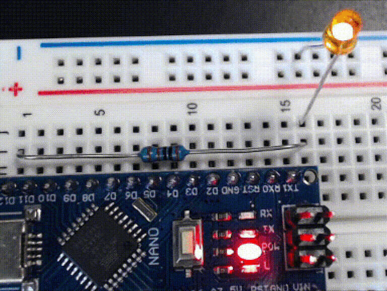

..  ATTENTION::
    **CHECKPOINT 4**
    | |checkpoint| installed the LED and its current-limiting resistor. |updateCheckpointsTXT|

:\:[   ]: In your IDE, load your *MyBlink* project.

:\:[   ]: In the ``pinMode()`` and the two ``digitalWrite()`` calls, replace the ``LED_BUILTIN`` argument with ``12``:

    .. code-block:: cpp
        :emphasize-lines: 2,6,8

        void setup(void) {
            pinMode(12, OUTPUT);
        }

        void loop(void) {
            digitalWrite(12, HIGH);
            delay(250);   // or whatever value you used
            digitalWrite(12, LOW);
            delay(1500);  // or whatever value you used
        }

:\:[   ]: Re-connect the USB cable to your |developmentBoard|.

:\:[   ]: Compile the program and upload it to your |developmentBoard|.

Now, instead of the built-in LED, the external LED that you installed will blink.

