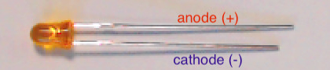
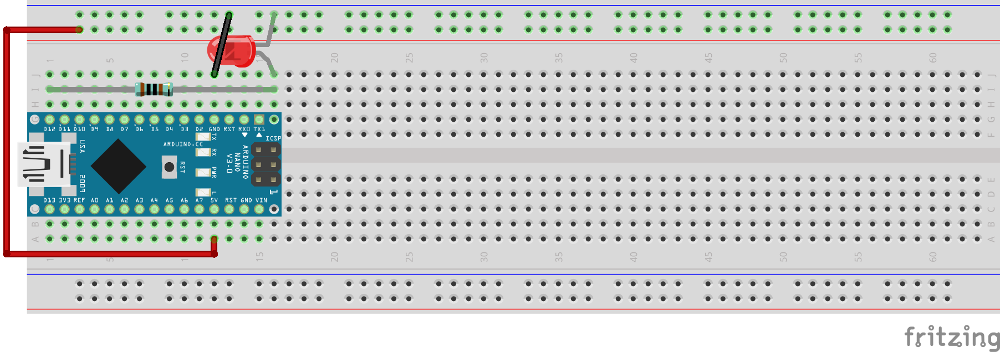
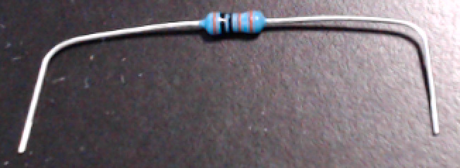

..  include:: ../mk1ef.txt

Install the Light-Emitting Diode
================================
*Cow Pi mk1e: Arduino Nano form factor*

You will now connect an external LED.
An LED is a *light emitting diode*, and like all diodes it allows current to flow only in one direction.
As shown in :numref:`mk1eLEDAnnotated`, one lead on the LED is longer than the other, and this tells us which direction current will flow.
When we insert the LED into the circuit, power will flow from one of the Arduino Nano's pins through the LED to ground.
Most LEDs have so little internal resistance that, unless current is otherwise limited, enough current will flow through the LED to destroy the semiconductor material.
The typical solution, which we will use, is to employ a *current-limiting resistor*.
(If you look very closely at your Arduino Nano, you will see a tiny surface-mount resistor next to each built-in LED.)

:numref:`mk1eLEDDiagram` shows a diagram of the components you
will install for the LED output.

..  _mk1eLEDAnnotated:

    The LED's longer lead connects to power; the shorter lead connects to ground.

..  _mk1eLEDDiagram:

    Diagram of component assembly for LED output.

..  _mk1eResistorBent:

    Bend the resistor's leads about 1cm from the ends.

..  IMPORTANT::
    Before proceeding further, disconnect the USB cable from the |developmentBoard|.

:\:[   ]: Take the 1k\ :math:`\Omega` resistor and place a right-angle bend in each lead about 0.4in (1cm) from the ends
    (we want the remaining length to be about 1.5in (3.8cm) – you do not need to be exact; [#breadboardSpacing]_
    the leads are flexible enough that you only need to be approximate) – see :numref:`mk1eResistorBent`.

:\:[   ]: Insert one of the resistor's leads into contact point |resistorContactPointOne|
    (electrically connected to the |developmentBoard|'s |ledPin| pin in |ledPinContactPoint|)
    and the other into contact point |resistorContactPointTwo|.

:\:[   ]: Gently press along the length of the resistor, causing the leads to deform slightly, until the resistor's height above the breadboard is about the same as the Arduino Nano's printed circuit board.
    See :numref:`mk1eConstructingLED`\ (a).

:\:[   ]: Take the LED and spread the leads apart slightly.

:\:[   ]: Insert the longer lead (the anode) in contact point |ledAnodeContactPoint|, and the shorter lead (the cathode) in the upper |ground|.
    See :numref:`mk1eConstructingLED`\ (b).

.. _mk1eConstructingLED:
.. figure:: ../../../blank.png

    Constructing the LED assembly.

    +--------------------------------------------------------------------------------------------------+---------------------------------------------------------------------+
    | a                                                                                                | b                                                                   |
    +==================================================================================================+=====================================================================+
    | .. image:: resistor-inserted.jpg                                                                 | .. image:: led-inserted.jpg                                         |
    |    :width: 24cm                                                                                  |    :width: 6cm                                                      |
    |    :align: center                                                                                |    :align: center                                                   |
    +--------------------------------------------------------------------------------------------------+---------------------------------------------------------------------+
    | The resistor run between contact points |resistorContactPointOne| and |resistorContactPointTwo|. | | The LED's longer lead in in contact point |ledAnodeContactPoint|, |
    |                                                                                                  | | and the shorter lead is in the upper |ground|.                    |
    +--------------------------------------------------------------------------------------------------+---------------------------------------------------------------------+

When you have finished installing the external LED, there should be the electrical connections described in :numref:`mk1eLEDElectricalConnections`.
Read each of this and subsequent tables' rows as describing which electrical components are connected to which other components.
For example, the LED's anode is connected to the resistor's right lead;
the LED's cathode is connected to ground;
and the resistor's left lead is connected to the |developmentBoard|'s |ledPin| pin.

..  _mk1eLEDElectricalConnections:
..  table:: Electrical Connections for External LED.

    ======== ============= ====================== ====================
    LED lead Resistor lead |developmentBoard| pin Power/Ground Rail
    ======== ============= ====================== ====================
    Anode    Right
    Cathode                                       |ground|
    \        Left          |ledPin|
    ======== ============= ====================== ====================

..  include:: led-confirmation.rst

----

.. [#breadboardSpacing]
   If you want to try to be exact, you can use the breadboard's contact
   points to measure: they are 0.1in (2.54mm) apart.
