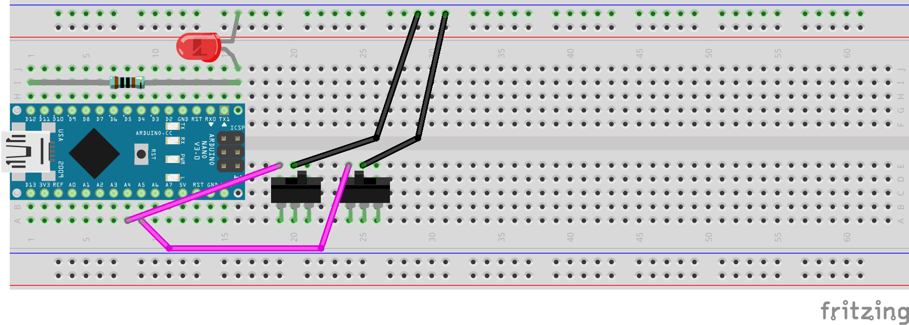
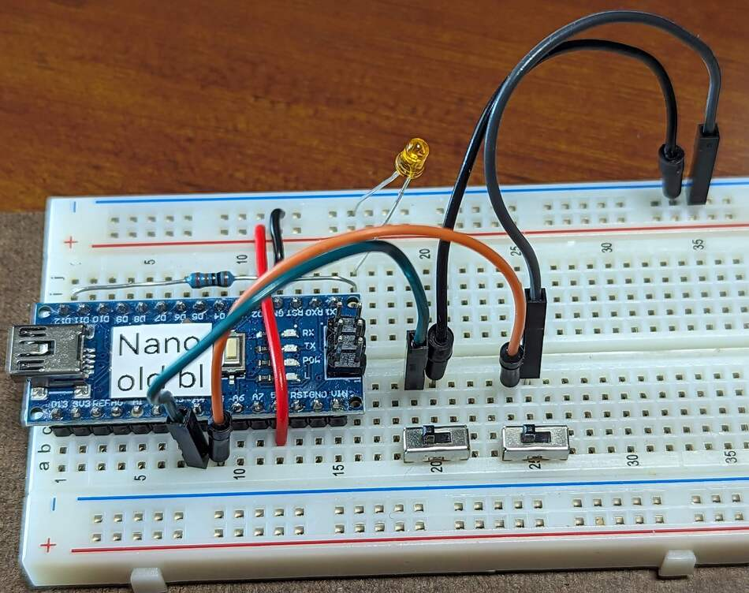

..  include:: ../mk1ef.txt
..  include:: ../mk1e.txt

Install the Slide Switches
==========================
*Cow Pi mk1e: Arduino Nano form factor, SPI communication*

In this section, you will install the "slide" switches that toggle between their two positions, holding their position until toggled again.
We will wire them such that when a switch is toggled to the left, it will produce a 0, and when it is toggled to the right, it will produce a 1.
:numref:`mk1eSwitchDiagram` shows a diagram of the wiring for the slide switches.

..  _mk1eSwitchDiagram:

    Diagram of wiring associated with toggle switch input.

..  _mk1eFigureSwitchSPDT:

    The slide switches, each with the center pin grounded, the left pin connected to the |developmentBoard|, and the right pin floating.

..  include:: switches-steps.rst

When you have finished setting up the switches' wiring, there should be the electrical connections described in :numref:`mk1eTableSwitchSPDT`.

..  _mk1eTableSwitchSPDT:
..  table:: Electrical Connections for 3-pin Slider Switches.

    ========================= ======================== ====================
    Switch                    |developmentBoard| pin   Power/Ground Rail
    ========================= ======================== ====================
    Left switch's left pin    |mcuLeftSwitchPin|
    Left switch's center pin                           |ground|
    Left switch's right pin   not connected / floating
    Right switch's left pin   |mcuRightSwitchPin|
    Right switch's center pin                          |ground|
    Right switch's right pin  not connected / floating
    ========================= ======================== ====================

..  include:: switches-confirmation.rst
