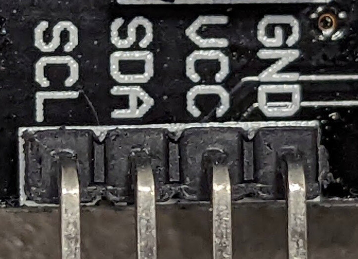
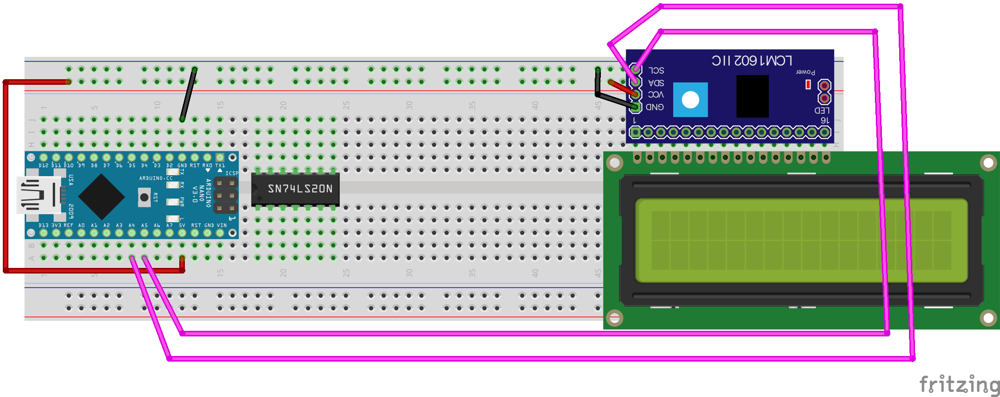
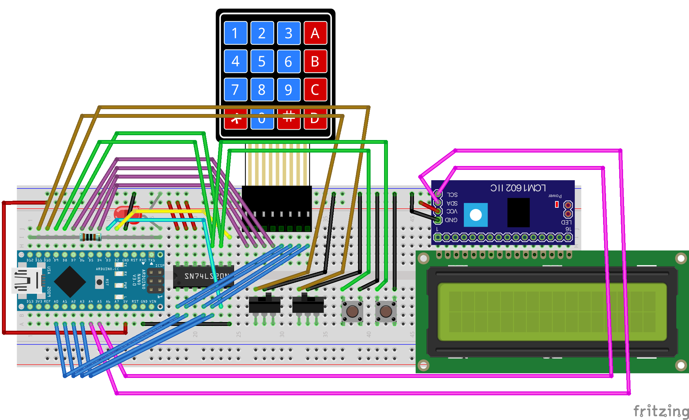

..  include:: ../mk1ef.txt
..  include:: ../mk1f.txt

Installing the Display Module
=============================
*Cow Pi mk1f: Arduino Nano form factor,* |i2c-italics| *communication*

Examine the I2C-LCD serial interface.
Notice that the header has |numberOfSerialPins| pins (:numref:`i2cDisplayModuleHeader`): ``VCC`` (common collector voltage), ``GND`` (ground), |serialPins|.
When the display module is oriented for viewing, these header pins will be on the left.

..  _i2cDisplayModuleHeader:

    The display module's header has |numberOfSerialPins| pins.

:numref:`lcd1602FigureDisplayDiagram` shows a diagram of the wiring to connect the display module to the breadboard.

..  _lcd1602FigureDisplayDiagram:

    Diagram of display module's connections to the breadboard.

..  IMPORTANT::
    Before proceeding further, disconnect the USB cable from the |developmentBoard|.

-   **If your I2C-LCD serial interface is NOT attached to the LCD display module, then you will use the breadboard to provide the electrical connections between the serial interface and the display module.**

    :\:[   ]: Insert the LCD display module's sixteen pins into contact points |lcd1602Range|.}

    :\:[   ]: With the four header pins pointing to the left, insert the I2C-LCD serial interface's sixteen downward-pointing pins into contact points |serialAdapterRange|.}

-   **If your I2C-LCD serial interface IS attached to the LCD display module, then the sixteen pins connecting the serial adapter to the display module do not need to be inserted into the breadboard.**

    :\:[   ]: *Optionally* place a jumper wire looped from a63 to j63 to prevent the display module from sliding around.

\

:\:[   ]: Take the |numberOfSerialPins|-conductor female-to-male rainbow cable and attach the |numberOfSerialPins| female connectors to the display module’s |numberOfSerialPins| header pins.

:\:[   ]: Identify the wire that is connected to the display module's |serialClockPin| pin;
    insert the male end of this wire in contact point |mcuClockPoint| (electrically connected to the |developmentBoard|'s |mcuClockPin| pin).

:\:[   ]: Insert the male end of the |serialDataPin| wire into contact point |mcuDataPoint| (electrically connected to the |developmentBoard|'s |mcuDataPin| pin).

:\:[   ]: Insert the ``GND`` wire into the upper |ground|, and the ``VCC`` wire into the upper |power|.

When you have finished connecting the display module, there should be the electrical connections described in :numref:`i2cDisplayModuleConnections`.

..  _i2cDisplayModuleConnections:
..  table:: Electrical Connections for Display Module.

    ====================== ====================== ====================
    Display Module pin     |developmentBoard| pin Power/Ground Rail
    ====================== ====================== ====================
    |serialClockPin|       |mcuClockPin|
    |serialDataPin|        |mcuDataPin|
    ``GND``                                       |ground|
    ``VCC``                                       |power|
    ====================== ====================== ====================

..  ATTENTION::
    **CHECKPOINT 8**
    | Before proceeding further, have a TA or a classmate verify that you have correctly connected the display module to the breadboard.
    Update *checkpoints.txt* file to indicate who checked your work and when they did so.

:\:[   ]: In the Arduino IDE, open the *File* ⟶ *Examples* ⟶ *CowPi* ⟶ |displayModuleHelloWorld| example.

:\:[   ]: Find these lines in the ``setup()`` function:

   ::

      //    protocol = SPI;
          protocol = I2C;

:\:[   ]: Make sure that the ``protocol = I2C`` line is uncommented and that the ``protocol = SPI`` line is commented-out.

:\:[   ]: Compile the program and upload it to your Arduino Nano.

    You should see the display module's backlight blink on and off.
    If so, then you have correctly connected the display module and serial adapter even if you don't see a message on the display module.

:\:[   ]: Using a screwdriver, turn the trim potentiometer on the serial adapter until you can see the "Hello, world!" message.

    ..  image:: animations/lcd1602.gif
        :height: 5cm
        :align: center

Kit Assembly is Complete
========================

You have now finished assembling the class kit.
In the upcoming I/O labs, you will use the kit to learn about memory-mapped I/O and about handling low-level interrupts.

