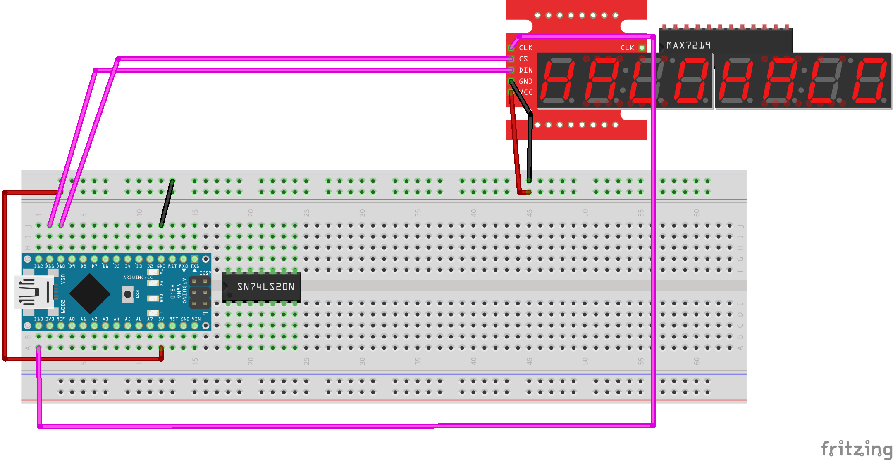

..  include:: ../mk1ef.txt
..  include:: ../mk1e.txt

Installing the Display Module
=============================
*Cow Pi mk1e: Arduino Nano form factor, SPI communication*

Examine the 7-segment display module.
Notice that the header has |numberOfSerialPins| pins (:numref:`spiDisplayModuleHeader`): ``VCC`` (common collector voltage), ``GND`` (ground), |serialPins|.
When the display module is oriented for viewing, these header pins will be on the left.

..  _spiDisplayModuleHeader:
..  figure:: spi-module-header.jpg
    :width: 5cm
    :align: center

    The display module's header has |numberOfSerialPins| pins.

:numref:`max7219FigureDisplayDiagram` shows a diagram of the wiring to connect the display module to the breadboard.

..  _max7219FigureDisplayDiagram:

    Diagram of display module's connections to the breadboard.

..  IMPORTANT::
    Before proceeding further, disconnect the USB cable from the |developmentBoard|.

:\:[   ]: Take the |numberOfSerialPins|-conductor female-to-male rainbow cable and attach the |numberOfSerialPins| female connectors to the display module’s |numberOfSerialPins| header pins.

:\:[   ]: Identify the wire that is connected to the display module's |serialClockPin| pin;
    insert the male end of this wire in contact point |mcuClockPoint| (electrically connected to the |developmentBoard|'s |mcuClockPin| pin).

:\:[   ]: Insert the male end of the |serialDataPin| wire into contact point |mcuDataPoint| (electrically connected to the |developmentBoard|'s |mcuDataPin| pin).

:\:[   ]: Insert the male end of the |serialLatchPin| wire into contact point |mcuLatchPoint| (electrically connected to the |developmentBoard|'s |mcuLatchPin| pin).

:\:[   ]: Insert the ``GND`` wire into the upper |ground|, and the ``VCC`` wire into the upper |power|.

When you have finished connecting the display module, there should be the electrical connections described in :numref:`spiDisplayModuleConnections`.

..  _spiDisplayModuleConnections:
..  table:: Electrical Connections for Display Module.

    ====================== ====================== ====================
    Display Module pin     |developmentBoard| pin Power/Ground Rail
    ====================== ====================== ====================
    |serialClockPin|       |mcuClockPin|
    |serialDataPin|        |mcuDataPin|
    |serialLatchPin|       |mcuLatchPin|
    ``GND``                                       |ground|
    ``VCC``                                       |power|
    ====================== ====================== ====================

..  ATTENTION::
    **CHECKPOINT 8**
    | Before proceeding further, have a TA or a classmate verify that you have correctly connected the display module to the breadboard.
    Update *checkpoints.txt* file to indicate who checked your work and when they did so.

:\:[   ]: In the Arduino IDE, open the *File* ⟶ *Examples* ⟶ *CowPi* ⟶ |displayModuleHelloWorld| example.

:\:[   ]: Compile the program and upload it to your Arduino Nano.

    You should see the display module's backlight blink on and off.
    If so, then you have correctly connected the display module and serial adapter even if you don't see a message on the display module.

:\:[   ]: Using a screwdriver, turn the trim potentiometer on the serial adapter until you can see the "Hello, world!" message.

    ..  image:: animations/sevensegment.gif
        :height: 5cm
        :align: center

Kit Assembly is Complete
========================

You have now finished assembling the class kit.
In the upcoming I/O labs, you will use the kit to learn about memory-mapped I/O and about handling low-level interrupts.

    ..  image:: ../fritzing_diagrams/complete-max7219.png
