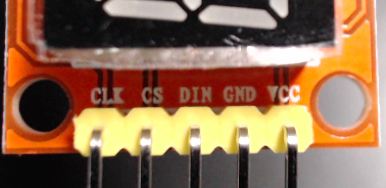
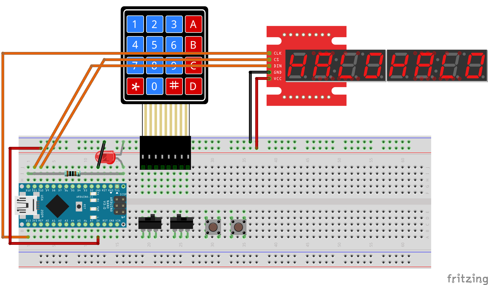
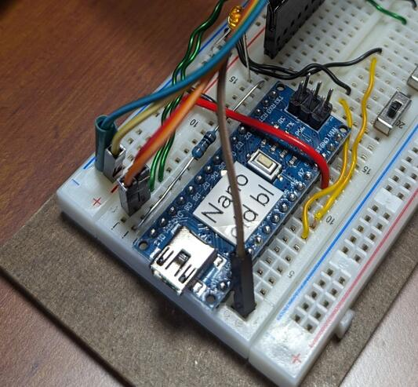
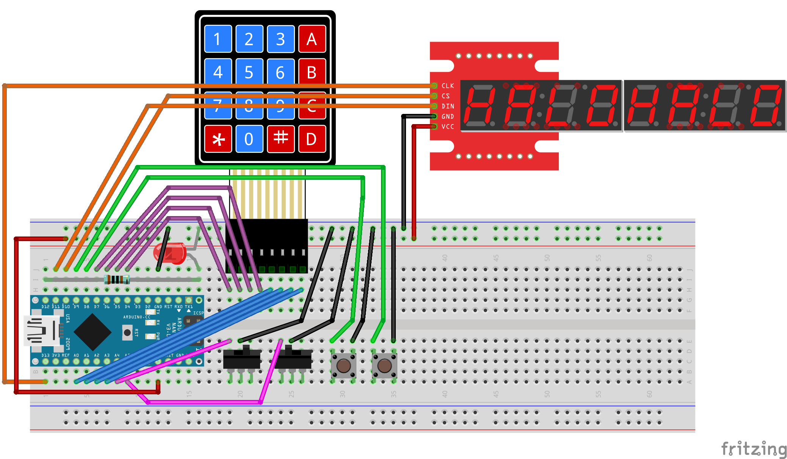

..  include:: ../mk1ef.txt
..  include:: ../mk1e.txt

Install the Display Module
==========================
*Cow Pi mk1e: Arduino Nano form factor, SPI communication*

Examine the 7-segment display module.
Notice that the header has |numberOfSerialPins| pins (:numref:`spiDisplayModuleHeader`): ``VCC`` (common collector voltage), ``GND`` (ground), |serialPins|.
When the display module is oriented for viewing, these header pins will be on the left.

..  _spiDisplayModuleHeader:

    The display module's header has |numberOfSerialPins| pins.

:numref:`max7219FigureDisplayDiagram` shows a diagram of the wiring to connect the display module to the breadboard.

..  _max7219FigureDisplayDiagram:

    Diagram of display module's connections to the breadboard.

..  _spiFigureConnections:

    SPI connections on at the microcontroller.

..  IMPORTANT:: |unplug|

:\:[   ]: Look at :numref:`spiFigureDisplays` to determine which display module you have:

..  _spiFigureDisplays:
.. figure:: ../../../blank.png

    Display modules that use the Serial-Parallel Interface protocol

    +-------+---------------------------------------------------------------------------------------------------------+
    |       | .. image:: max7219-segment-display.jpg                                                                  |
    |       |    :align: center                                                                                       |
    | **a** |    :width: 45%                                                                                          |
    |       |                                                                                                         |
    |       | MAX7219-driven 8-digit/7-segment display.                                                               |
    +-------+------------------------------------------------+-------+------------------------------------------------+
    |       | .. image:: max7219-matrix-floating-display.jpg |       | .. image:: max7219-matrix-pinned-display.jpg   |
    |       |    :align: center                              |       |    :align: center                              |
    | **b** |    :width: 90%                                 | **c** |    :width: 90%                                 |
    |       |                                                |       |                                                |
    |       | MAX7219-driven LED matrix display.             |       | MAX7219-driven LED matrix display              |
    |       |                                                |       |  (pins inserted into breadboard).              |
    +-------+------------------------------------------------+-------+------------------------------------------------+

-   If you have an 8-digit/7-segment display (:numref:`spiFigureDisplays`\ (a)):

    :\:[   ]: Take the |numberOfSerialPins|-conductor female-to-male rainbow cable and attach the |numberOfSerialPins| female connectors to the display module’s |numberOfSerialPins| header pins.

    :\:[   ]: *Optionally* loop a wire from breadboard row 63(a-e) to row 63(f-j) as shown in :numref:`spiFigureDisplays`\ (a) to keep the display module from sliding around.

-   If you have an LED matrix display, you can either let it float free (:numref:`spiFigureDisplays`\ (b)) or pin it to the breadboard (:numref:`spiFigureDisplays`\ (c))

    -   If you let it float free:

        :\:[   ]: Take the |numberOfSerialPins|-conductor female-to-male rainbow cable and attach the |numberOfSerialPins| female connectors to the display module’s |numberOfSerialPins| header pins. Be sure that you attach the cable to the side of the display module that has a ``DIN`` pin.

        :\:[   ]: *Optionally* loop a wire from breadboard row 63(a-e) to row 63(f-j) as shown in :numref:`spiFigureDisplays`\ (a) to keep the display module from sliding around.

    -   If you pin it to the breadboard:

        :\:[   ]: Determine which side of the display module has a ``DIN`` pin. Insert the pins on that side into |numberOfSerialPins| adjacent breadboard rows.

        :\:[   ]: Take a |numberOfSerialPins|-conductor male-to-male rainbow cable and insert one end into the same rows as the display module’s |numberOfSerialPins| header pins.

|

:\:[   ]: Identify the wire that is connected to the display module's |serialClockPin| pin;
    insert the male end of this wire in contact point |mcuClockPoint| (electrically connected to the |developmentBoard|'s |mcuClockPin| pin).

:\:[   ]: Insert the male end of the |serialDataPin| wire into contact point |mcuDataPoint| (electrically connected to the |developmentBoard|'s |mcuDataPin| pin).

:\:[   ]: Insert the male end of the |serialLatchPin| wire into contact point |mcuLatchPoint| (electrically connected to the |developmentBoard|'s |mcuLatchPin| pin).

:\:[   ]: Insert the ``GND`` wire into the upper |ground|, and the ``VCC`` wire into the upper |power|.

When you have finished connecting the display module, there should be the electrical connections described in :numref:`spiDisplayModuleConnections`.

..  _spiDisplayModuleConnections:
..  table:: Electrical Connections for Display Module.

    ====================== ====================== ====================
    Display Module pin     |developmentBoard| pin Power/Ground Rail
    ====================== ====================== ====================
    |serialClockPin|       |mcuClockPin|
    |serialDataPin|        |mcuDataPin|
    |serialLatchPin|       |mcuLatchPin|
    ``GND``                                       |ground|
    ``VCC``                                       |power|
    ====================== ====================== ====================

..  ATTENTION::
    **CHECKPOINT 8**
    | |checkpoint| connected the display module to the breadboard. |updateCheckpointsTXT|

-   If you have an 8-digit/7-segment display:

    -   If you are using the Arduino IDE:

        :\:[   ]: Open the *File* ⟶ *Examples* ⟶ *CowPi_stdio* ⟶ *max7219_seven_segment* example.

    -   If you are using PlatformIO:

        :\:[   ]: Create a new project named *DisplayTest* with the appropriate board selection for  your |developmentBoard|.
            *Without removing anything from your* platformio.ini *file,* add the following to your *platformio.ini* file, replacing ``▶environment_name◀`` with the environment name that PlatformIO created automatically for you:

            ..  code-block:: ini

                [platformio]
                src_dir = .pio/libdeps/▶environment_name◀/CowPi_stdio/examples/max7219_seven_segment

                [env]
                lib_deps =
                  docbohn/CowPi @ ^0.7.0
                  docbohn/CowPi_stdio @ ^0.6.1
                monitor_echo = yes

    :\:[   ]: Compile the program and upload it to your Arduino Nano.

        You should see a "Hello, world!" message.
        If so, then you have correctly connected the display module.

        ..  image:: animations/sevensegment.gif
            :height: 5cm
            :align: center

|

-   If you have an LED matrix display:

    -   If you are using the Arduino IDE:

        :\:[   ]: Open the *File* ⟶ *Examples* ⟶ *CowPi_stdio* ⟶ *max7219_dotmatrix* example.

    -   If you are using PlatformIO:

        :\:[   ]: Create a new project named *DisplayTest* with the appropriate board selection for  your |developmentBoard|.
            *Without removing anything from your* platformio.ini *file,* add the following to your *platformio.ini* file, replacing ``▶environment_name◀`` with the environment name that PlatformIO created automatically for you:

            ..  code-block:: ini

                [platformio]
                src_dir = .pio/libdeps/▶environment_name◀/CowPi_stdio/examples/max7219_dotmatrix

                [env]
                lib_deps =
                  docbohn/CowPi @ ^0.7.0
                  docbohn/CowPi_stdio @ ^0.6.1
                monitor_echo = yes

    :\:[   ]: Compile the program and upload it to your Arduino Nano.

        You should see a "Hello, world!" message.
        If so, then you have correctly connected the display module.

.. ..        ..  image:: animations/sevensegment.gif
.. ..            :height: 5cm
.. ..            :align: center

|

----

Kit Assembly is Complete
========================

You have now finished assembling the class kit.
In the upcoming I/O labs, you will use the kit to learn about memory-mapped I/O and about handling low-level interrupts.

