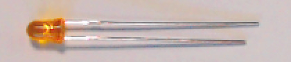

Inventory the Hardware
----------------------

Examine the contents of your class kit. It contains:

-   | One (1) full-sized solderless breadboard
    | |breadboard|

-   | One (1) Arduino Nano (or clone) microcontroller board
    | |nano|

-   | One (1) USB cable (mini-USB shown; yours may be different)
    | |usbCable|

-   | One (1) 4 × 4 matrix keypad
    | |keypad|

-   | One (1) 8-pin male-male header strip
      (might already be inserted into keypad’s female connectors;
      might have more than 8 pins)
    | |headerIn| or |headerOut|

-   | Two (2) breadboard-mount momentary pushbuttons, aka tactile switches;
      these might have two leads (which might or might not be attached to cardboard strip),
      or they might have 4 prongs
    | |buttons2Pin| or |buttons4Pin|

-   | Two (2) breadboard-mount slide switches
    | |switches|

-   | One (1) Light Emitting Diode (LED) (color may be different than shown)
    | |LED|

-   | One (1) 1k\ :math:`\Omega` resistor
    | |resistor|

-   | One (1) 40-conductor 10cm "rainbow" cable (male-to-male),
    | *or* One (1) 20-conductor 10cm "rainbow" cable (male-to-male) and one (1) 20-conductor 20cm "rainbow" cable (male-to-male)
    | |dupontCable|

..  |breadboard|        image:: breadboard.jpg
    :height: 2cm

..  |usbCable|          image:: usb.jpg
    :height: 2cm
..  |keypad|            image:: keypad.jpg
    :height: 2cm
..  |headerIn|          image:: keypad-header-in-connector.jpg
    :height: 2cm

..  |buttons2Pin|       image:: buttons-2pin.jpg
    :height: 2cm

..  |resistor|          image:: resistor.jpg
    :height: 1cm

