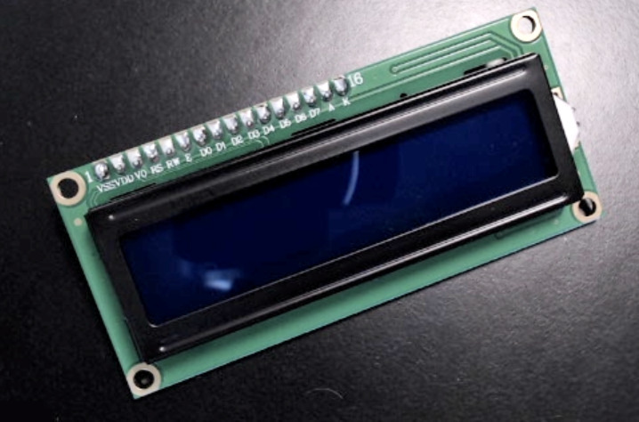
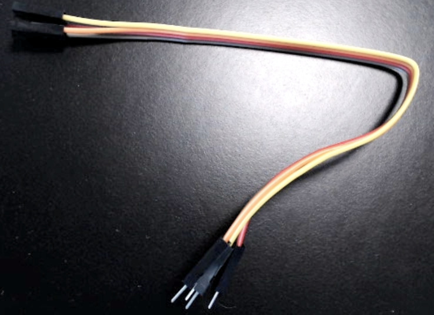

..  include:: ../mk1f.txt

Preparing to Assemble the Cow Pi mark 1f
========================================

..  include:: preparation-inventory.rst

-   | One (1) :math:`2 \times 16` character LCD display module
    | |lcd1602|

-   | One (1) |i2c| Serial Interface (might be attached to display module)
    | |serialAdapter| or |adafruitAdapter| or |piggypackAdapter|

-   | One (1) 4-conductor 20cm "rainbow" cable (female-to-male)
    | |fourConductor|

..  include:: preparation-assembling.rst

..  NOTE::
    The circuit you build by following these instructions will look a bit like a rat's nest by the time that you are finished.
    This is because the jumper wires you remove from the male-to-male rainbow cable are not cut to length and generally will be longer than they need to be (which is much better than being shorter than they need to be).
    If you have prior experience with building circuits on a solderless breadboard, and if you have solid-core wires and wire cutters, then optionally you may build the circuit with cut-to-length solid core wires.

    ..  image:: completed-kit-lcd1602.jpg
        :width: 90%
        :align: center

    \
        \
            Cow Pi mk1d that was constructed using 10cm and 20cm jumper wires.

..  NOTE::
    In many of the photographs on the following pages, jumper wires from earlier steps have been replaced with cut-to-length wires to emphasize the wires from the current step.
    This may cause the photographs to look "cleaner" than your circuit.

..  |serialAdapter|     image:: lcd-adapter.jpg
    :height: 2cm
..  |adafruitAdapter|   image:: adafruit-lcd-adapter.jpg
    :height: 2cm
..  |piggypackAdapter|  image:: piggyback-lcd-adapter.jpg
    :height: 2cm
