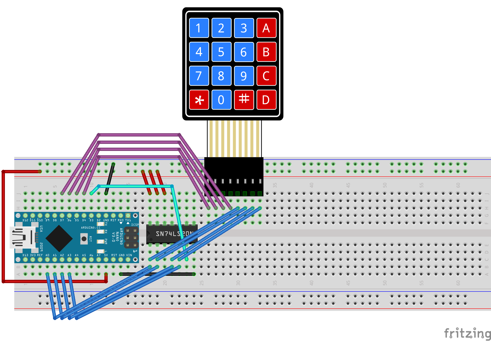

..  include:: ../mk1ef.txt
..  include:: ../mk1e.txt

..  _mk1eKeypadSection:

Install the Matrix Keypad
=========================
*Cow Pi mk1e: Arduino Nano form factor, SPI communication*

Observe that the matrix keypad has sixteen buttons has eight pins in its female connector.
As shown in :numref:`mk1eAnnotatedKeypad`\ (a), when the keypad is face-up and oriented for reading, the four pins on the left are the *row* pins, and the four pins on the right are the *column* pins.
From left-to-right, we will name these pins ``row1``, ``row4``, ``row7``, ``row*``, ``column1``, ``column2``, ``column3``, ``columnA``.
:numref:`mk1eAnnotatedKeypad`\ (b) shows the membrane contacts and which |developmentBoard| pin will be connected to each keypad pin.

.. _mk1eAnnotatedKeypad:
.. figure:: ../../../blank.png

    The numeric keypad's header has four row pins and four column pins

    +---------------------------------+-------------------------------------+
    | a                               | b                                   |
    +=================================+=====================================+
    | .. image:: keypad-annotated.jpg | .. image:: keypad-matrix.png        |
    |    :height: 7cm                 |    :height: 7cm                     |
    |    :align: center               |    :align: center                   |
    +---------------------------------+-------------------------------------+
    | Front of matrix keypad.         | Keypad's underlying contact matrix. |
    +---------------------------------+-------------------------------------+

:numref:`mk1eFigureKeypadDiagram` shows a diagram of the wiring for the matrix keypad.

..  _mk1eFigureKeypadDiagram:

    Diagram of wiring associated with matrix keyboard input.

..  include:: keypad-steps.rst

When you have finished setting up the keypad wiring, there should be the electrical paths described in :numref:`mk1eTableKeypadConnections`.

..  _mk1eTableKeypadConnections:
..  table:: Electrical Paths for Matrix Keypad.

    =========== ========================
    Keypad pin  Arduino Nano pin
    =========== ========================
    ``row1``    |mcuRow1Pin|
    ``row4``    |mcuRow4Pin|
    ``row7``    |mcuRow7Pin|
    ``row*``    |mcuRowStarPin|
    ``column1`` |mcuColumn1Pin|
    ``column2`` |mcuColumn2Pin|
    ``column3`` |mcuColumn3Pin|
    ``columnA`` |mcuColumnAPin|
    =========== ========================

..  include:: keypad-confirmation.rst
