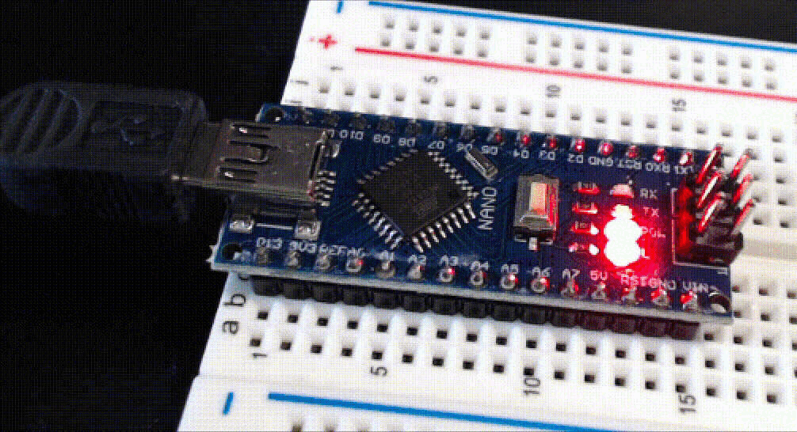

Selecting the Correct "Processor"
"""""""""""""""""""""""""""""""""

There are *three* choices for the Arduino Nano's processor, two of which specify the ATmega328P processor.
Even though the difference is with the bootloader, it is resolved through the Arduino IDE's "Processor" selection:

-   Official Arduino Nanos and some clones use the "new bootloader".
    Under the "Tools" menu, when choosing "Processor", select "ATmega328P".

-   Older official Arduino Nanos and some clones use the "old bootloader".
    Under the "Tools" menu, when choosing "Processor", select "ATmega328P (Old Bootloader)"

-   Very old Arduino Nanos use the ATmega168 processor.
    If you have such a device, replace it with a newer Arduino Nano.

Updating Windows USB Driver if Necessary
""""""""""""""""""""""""""""""""""""""""

Official Arduino Nanos use the FT232RL USB interface chip.
*Most* Arduino Nano clones use the CH340 USB interface chip.
We have seen some Windows computers without the CH340 USB driver,
and we have seen that some Windows 11 computers need their CH340 USB driver updated.

See :doc:`../../../troubleshooting/nano` for instructions to handle these problems.

Upload a New Sketch
"""""""""""""""""""

:\:[   ]: From the Arduino IDE's File menu, open the *Blink.ino* example:
    *File* ⟶ *Examples* ⟶ *01.Basics* ⟶ *Blink*

:\:[   ]: Select *Save As...* and save the project as *MyBlink*.

:\:[   ]: Edit the values in the ``delay()`` calls to change the delays between the LED turning on, off, and on again.
    Select values that will visibly have a difference, such as 250 or 2000.

:\:[   ]: Compile the program using the "Verify" checkmark in the IDE's toolbar and make corrections if the program doesn't compile.

:\:[   ]: Upload the program to your Arduino Nano using the "Upload" arrow in the IDE's toolbar.
    (If you forget to compile first, the IDE will compile your program before uploading, but I find it useful to find compile-time mistakes before attempting to upload the program.)

If you successfully uploaded *MyBlink.ino* then you will see the following in the IDE's *Output* window:

   …(elided configuration data)…

.. code-block:: console

          avrdude: AVR device initialized and ready to accept instructions

          Reading | ################################################## | 100% 0.01s

          avrdude: Device signature = 0x1e950f (probably m328p)
          avrdude: reading input file "/var/folders/p7/lx4gt70d0_34cpy8r0j3c95c0000gp/T/arduino-sketch-11A4823C54657006C9F78B0812B621A8/MyBlink.ino.hex"
          avrdude: writing flash (932 bytes):

          Writing | ################################################## | 100% 0.33s

          avrdude: 932 bytes of flash written

          avrdude done.  Thank you.

          --------------------------
          upload complete.

and then the LED's on-off pattern will change, reflecting the ``delay()`` values you assigned.

Handling Errors
~~~~~~~~~~~~~~~

If you get an error when attempting to upload a sketch, try these corrective measures:

#.  Try selecting "ATmega328P" and try selecting "ATmega328P (Old Bootloader)".

#.  Try uploading again (if you attempt to upload a sketch too soon after connecting your Arduino Nano to your computer, the USB interface won't have finished its handshake).

#.  The `Troubleshooting Guide <https://support.arduino.cc/hc/en-us/articles/4401874331410--Error-avrdude-when-uploading>`_ recommends disconnecting your Arduino Nano and reconnecting it, then selecting whichever COM port appears.

#.  Review the discussion at :ref:`Windows11CH340`.

If, instead of an error, your IDE "hangs" while collecting configuration data, try this corrective measure:

-   Press the ``RESET`` button in the middle of the Arduino Nano;
    the IDE should begin uploading the sketch after you release the button.

..  ATTENTION::
    **CHECKPOINT 2**
    | Before proceeding further, have a TA or a classmate verify that you have correctly uploaded new code to the |developmentBoard|.
    Update *checkpoints.txt* file to indicate who checked your work and when they did so.
