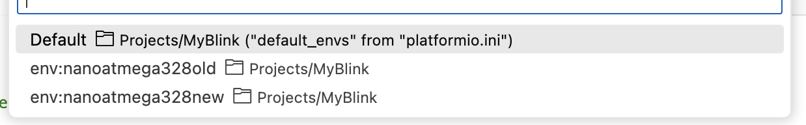

VS Code with the PlatformIO Plugin
----------------------------------

If you prefer to use VS Code, you can do so.
If you have not already installed VS Code, then `download and install <https://code.visualstudio.com/>`_ it.
Next, you need to `install the PlatformIO extension <https://platformio.org/install/ide?install=vscode>`_\ .
You may want to take a quick look at the `parts of the PlatformIO Toolbar <https://docs.platformio.org/en/latest/integration/ide/vscode.html#platformio-toolbar>`_\.

About PlatformIO and the Arduino Framework
""""""""""""""""""""""""""""""""""""""""""

PlatformIO is able to work with many frameworks;
for the I/O labs, we will use the Arduino framework.
As application programmers, the starting point is a C++ program\ [#usingC]_ in which you write two functions, ``setup()`` and ``loop()``, along with any helper code that you need.
PlatformIO will compile your program and link it to a ``main()`` function that looks something like:

.. code-block:: c

    int main(void) {
        setup();
        while(true) {
            loop();
        }
    }

(The actual ``main()`` function\ [#arduinoMain]_ also calls a few other functions from the Arduino core library.)

Connect to the |developmentBoard|
"""""""""""""""""""""""""""""""""

:\:[   ]: Connect one end of the USB cable to a lab computer or to your personal laptop.\ [#usbConnection]_

:\:[   ]: Connect the other end of the cable to your |developmentBoard|.

The ``PWR`` LED will light up, and you may see the ``L`` LED repeatedly blink on-and-off.
The ``L`` LED is connected to the |developmentBoard|'s pin D13, and Arduino microcontroller boards typically leave the factory with *Blink.ino* loaded, but it does not matter if yours does not have *Blink.ino* pre-loaded.

.. code-block:: cpp

    // the setup function runs once when you press reset or power the board
    void setup(void) {
        // initialize digital pin LED_BUILTIN as an output.
        pinMode(LED_BUILTIN, OUTPUT);
    }

    // the loop function runs over and over again forever
    void loop(void) {
        digitalWrite(LED_BUILTIN, HIGH);   // turn the LED on (HIGH is the voltage level)
        delay(1000);                       // wait for a second
        digitalWrite(LED_BUILTIN, LOW);    // turn the LED off by making the voltage LOW
        delay(1000);                       // wait for a second
    }

:\:[   ]: Open VS Code on the computer that your |developmentBoard| is connected to.

On VS Code's left-side menu, you will see an bug head icon;
this is PlatformIO's logo.

..  image:: platformIOIcon.png
    :align: center

:\:[   ]: Click on the PlatformIO logo.

After a few seconds, a PlatformIO side-window will appear.

:\:[   ]: In that side-window, click on the "Create New Project" button.

This takes you to the "PlatformIO Home."

:\:[   ]: In PlatformIO Home, click on the "Project Examples" button.

:\:[   ]: In resulting pop-up window, click on the "Select an example..." drop-down menu.

:\:[   ]: In the drop-down menu, click on "arduino blink" (it should be the first option). Click on the "Import" button.

You will need to wait a few seconds, and then a new project will be created whose name is derived from the current date and time, such as "230718-112959-arduino-blink."
The code in *src/Blink.cpp* is the same code that is typically loaded onto an Arduino Nano before leaving the factory.

:\:[   ]: Open the *platformio.ini* file (it may open automatically).

:\:[   ]: Delete the entire contents of *platformio.ini* and replace it with:

    ..  code-block:: console

        [env:nanoatmega328old]
        platform = atmelavr
        board = nanoatmega328
        framework = arduino

        [env:nanoatmega328new]
        platform = atmelavr
        board = nanoatmega328new
        framework = arduino

:\:[   ]: Save the updated *platformio.ini* file.

Determine Which Bootloader your |developmentBoard| has
~~~~~~~~~~~~~~~~~~~~~~~~~~~~~~~~~~~~~~~~~~~~~~~~~~~~~~

A few years ago, Arduino changed the bootloader in the Official Arduino Nano.
Some clones now ship with the "new" bootloader, and some clones still ship with the "old" bootloader.
In the previous step, you told PlatformIO that you might have an Arduino Nano with the old bootloader and you might have an Arduino Nano with the new bootloader.
Now you will determine *which* bootloader you have.

\

The `PlatformIO Toolbar <https://docs.platformio.org/en/latest/integration/ide/vscode.html#platformio-toolbar>`_ has a few options.

-   The house icon takes you to the PlatformIO Home
-   The checkmark icon compiles your program
-   The arrow icon uploads your program to your |developmentBoard|
-   The trash can icon deletes your program's compiled firmware
-   The beaker icon runs unit tests
-   The plug icon opens a Serial Monitor to interact with programs on your |developmentBoard|
-   The box with an angle bracket opens a command-line terminal
-   On the right, where it currently says "Default," is the PlatformIO Environment selector.

:\:[   ]: Click on the checkmark icon to compile the program.

So long as the PlatformIO Environment is "default," PlatformIO will compile the program for *both* types of Nano you told it about.

..  code-block:: console

    …(elided compiler logs)…

    Environment       Status    Duration
    ----------------  --------  ------------
    nanoatmega328old  SUCCESS   00:00:05.381
    nanoatmega328new  SUCCESS   00:00:04.735
    ========================================================================= 2 succeeded in 00:00:10.116 =========================================================================
     *  Terminal will be reused by tasks, press any key to close it.

:\:[   ]: Clock on the arrow icon to upload the program to your |developmentBoard|.

So long as the PlatformIO Environment is "default," PlatformIO will attempt to upload the program to *both* types of Nanos.
Since you have only one |developmentBoard| connected to your computer, one of those attempts *must* fail.
This example shows the output from attempting to upload to a |developmentBoard| with the new bootloader:

..  code-block:: console

    Executing task: platformio run --target upload

    Processing nanoatmega328old (platform: atmelavr; board: nanoatmega328; framework: arduino)
    -------------------------------------------------------------------------------------------------------------------------------------------------------------------------------------

    …(elided configuration data)…

    Looking for upload port...
    Auto-detected: /dev/cu.usbserial-141330
    Uploading .pio/build/nanoatmega328old/firmware.hex
    avrdude: stk500_recv(): programmer is not responding
    avrdude: stk500_getsync() attempt 1 of 10: not in sync: resp=0x00
    avrdude: stk500_recv(): programmer is not responding
    avrdude: stk500_getsync() attempt 2 of 10: not in sync: resp=0x00
    avrdude: stk500_recv(): programmer is not responding
    avrdude: stk500_getsync() attempt 3 of 10: not in sync: resp=0x00
    avrdude: stk500_recv(): programmer is not responding
    avrdude: stk500_getsync() attempt 4 of 10: not in sync: resp=0x00
    avrdude: stk500_recv(): programmer is not responding
    avrdude: stk500_getsync() attempt 5 of 10: not in sync: resp=0x00
    avrdude: stk500_recv(): programmer is not responding
    avrdude: stk500_getsync() attempt 6 of 10: not in sync: resp=0x00
    avrdude: stk500_recv(): programmer is not responding
    avrdude: stk500_getsync() attempt 7 of 10: not in sync: resp=0x00
    avrdude: stk500_recv(): programmer is not responding
    avrdude: stk500_getsync() attempt 8 of 10: not in sync: resp=0x00
    avrdude: stk500_recv(): programmer is not responding
    avrdude: stk500_getsync() attempt 9 of 10: not in sync: resp=0x00
    avrdude: stk500_recv(): programmer is not responding
    avrdude: stk500_getsync() attempt 10 of 10: not in sync: resp=0x00

    avrdude done.  Thank you.

    *** [upload] Error 1
    ============================================================================ [FAILED] Took 53.28 seconds ============================================================================

    Processing nanoatmega328new (platform: atmelavr; board: nanoatmega328new; framework: arduino)
    -------------------------------------------------------------------------------------------------------------------------------------------------------------------------------------

    …(elided configuration data)…

    Looking for upload port...
    Auto-detected: /dev/cu.usbserial-141330
    Uploading .pio/build/nanoatmega328new/firmware.hex

    avrdude: AVR device initialized and ready to accept instructions

    Reading | ################################################## | 100% 0.00s

    avrdude: Device signature = 0x1e950f (probably m328p)
    avrdude: reading input file ".pio/build/nanoatmega328new/firmware.hex"
    avrdude: writing flash (924 bytes):

    Writing | ################################################## | 100% 0.18s

    avrdude: 924 bytes of flash written
    avrdude: verifying flash memory against .pio/build/nanoatmega328new/firmware.hex:
    avrdude: load data flash data from input file .pio/build/nanoatmega328new/firmware.hex:
    avrdude: input file .pio/build/nanoatmega328new/firmware.hex contains 924 bytes
    avrdude: reading on-chip flash data:

    Reading | ################################################## | 100% 0.14s

    avrdude: verifying ...
    avrdude: 924 bytes of flash verified

    avrdude: safemode: Fuses OK (E:00, H:00, L:00)

    avrdude done.  Thank you.

    ============================================================================ [SUCCESS] Took 3.02 seconds ============================================================================

    Environment       Status    Duration
    ----------------  --------  ------------
    nanoatmega328old  FAILED    00:00:53.277
    nanoatmega328new  SUCCESS   00:00:03.024
    ======================================================================= 1 failed, 1 succeeded in 00:00:56.300 =======================================================================

     *  The terminal process "platformio 'run', '--target', 'upload'" terminated with exit code: 1.
     *  Terminal will be reused by tasks, press any key to close it.

If the |developmentBoard| were a Nano with the old bootloader, then the upload for "nanoatmega328new" would have failed::

    …(elided most of the output)…

    Environment       Status    Duration
    ----------------  --------  ------------
    nanoatmega328old  SUCCESS   00:00:02.979
    nanoatmega328new  FAILED    00:00:52.333
    ======================================================================= 1 failed, 1 succeeded in 00:00:55.312 =======================================================================

:\:[   ]: On the PlatformIO Toolbar, click on the PlatformIO Environment selector (which currently says "Default").

At the top of VS Code, you will see the environment options.

Select whichever environment **SUCCESS**\ fully uploaded the program to your |developmentBoard|.

Modify the Program
""""""""""""""""""

:\:[   ]: Open *src/Blink.cpp*

:\:[   ]: Edit the values in the ``delay()`` calls to change the delays between the LED turning on, off, and on again.
    Select values that will visibly have a difference, such as 250 or 2000.

:\:[   ]: Compile the program.

Now that a specific PlatformIO Environment is selected, PlatformIO will compile the program only for that environment.

:\:[   ]: Upload the program to your |developmentBoard|.

Now that a specific PlatformIO Environment is selected, PlatformIO only attempt to upload the program to a |developmentBoard| with the correct bootloader.
The LED's on-off pattern will change, reflecting the ``delay()`` values you assigned.

..  image:: animations/myblink.gif
    :height: 3cm
    :align: center

Handling Errors
~~~~~~~~~~~~~~~

..  DANGER::
    TODO

..  ATTENTION::
    **CHECKPOINT 2**
    | Before proceeding further, have a TA or a classmate verify that you have correctly uploaded new code to the |developmentBoard|.
    Update *checkpoints.txt* file to indicate who checked your work and when they did so.
