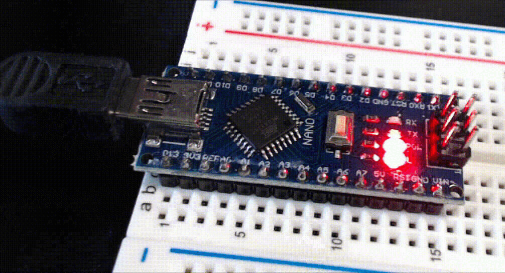

..  include:: ../mk1ef.txt

Installing the IDE
==================
*Cow Pi mk1e/f: Arduino Nano form factor*

Broadly speaking, you have two options:

-   Using the :ref:`ArduinoIDE`
-   Using :ref:`vsCodeWithPlatformIO`

..  _ArduinoIDE:

Arduino IDE
-----------

The Arduino IDE is installed on the lab computers.
If you choose to install the Arduino IDE on your personal laptop, you can download it from https://www.arduino.cc/en/software
and follow the `installation instructions <https://docs.arduino.cc/software/ide-v2/tutorials/getting-started/ide-v2-downloading-and-installing>`_.
Alternatively, you can install a browser plugin to use the `Arduino Web Editor <https://docs.arduino.cc/arduino-cloud/getting-started/getting-started-web-editor>`_.

About Arduino Programs
""""""""""""""""""""""

An Arduino program is called a *sketch* for historical reasons. [#sketches]_
For all intents and purposes, you can think of it as a C++ program [#usingC]_ in which you write two functions, ``setup()`` and ``loop()``, along with any helper code that you need.
The file extension for sketches is *.ino* (as in, Ardu\ *ino*).
The Arduino IDE will compile your sketch and link it to a ``main()`` function that looks something like:

.. code-block:: c

    int main(void) {
        setup();
        while(true) {
            loop();
        }
    }

(The actual ``main()`` function [#arduinoMain]_ also calls a few other functions from the Arduino core library.)

Connect to the |developmentBoard|
"""""""""""""""""""""""""""""""""

-   Review the `instructions to upload a program <https://docs.arduino.cc/software/ide-v2/tutorials/getting-started/ide-v2-uploading-a-sketch>`_.

-   Connect one end of the USB cable to a lab computer or to your personal laptop. [#usbConnection]_

-   Connect the other end of the cable to your |developmentBoard|.

The ``PWR`` LED will light up, and you may see the ``L`` LED repeatedly blink on-and-off.
The ``L`` LED is connected to the |developmentBoard|'s pin D13, and Arduino microcontroller boards typically leave the factory with *Blink.ino* loaded, but it does not matter if yours does not have *Blink.ino* pre-loaded.

.. code-block:: cpp

    // the setup function runs once when you press reset or power the board
    void setup(void) {
        // initialize digital pin LED_BUILTIN as an output.
        pinMode(LED_BUILTIN, OUTPUT);
    }

    // the loop function runs over and over again forever
    void loop(void) {
        digitalWrite(LED_BUILTIN, HIGH);   // turn the LED on (HIGH is the voltage level)
        delay(1000);                       // wait for a second
        digitalWrite(LED_BUILTIN, LOW);    // turn the LED off by making the voltage LOW
        delay(1000);                       // wait for a second
    }

:\:[   ]: Open the Arduino IDE on the computer that your |developmentBoard| is connected to.

:\:[   ]: Connect the Arduino IDE to the Arduino Nano.

Arduino claims that the board and COM port (Windows) or TTY port (Mac/Linux) will be detected automatically.
We have found that automatic detection is unlikely with non-official boards.

You will need to select the board and port;
on Windows, you may need to select "Show Hidden Ports" (see :numref:`selectingBoard`\ (a)).
With Arduino Nanos, you will also need to select the processor (see :numref:`selectingBoard`\ (b) and the discussion below).

.. _selectingBoard:
.. figure:: ../../../blank.png

    Selecting board and processor in the Arduino IDE.

    +-----------------------------------------------+---------------------------------------------------------+
    | a                                             | b                                                       |
    +===============================================+=========================================================+
    | .. image:: selecting-nano.jpg                 | .. image:: selecting-nano-processor.jpg                 |
    |    :width: 8cm                                |    :width: 8cm                                          |
    |    :align: center                             |    :align: center                                       |
    +-----------------------------------------------+---------------------------------------------------------+
    | Selecting the board with Arduino IDE 2.0.     | Selecting the processor after selecting the board.      |
    +-----------------------------------------------+---------------------------------------------------------+

Selecting the Correct "Processor"
"""""""""""""""""""""""""""""""""

There are *three* choices for the Arduino Nano's processor, two of which specify the ATmega328P processor.
Even though the difference is with the bootloader, it is resolved through the Arduino IDE's "Processor" selection:

-   Official Arduino Nanos and some clones use the "new bootloader".
    Under the "Tools" menu, when choosing "Processor", select "ATmega328P".

-   Older official Arduino Nanos and some clones use the "old bootloader".
    Under the "Tools" menu, when choosing "Processor", select "ATmega328P (Old Bootloader)"

-   Very old Arduino Nanos use the ATmega168 processor.
    If you have such a device, replace it with a newer Arduino Nano.

Updating Windows USB Driver if Necessary
""""""""""""""""""""""""""""""""""""""""

Official Arduino Nanos use the FT232RL USB interface chip.
*Most* Arduino Nano clones use the CH340 USB interface chip.

We have seen some Windows computers without the CH340 USB driver.
If you encounter this problem and the Device Manager shows you the warning in :numref:`usbIssues`\ (a),
then the first thing to try is updating the driver.
Right-click on USB2.0-Ser! (:numref:`usbIssues`\ (b)) and choose "Update driver".
Then choose "Search automatically for updated driver software".

.. _usbIssues:
.. figure:: ../../../blank.png

    Some Windows computers lack the CH340 USB driver.

    +---------------------------------------+------------------------------+
    | a                                     | b                            |
    +=======================================+==============================+
    | .. image:: device-manager-warning.png | .. image:: update-driver.jpg |
    |    :width: 8cm                        |    :width: 8cm               |
    |    :align: center                     |    :align: center            |
    +---------------------------------------+------------------------------+

If Windows reports that "Windows has successfully updated your drivers" then you should now be able to connect to the Arduino Nano.
On the other hand, if Windows reports that "Windows was unable to install your USB2.0-Ser!", then the `How to Install CH340 Drivers <https://learn.sparkfun.com/tutorials/how-to-install-ch340-drivers/>`_ page at sparkfun.com will guide you through manually downloading the driver and installing it.

Sparkfun's `How to Install CH340 Drivers <https://learn.sparkfun.com/tutorials/how-to-install-ch340-drivers/>`_ page also has instructions for installing the driver on MacOS and on Linux;
however, we are not aware of any students needing to manually
install the CH340 driver on MacOS.

No Driver Warning but Cannot Connect
""""""""""""""""""""""""""""""""""""

Standard Answer
~~~~~~~~~~~~~~~

If you see no warnings but your Windows computer still won't communicate with the Arduino Nano
then probably what happened is that your computer has the driver, but you're telling the IDE to connect to the wrong virtual COM port.
The typical way to handle this is to
disconnect the Arduino Nano from your computer,
go to the part of the menu where you connect to the COM port,
connect the Arduino Nano to your computer,
and select whichever COM port appears after plugging in the Arduino Nano.

.. _Windows11CH340:

Windows 11 and Arduino Nano Clones
~~~~~~~~~~~~~~~~~~~~~~~~~~~~~~~~~~

We have seen problems with Windows 11 and Arduino Nano Clones, with error messages similar to:

.. code-block:: console

    avrdude: ser_open(): can't set com-state for "\\.\COM3"

As the staff at the EE Shop has worked to troubleshoot this, there were indications that the problem was with the Arduino IDE 2.1.0;
**if you see this problem with the Arduino IDE 2.1.1, please let us know.**

Another fix that seems to work is to install the latest CH340/341 drivers from https://oemdrivers.com/usb-ch340 :

    When you download and un-ZIP this package, you end up with folders containing .INF and other files.
    A common way to upgrade Windows device drivers is to select the device in Device Manager, tell it to update drivers and click on the option to browse your computer for the drivers.
    Usually you select the directory containing those files and Windows uses them.
    I found that when I tried this Windows insisted "no, the drivers already installed are the best."

    However this driver package also includes a couple executable programs that you
    just run to install the driver, and that works.  (One in the main folder, one in
    the "W1X" folder.  As far as I can tell they do the same thing.)

Finally:

    On Windows 11, the first time after launching the IDE,  your code should compile and upload with no complaints.
    But your next upload will fail  .... UNLESS you
    unplug the Nano from the computer, letting it's COMx port "go away", then plug
    it back in so Windows and the IDE  "rediscover" it.
    (The IDE immediately picks up using the same port settings when you plug it in.)
    And then you can upload another sketch.
    This is inconvenient but not majorly so, considering the payoff is that uploads can be depended upon to work when you do this.

    All the above is the same under Windows 10, except Win10 doesn't have the "I'll only upload once" problem,
    and you can leave your board plugged in as long as you like.

Upload a New Sketch
"""""""""""""""""""

:\:[   ]: From the Arduino IDE's File menu, open the *Blink.ino* example:
    | *File* :math:`\rightarrow` *Examples* :math:`\rightarrow` *01.Basics* :math:`\rightarrow` *Blink*
    | Select *Save As...* and save the project as *MyBlink*.

:\:[   ]: Edit the values in the ``delay()`` calls to change the delays between the LED turning on, off, and on again.
    Select values that will visibly have a difference, such as 250 or 2000.

:\:[   ]: Compile the program using the "Verify" checkmark in the IDE's toolbar and make corrections if the program doesn't compile.

:\:[   ]: Upload the program to your Arduino Nano using the "Upload" arrow in the IDE's toolbar.
    (If you forget to compile first, the IDE will compile your program before uploading, but I find it useful to find compile-time mistakes before attempting to upload the program.)

If you successfully uploaded *MyBlink.ino* then you will see the following in the IDE's *Output* window:

   …(elided configuration data)…

.. code-block:: console

          avrdude: AVR device initialized and ready to accept instructions

          Reading | ################################################## | 100% 0.01s

          avrdude: Device signature = 0x1e950f (probably m328p)
          avrdude: reading input file "/var/folders/p7/lx4gt70d0_34cpy8r0j3c95c0000gp/T/arduino-sketch-11A4823C54657006C9F78B0812B621A8/MyBlink.ino.hex"
          avrdude: writing flash (932 bytes):

          Writing | ################################################## | 100% 0.33s

          avrdude: 932 bytes of flash written

          avrdude done.  Thank you.

          --------------------------
          upload complete.

and then the LED's on-off pattern will change, reflecting the ``delay()`` values you assigned.

Handling Errors
~~~~~~~~~~~~~~~

If you get an error when attempting to upload a sketch, try these corrective measures:

#.  Try selecting "ATmega328P" and try selecting "ATmega328P (Old Bootloader)" (see :numref:`selectingBoard`\ (b)).

#.  Try uploading again (if you attempt to upload a sketch too soon after connecting your Arduino Nano to your computer, the USB interface won't have finished its handshake).

#.  The `Troubleshooting Guide <https://support.arduino.cc/hc/en-us/articles/4401874331410--Error-avrdude-when-uploading>`_ recommends disconnecting your Arduino Nano and reconnecting it, then selecting whichever COM port appears.

#.  Review the discussion at :ref:`Windows11CH340`.

If, instead of an error, your IDE "hangs" while collecting configuration
data, try this corrective measure:

-  Press the ``RESET`` button in the middle of the Arduino Nano; the IDE
   should begin uploading the sketch after you release the button.

..  ATTENTION::
    **CHECKPOINT 2**
    | Before proceeding further, have a TA or a classmate verify that you have correctly uploaded new code to the |developmentBoard|.
    Update *checkpoints.txt* file to indicate who checked your work and when they did so.

If you are satisfied with using the Arduino IDE, then proceed to :doc:`power`.

----

.. _vsCodeWithPlatformIO:

VS Code with the PlatformIO Plugin
----------------------------------

..  DANGER::
    TODO

..  ATTENTION::
    **CHECKPOINT 2**
    | Before proceeding further, have a TA or a classmate verify that you have correctly uploaded new code to the |developmentBoard|.
    Update *checkpoints.txt* file to indicate who checked your work and when they did so.

If you are satisfied with using PlatformIO, then proceed to :doc:`power`.

----

..  [#sketches]
    | The Arduino language is based off of the Wiring language, which in turn is based off of the Processing language, which was designed to make computing accessible to artists.
..  [#usingC]
    | Your code in the I/O labs will be C code.
..  [#arduinoMain]
    | https://github.com/arduino/ArduinoCore-avr/blob/master/cores/arduino/main.cpp
..  [#usbConnection]
    | You can connect it to a "wall wart" USB power supply to run the Arduino Nano, but you need to connect it to a computer to upload a new sketch to the Arduino Nano.
