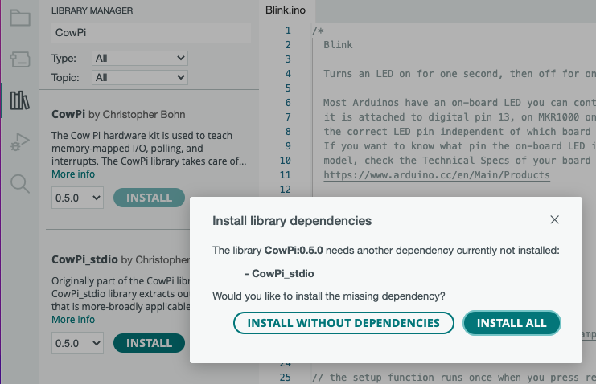
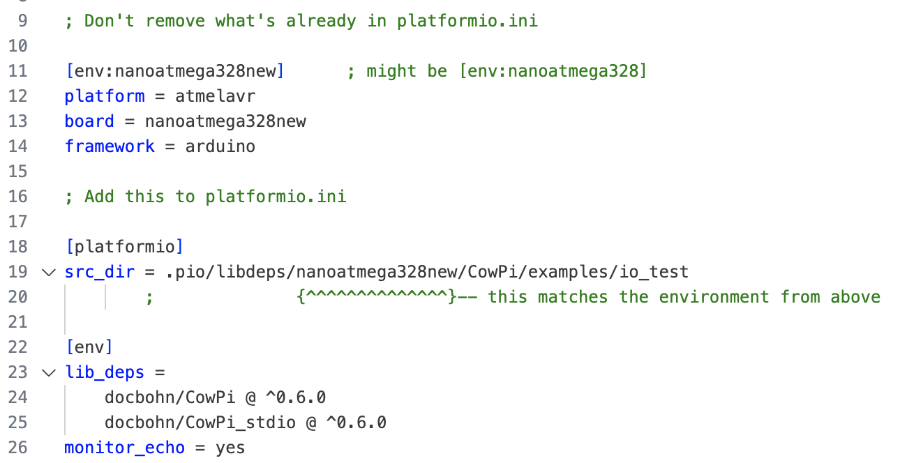

..  include:: ../mk1ef.txt

Install the CowPi and the CowPi_stdio Libraries
===============================================
*Cow Pi mk1f: Arduino Nano form factor*

You will need to install the CowPi and the CowPi_stdio libraries.
The instructions differ, depending on which IDE you are using:

-   :ref:`mk1fArduinoLibrary`
-   :ref:`mk1fPlatformIOLibrary`

..  _mk1fArduinoLibrary:

..  include:: libraries-arduino-steps.rst

You will see a pop-up window telling you that you also need to install the CowPi_stdio library (:numref:`mk1fInstallingArduinoLibraries`).

..  _mk1fInstallingArduinoLibraries:

    Installing both libraries can be achieved by installing the CowPi library and its dependency.

:\:[   ]: Click the "Install All" button.

    -   If you err and select "Install Without Dependencies" then you can still install the CowPi_stdio library separately.

Load the I/O Test Code
~~~~~~~~~~~~~~~~~~~~~~

:\:[   ]: From the Arduino IDE's File menu, open the *io_test* example:
    *File* ⟶ *Examples* ⟶ *CowPi* ⟶ *io_test*

:\:[   ]: Open your IDE's Serial Monitor.

:\:[   ]: Compile and upload *io_test* to your |developmentBoard| in the same manner that you did for *MyBlink*.

..  include:: io-test-started.rst

After the libraries are installed and the test code is loaded, proceed to :doc:`../direct-io/switches-mk1f`.

|

----

|

..  _mk1fPlatformIOLibrary:

Install the Libraries for PlatformIO
""""""""""""""""""""""""""""""""""""

You do not need to explicitly install the libraries;
we will specify their use in *platformio.ini* files, and PlatformIO will automatically download them.

Proceed to :doc:`../direct-io/switches-mk1f`.

..  _testCode:

Load the I/O Test Code
~~~~~~~~~~~~~~~~~~~~~~

:\:[   ]: In the PlatformIO Home, under "Quick Access," click on the "+ New Project" button.

:\:[   ]: In resulting pop-up window, name the project *io_test*. In the "board" field, type *arduino nano* (:numref:`mk1fCreatingIOTest`\ (a)).

:\:[   ]: If your |developmentBoard| has the old bootloader, then select "Arduino Nano ATmega328".
    If your |developmentBoard| has the new bootloader, then select "Arduino Nano ATmega328 (New Bootloader)".
    After you do so, the "framework" field will auto-populate to "Arduino" (:numref:`mk1fCreatingIOTest`\ (b)).

:\:[   ]: Click on the "Finish" button. After several seconds, a new project will be ready.

..  _mk1fCreatingIOTest:
..  figure:: ../../../blank.png

    Selecting board and processor in the Arduino IDE.

    +------------------------------------------+-----------------------------------------+
    | a                                        | b                                       |
    +==========================================+=========================================+
    | .. image:: platformIOStartingProject.png | .. image:: platformIOReadyForIOTest.png |
    |    :width: 8cm                           |    :width: 8cm                          |
    |    :align: center                        |    :align: center                       |
    +------------------------------------------+-----------------------------------------+
    | Selecting the board with PlatformIO.     | Ready to create the *io_test* project   |
    +------------------------------------------+-----------------------------------------+

:\:[   ]: Open the *platformio.ini* file (it may open automatically).

:\:[   ]: Make a note of the environment name that PlatformIO created automatically for you.
    If you see ``[env:nanoatmega328]`` then then environment name is ``nanoatmega328``.
    If you see ``[env:nanoatmega328new]`` then then environment name is ``nanoatmega328new``.

:\:[   ]: *Without removing anything from your* platformio.ini *file,* add the following to your *platformio.ini* file, replacing ``▶environment_name◀`` with the environment name that PlatformIO created automatically for you (see :numref:`mk1fLoadLibraries`):

    ..  code-block:: ini

        [platformio]
        src_dir = .pio/libdeps/▶environment_name◀/CowPi/examples/io_test

        [env]
        lib_deps =
          docbohn/CowPi @ ^0.6.0
          docbohn/CowPi_stdio @ ^0.6.0
        monitor_echo = yes

    This will instruct PlatformIO to use the CowPi and CowPi_stdio libraries,
    and it instructs PlatformIO to compile the CowPi library's *io_test* example instead of anything in the *src/* directory.

..  _mk1fLoadLibraries:

    Configuring the PlatformIO project to use the CowPi and CowPi_stdio libraries, and to compile the *io_test* example.

:\:[   ]: **Save** *platformio.ini*\ .

:\:[   ]: Open your IDE's Serial Monitor.

:\:[   ]: **Compile** and **upload** *io_test* to your |developmentBoard| in the same manner that you did for *MyBlink*.

..  include:: io-test-started.rst

After the test code is loaded, proceed to :doc:`../direct-io/switches-mk1f`.
