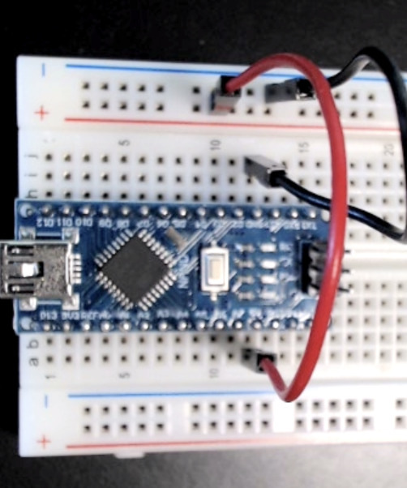

..  include:: ../mk1ef.txt

Connect Power and Ground to Power Bus Strips
============================================
*Cow Pi mk1e: Arduino Nano form factor*

..  include:: power-steps.rst

:\:[   ]: Insert the other end of the ``GND`` wire into the upper |ground| marked with a blue stripe.
    See :numref:`mk1ePowerConnections`.

..   _mk1ePowerConnections:

    Tapping power and ground from the |developmentBoard|.

..  NOTE::
    The lower |power| and the lower |ground| are *not* connected to anything.
    This is because we want to keep the rat's nest of jumper wires away from the slide-switches and pushbuttons.
    If you later attempt to use the lower |power| and the lower |ground| for power & ground, that will be ineffective.

..  ATTENTION::
    **CHECKPOINT 3**
    | Before proceeding further, have a TA or a classmate verify that you have correctly connected the |developmentBoard| to the upper |power| and the upper |ground|.
    Update *checkpoints.txt* file to indicate who checked your work and when they did so.

