**************************************************************************************************************************
Cow Pi mark 3c Assembly Instructions (Raspberry Pi Pico form factor, SSD1306 OLED graphic display via |i2c| communication)
**************************************************************************************************************************

These are the instructions to assemble a Cow Pi circuit on a through-hole printed circuit board using a Raspberry Pi Pico or another microcontroller board that has the same form factor. [#picos]_

..  WARNING::
    Cow Pi mk3c PCBs produced in August 2023 have the Raspberry Pi Pico's GP02--GP17 pins mislabeled as GP03--GP18.
    Boards with this defect can easily be identified by examining the labels for the SPI pins to see if there are two pins labeled GP18.

    ..  image:: mk3c-images/defective-mk3c.png
        :height: 3cm
        :align: center

    If you have one of these boards, we recommend that you correct the error by re-labeling pins GP02--GP17 with a label maker.

..  contents::
    :depth: 2

----

Prepare to Assemble the Cow Pi mark 3c
======================================

Required and Optional Components
--------------------------------

..  _mk3cComponents:
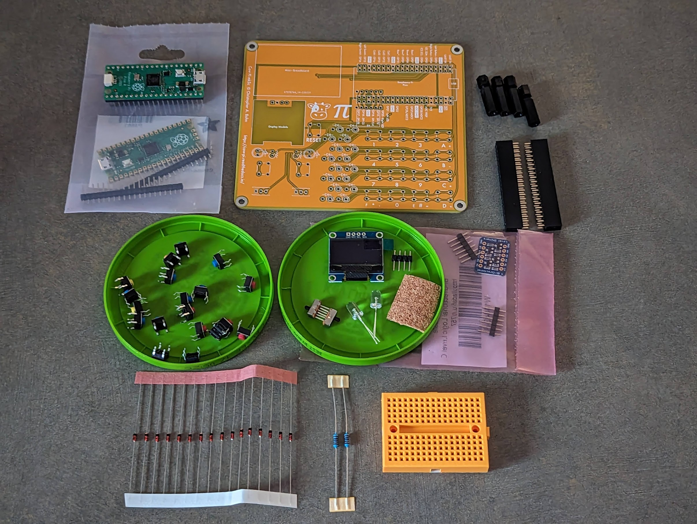

    Components for a Cow Pi mk3c development board, prior to assembly.

The components for a Cow Pi mk3c development board are:

-   One (1) Cow Pi mk3c printed circuit board

    -   `Gerber files <https://github.com/DocBohn/CowPi_hardware/blob/main/mark-3/CowPi-mk3c-gerber.zip>`_
    -   `KiCad files <https://github.com/DocBohn/CowPi_hardware/tree/main/mark-3/CowPi-mk3c>`_

-   One (1) Raspberry Pi Pico with headers

    -   Shown are a Raspberry Pi Pico H, which has the headers pre-attached, and an original Raspberry Pi Pico, which does not have the headers pre-attached.
        This is to illustrate the two options;
        you only need one Pico, not two.

-   Four (4) PCB "feet"

    -   Shown are nylon spacers;
        many other options are viable.

-   Two (2) 2x20 female headers with 0.1 in (2.54 mm) spacing

-   Nineteen (19) 6mm 4-prong tactile switches

    -   You do not need the colorful ones shown in the photo.

-   Two (2) "breadboard compatible" SPDT slide switches

    -   "Breadboard compatible" is how these switches are often described;
        they need three pins with 0.1 in (2.54 mm) spacing, regardless of whether they are described as "breadboard" switches.

-   One (1) SSD1306-driven OLED graphic display module with header

    -   Specifically, the display module needs to have four pins in the left-to-right sequence: ``GND``\  \ ``VCC``\  \ ``SCL``\  \ ``SDA``

-   Two (2) LEDs

-   *Optionally* one (1) piece of cork sheet or other insulating material, approximately 1 in (25 mm) square

-   One (1) Adafruit "`4-channel I2C-safe Bi-directional Logic Level Converter <https://www.adafruit.com/product/757>`_\ " with headers

    -   Electrically, any similar device will work;
        however, the PCB expects this particular device's pin arrangement.

-   Sixteen (16) general-purpose rectifier diodes

    -   Shown are 1N4448 diodes;
        however, nearly any other common rectifier diode will do.

-   Two (2) current-limiting resistors for the LEDs

    -   Shown are 1 kΩ resistors;
        any resistor value that keeps the current within the LED's rating and the RP2040's pads' rating, and that allows for an appropriate illumination level, will do.

-   One (1) mini-breadboard with adhesive backing

Tools and Expendables
---------------------

-   Soldering iron
-   Solder
-   Small fan or fume extractor
-   Suitable eye protection
-   Wet sponge and/or copper wool
-   *Recommended* soldering vise or clamp
-   *Optional* magnifying glass
-   Adhesive tape (does not need to be electrical tape)
-   Needle-nose pliers
-   Diagonal cutters

..  NOTE::
    Except as noted, all components should be mounted on the top of the board.
    Only the "level converter" and the "feet" should be mounted to the bottom of the board.

Attach Headers to Components
============================

..  _mk3cAttachingHeaders:
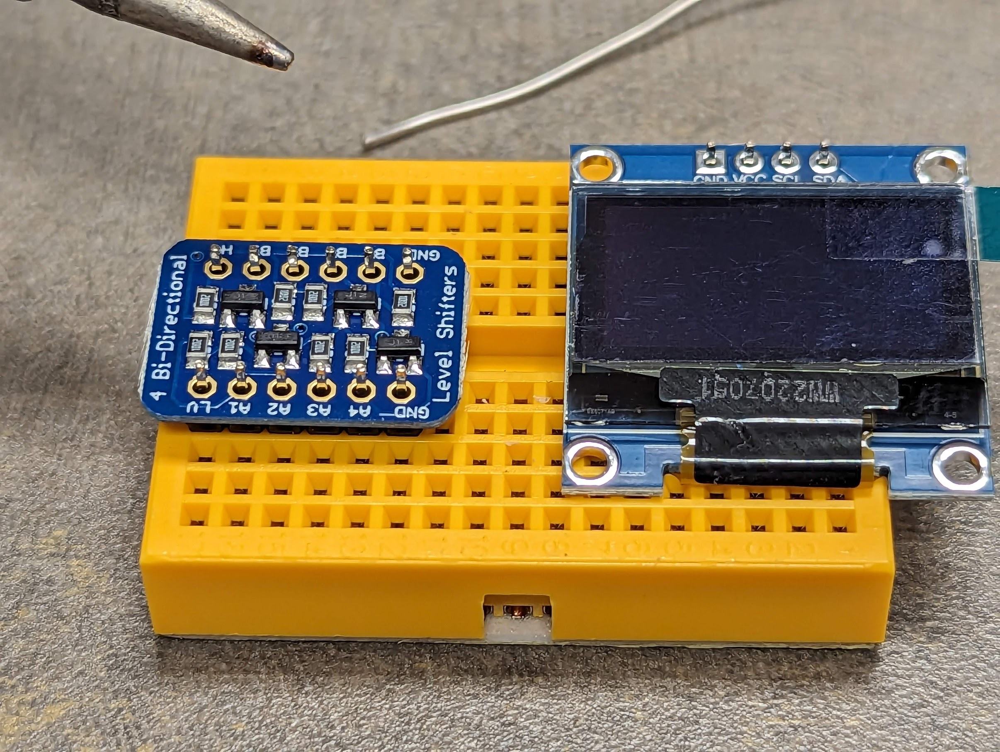

    Ready to solder the headers to the "level converter" and the display module.

:\:[   ]: Using the mini-breadboard as a jig, solder the headers to the "level converter".

:\:[   ]: Using the mini-breadboard as a jig, solder the headers to the display module.

:\:[   ]: If your Raspberry Pi Pico does not already have headers attached, solder the headers to the Pico.

    -   Even though mini-breadboards do not have enough rows to hold all of the pins in the Pico's headers, some mini-breadboards have borders that are narrow enough for the headers to straddle the borders.
        If this is the case for your mini-breadboard, then you can use your mini-breadboard as a jig when attaching the Pico's pins.
    -   Otherwise, you will need to use a half-sized (or full-sized) breadboard as a jig when attaching the Pico's pins.

Attach the Pico's Sockets and Voltage Converter
===============================================

..  _mk3cLowerSocketReady:
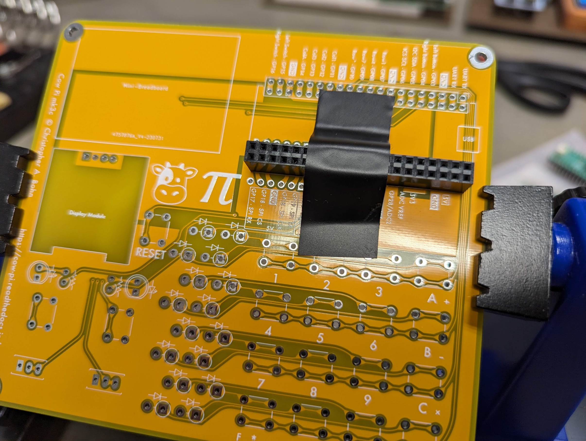

    Ready to solder the lower socket to the circuit board.

:\:[   ]: Mount the circuit board in your soldering vise.

:\:[   ]: Insert one of the 2x20 female headers into the lower set of holes for the Raspberry Pi Pico (the set that includes the labels ``5V`` and ``3V3``).

:\:[   ]: Tape that header in place.

:\:[   ]: Turn the board over and solder all 40 pins on the 2x20 female header to the board.

..  _mk3cAligningBooster:
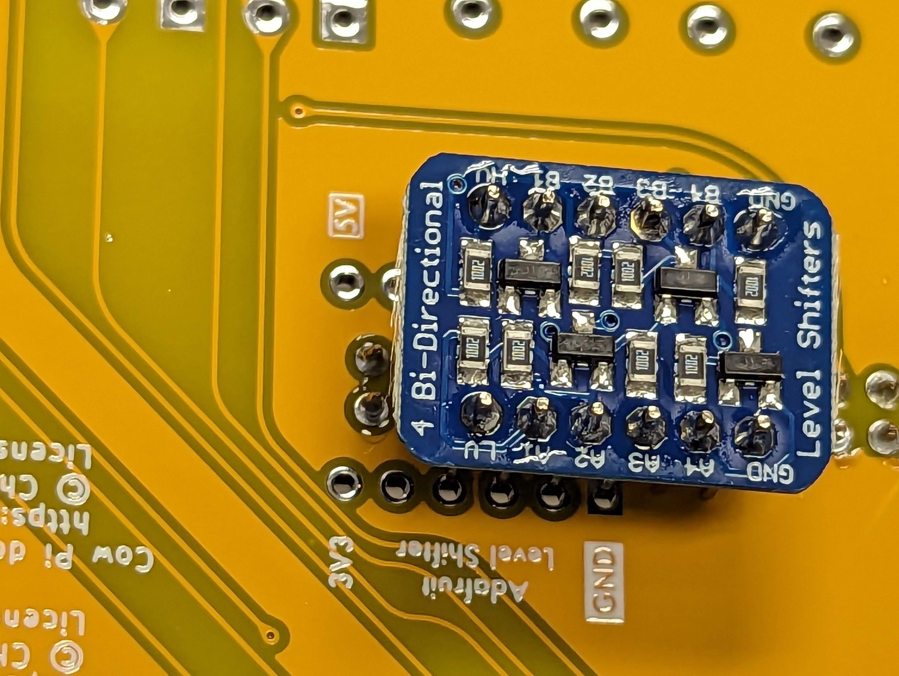

    Aligning the voltage booster.

..  IMPORTANT::
    The Adafruit Level Shifter will be mounted to the underside of the circuit board, straddling the pins of the socket that you just attached.

:\:[   ]: Note the labels for the Level Shifter.

The Level Shifter's ``LV`` pin will go in the hole labeled ``3V3``, and the Level Shifter's ``HV`` pin will go in the hole labeled ``5V``.

..  _mk3cBoosterOptions:
.. figure:: ../../blank.png

    Attaching the voltage booster

    +-------+---------------------------------------------------------------------------------------------------------------+
    |       | .. image:: mk3c-images/voltage-booster-without-cork.jpg                                                       |
    |       |    :align: center                                                                                             |
    | **a** |    :width: 45%                                                                                                |
    |       |                                                                                                               |
    |       | Voltage booster inserted without cork sheet.                                                                  |
    +-------+-------------------------------------------------+-------+-----------------------------------------------------+
    |       | .. image:: mk3c-images/cork-attached.jpeg       |       | .. image:: mk3c-images/level-booster-with-cork.jpeg |
    |       |    :align: center                               |       |    :align: center                                   |
    | **b** |    :width: 90%                                  | **c** |    :width: 90%                                      |
    |       |                                                 |       |                                                     |
    |       | Voltage booster's pins piercing the cork sheet. |       | Voltage booster inserted with cork sheet.           |
    +-------+-------------------------------------------------+-------+-----------------------------------------------------+

There *should* be enough clearance between the socket's pins and the underside of the Level Shifter that you do not *need* to use cork sheet to isolate them (:numref:`mk3cBoosterOptions`\ (a)).
However, if you are a "belt and suspenders" type of person (or if there is not enough clearance) then you can use cork sheet (or other insulating material) to be sure that the socket's pins do not scratch the Level Shifter's solder resist and come into contact with copper on the Level Shifter's PCB (:numref:`mk3cBoosterOptions`\ (c)).
The only consequence of unnecessarily using cork sheet is that the PCB "feet" you will use will need to be about ⅛\ in (3\ mm) longer than they otherwise would need to be.

:\:[   ]: *Optionally* pierce the cork sheet with the Level Shifter's pins (:numref:`mk3cBoosterOptions`\ (b))

:\:[   ]: With the Level Shifter's ``LV`` and ``HV`` pins lined up with the ``3V3`` and ``5V`` holes, respectively, insert the Level Shifter into its holes, straddling the socket's pins.

..  ATTENTION::
    **CHECKPOINT 1**
    | |checkpoint| the Level Shifter's ``LV`` pin is in the ``3V3`` hole, and the ``HV`` pin is in the ``5V`` hole.

:\:[   ]: Tape the Level Shifter in place, turn the circuit board over, and solder the Level Shifter's pins to the circuit board.

..  _mk3cAligningUpperSocket:
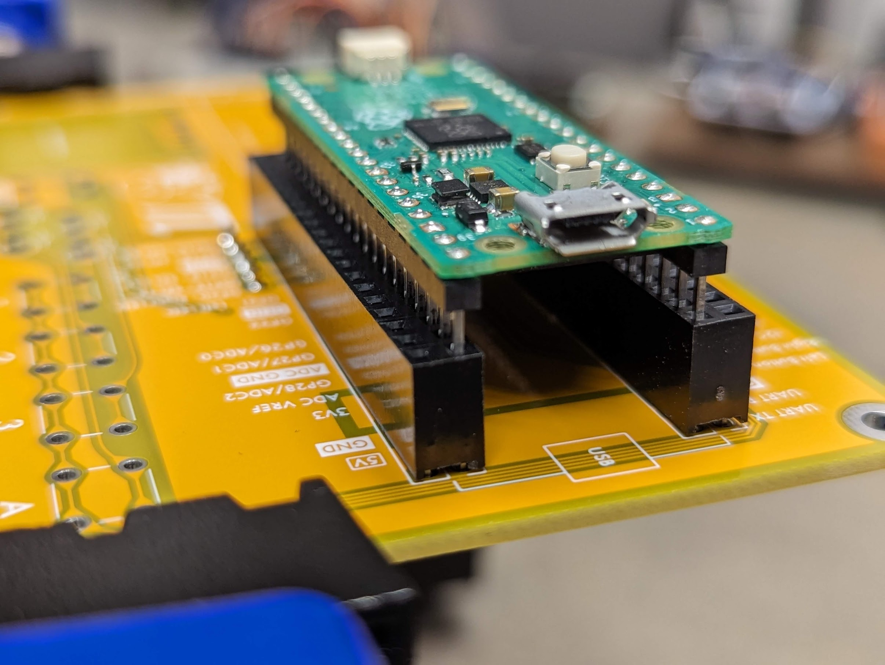

    Aligning the sockets for the Raspberry Pi Pico.

Despite your best efforts, the lower socket probably is not perfectly perpendicular to the circuit board.
That's okay, because it's more important that the lower socket and the upper socket be parallel to each other.
You will use the Raspberry Pi Pico as a jig to assure this alignment

:\:[   ]: Insert one of the 2x20 female headers into the upper set of holes for the Raspberry Pi Pico (the set that includes the labels ``UART TX`` and ``UART RX``).

:\:[   ]: Rest the Raspberry Pi Pico's pins in the inner set of holes in each socket.

:\:[   ]: Gently press on both ends of the Raspberry Pi Pico, inserting it into the sockets *just enough* that a light tug will not remove the Pico from the sockets (:numref:`mk3cAligningUpperSocket`).

..  _mk3cAttachingUpperSocket:
.. figure:: ../../blank.png

    Attaching the upper socket

    +-------+--------------------------------------------------+-------+---------------------------------------------------+
    |       | .. image:: mk3c-images/tacking-upper-socket.jpeg |       | .. image:: mk3c-images/upper-socket-finished.jpeg |
    |       |    :align: center                                |       |    :align: center                                 |
    | **a** |    :width: 90%                                   | **b** |    :width: 90%                                    |
    |       |                                                  |       |                                                   |
    |       | Tacking the upper socket in place.               |       | Both sockets are attached.                        |
    +-------+--------------------------------------------------+-------+---------------------------------------------------+

:\:[   ]: Turn the circuit board over (underside up), and tack the upper socket in place by soldering its four corner pins to the circuit board (:numref:`mk3cAttachingUpperSocket`\ (a)).

:\:[   ]: Turn the circuit board over (topside up), and remove the Raspberry Pi Pico from the sockets.

:\:[   ]: Turn the circuit board over (underside up), and solder the remaining pins to the circuit board (:numref:`mk3cAttachingUpperSocket`\ (b)).

Attach Discrete Components
==========================

..  _mk3cTactileSwitches:
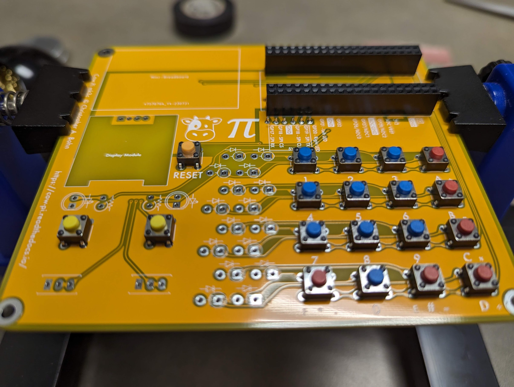

    Tactile switches inserted into the circuit board, ready to be attached.

:\:[   ]: Insert the nineteen tactile switches into the circuit board

    -   Sixteen for the matrix keypad

    -   Two for the left & right pushbuttons

    -   One as a ``RESET`` button

You do not need to tape the tactile switches in place:
the spring tension in their prongs will hold them in place while you solder.

:\:[   ]: Turn the circuit board over, and solder the tactile switches' pins to the circuit board.

..  _mk3cSlideSwitches:
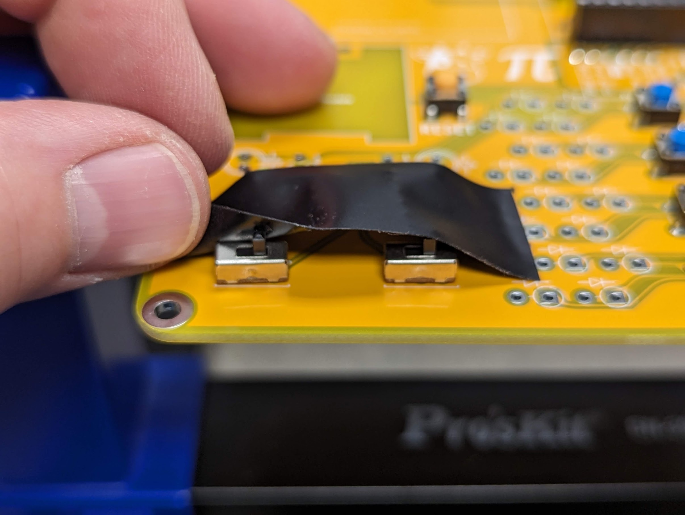

    Slide switches inserted into the circuit board, ready to be attached.

:\:[   ]: Insert the slide switches into their holes, and tape them in place.

:\:[   ]: Turn the circuit board over, and solder the slide switches' pins to the circuit board.

..  _mk3cResistors:
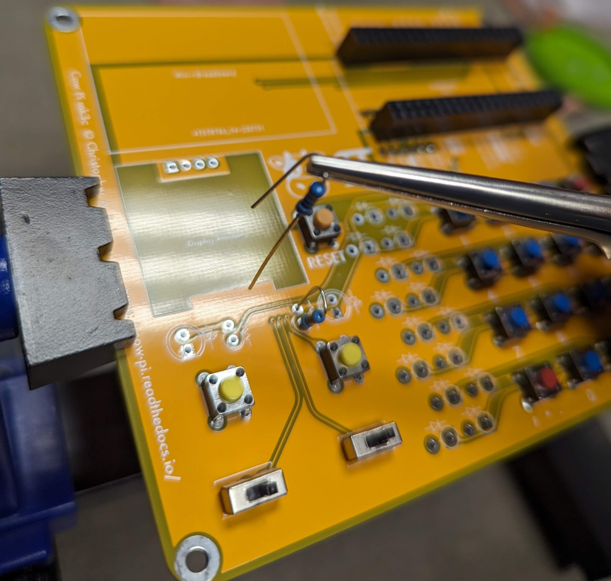

    Inserting the resistors into the circuit board.

:\:[   ]: Place two approximately-90˚ bends in one lead of one of the resistors.

..  TIP::
    If the second bend isn't *quite* 90˚, leaving the two leads slightly oblique to each other, then spring tension will help hold the resistor in place while you solder it to the circuit board.

:\:[   ]: Locate one of the pairs of holes that has a resistor symbol next to it.

:\:[   ]: Insert the resistor into that pair of holes, with the resistor's barrel in the hole surrounded by a circle.

:\:[   ]: Similarly bend one lead of the other resistor, and insert it into the other pair of holes.

:\:[   ]: Turn the circuit board over, and solder the resistor's leads to the circuit board.

:\:[   ]: Snip the excess leads.

..  _mk3cLED:
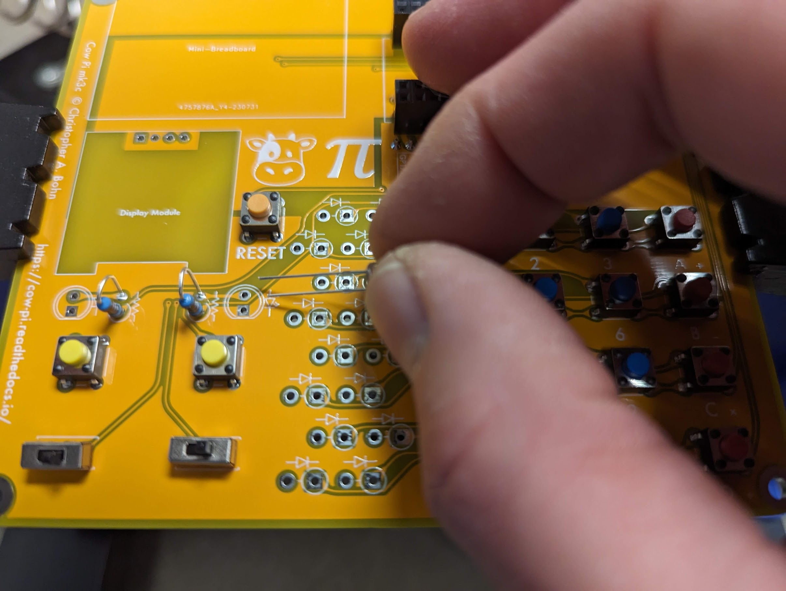

    The LED's shorter lead goes into the square solder pad.

..  IMPORTANT::
    An LED's shorter lead is its cathode, and its longer lead is its anode.
    The LED will not function if it is inserted backwards.

:\:[   ]: Locate the pairs of holes that have LED symbols next to them. Note that the symbols indicate that the cathode should go into the holes with the square solder pads.

..  ATTENTION::
    **CHECKPOINT 2**
    | |checkpoint| you are about to insert the LED's shorter lead into the hole with the square solder pad, and the LED's longer lead into the hole with the round solder pad.

:\:[   ]: Insert the LED into its holes.

:\:[   ]: Insert the other LED into its holes.

:\:[   ]: Tape the LEDs in place, turn the circuit board over, and solder their leads to the circuit board.

:\:[   ]: Snip the excess leads.

..  _mk3cPreparingDiodes:
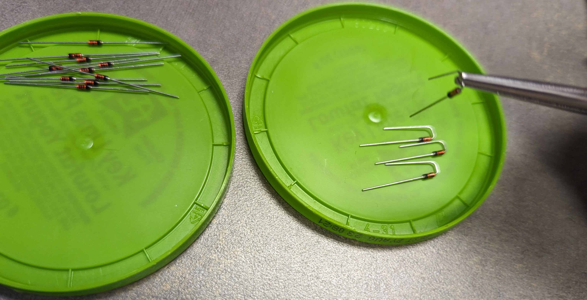

    Preparing the diodes.

..  IMPORTANT::
    A diode's cathode is the end with a bar on the barrel, and its anode is the end opposite the bar.
    The diode will not function if it is inserted backwards.

:\:[   ]: Place two approximately-90˚ bends in the anode lead of one of the diodes.

..  TIP::
    If the second bend isn't *quite* 90˚, leaving the two leads slightly oblique to each other, then spring tension will help hold the resistor in place while you solder it to the circuit board.

..  ATTENTION::
    **CHECKPOINT 3**
    | |checkpoint| you bent the anode lead and *not* the cathode lead.

:\:[   ]: Similarly bend the anode leads of the other fifteen diodes.

:\:[   ]: Locate the pairs of holes that have diode symbols next to them.
        Note that the symbols indicate that the cathode should go into the holes with the square solder pads.
        Notice also that each of these square solder pad have circles surrounding them, further indicating that the diode's barrel should be above this solder pad.

..  _mk3cInsertingDiodes:
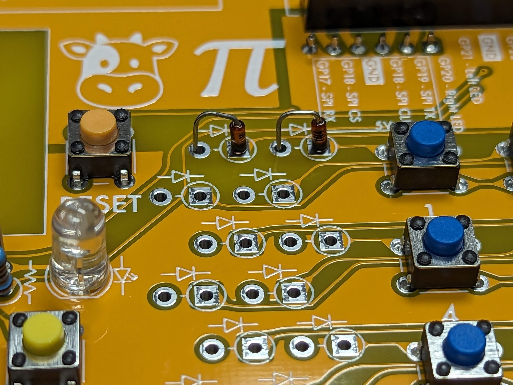

    Diodes inserted into the circuit board.

:\:[   ]: Insert two diodes into the circuit board, with the diode's barrel in the hole surrounded by a circle.
        Consequently, the cathode -- the end with a bar -- should be inserted into the hole with the square solder pad.

..  ATTENTION::
    **CHECKPOINT 4**
    | |checkpoint| the cathode is in the hole with the square solder pad, and the anode is in the hole with the round solder pad.

:\:[   ]: Turn the circuit board over, and solder the diode's leads to the circuit board.

:\:[   ]: Snip the excess leads.

:\:[   ]: Two at a time, insert the remaining diodes, solder their leads to the circuit board, and snip the excess leads.

..  _mk3cSolderingDiodes:
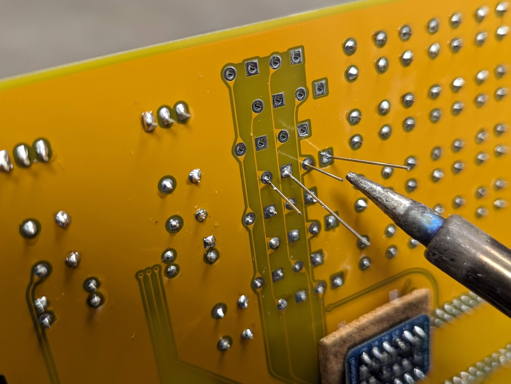

    Soldering diodes to the circuit board.

Attach Display Module
=====================

..  _mk3cDisplayModule:
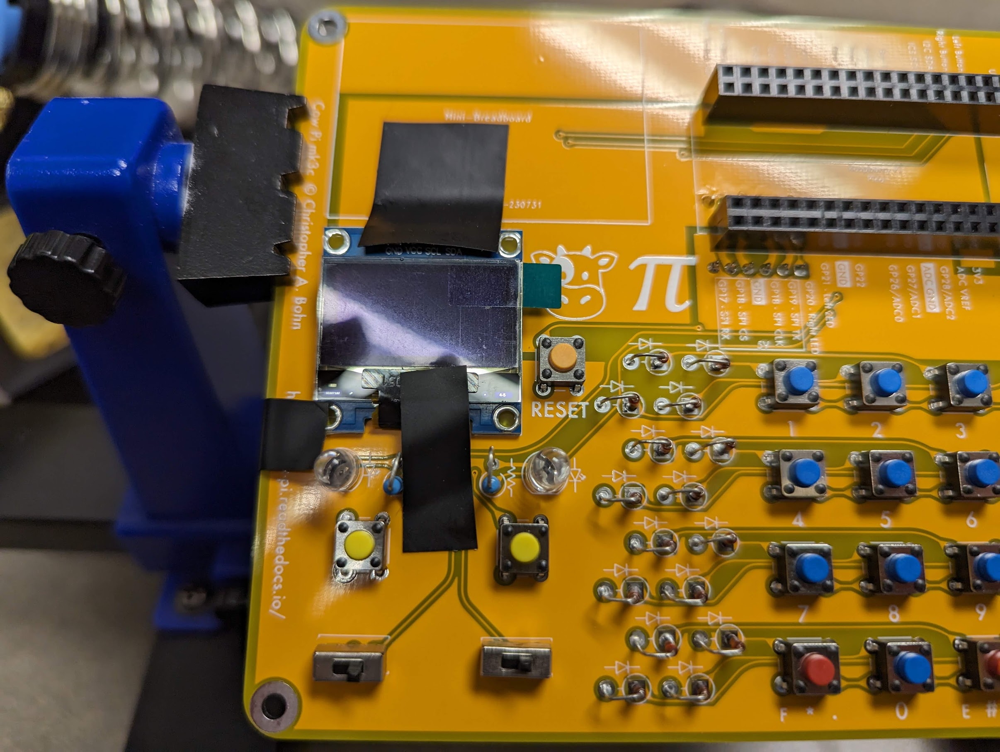

    The display module held to the circuit board with carefully-placed tape.

:\:[   ]: Insert the display module into the circuit board.

:\:[   ]: Attach tape to hold the display module to the circuit board, taking care not to attach tape directly to the display itself.

:\:[   ]: Turn the circuit board over, and solder the display module's pins to the circuit board

Attach Remaining Components
===========================

..  _mk3cFeetAttached:
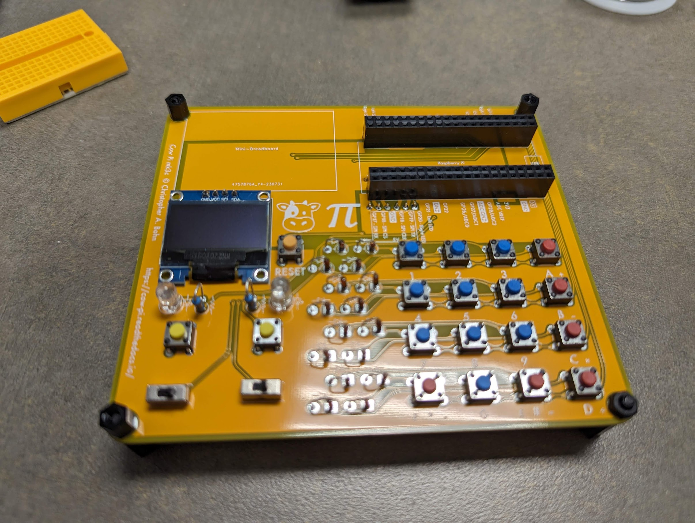

    The circuit board with nylon spacers inserted into the board's mounting holes.

:\:[   ]: Remove the circuit board from the soldering vise.

:\:[   ]: Insert a PCB "foot" into each of the circuit board's mounting holes.

..  _mk3cBreadboardAttached:
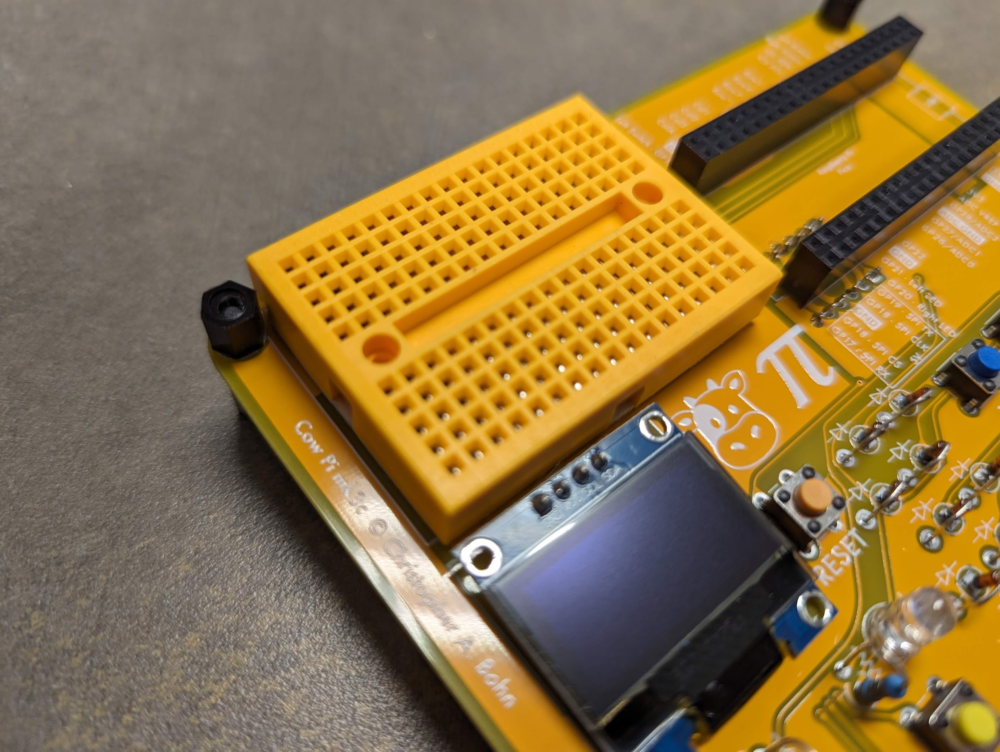

    The circuit board with the mini-breadboard attached.

:\:[   ]: Remove the covering from the mini-breadboard's adhesive backing

:\:[   ]: Place the mini-breadboard in the rectangle labeled "Mini-Breadboard"

..  _mk3cPicoInserted:
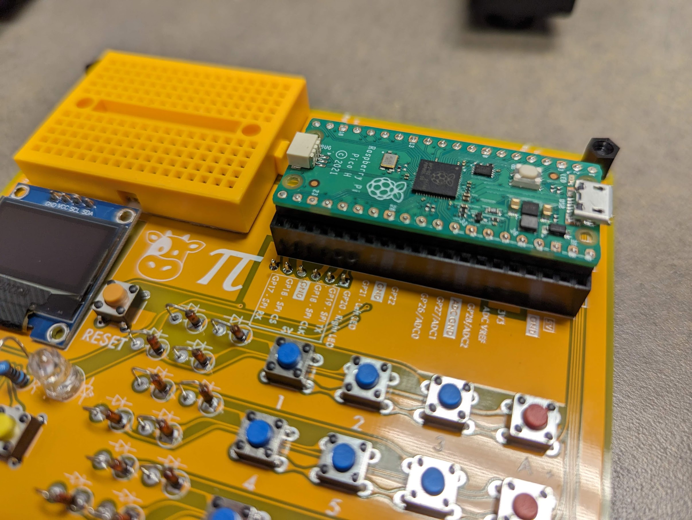

    The circuit board with the Raspberry Pi Pico inserted into its sockets.

:\:[   ]: Rest the Raspberry Pi Pico's pins in the inner set of holes in each socket.
        Be sure that the Pico's USB connector is over the "USB" label on the circuit board.

:\:[   ]: Gently press on both ends of the Raspberry Pi Pico, inserting it fully into the sockets.

|

----

Kit Assembly is Complete
========================

    +--------------------------------------------+-------------------------------------------+
    | .. image:: mk3c-images/complete-front.jpg  | .. image:: mk3c-images/complete-back.jpg  |
    |    :align: center                          |    :align: center                         |
    |    :width: 90%                             |    :width: 90%                            |
    +--------------------------------------------+-------------------------------------------+

You have now finished assembling the Cow Pi mark 3c.

|

..  _mk3cSchematic:
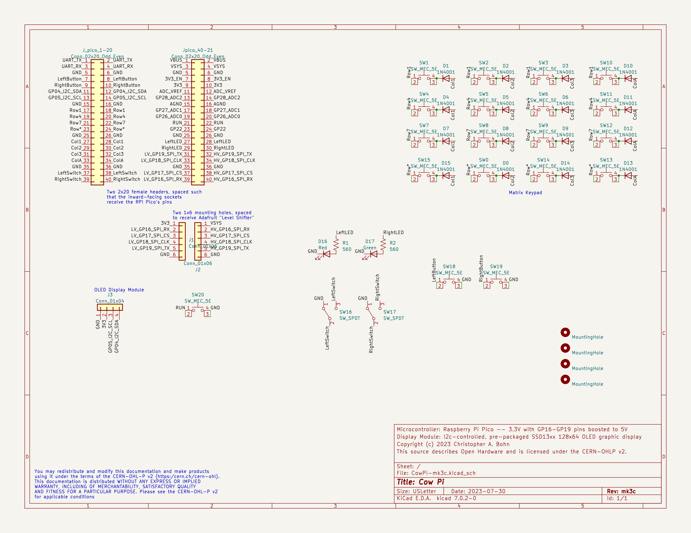

    The schematic diagram of the Cow Pi mark 3c.

|

----

..  [#picos]
    | Three-volt microcontroller boards that have the same form factor as the Raspberry Pi Pico include the original Pico itself, the Raspberry Pi Pico H, the Raspberry Pi Pico W, and the Raspberry Pi Pico WH.

..  |checkpoint| replace:: Before proceeding further, have a TA, a classmate, or a friend verify that