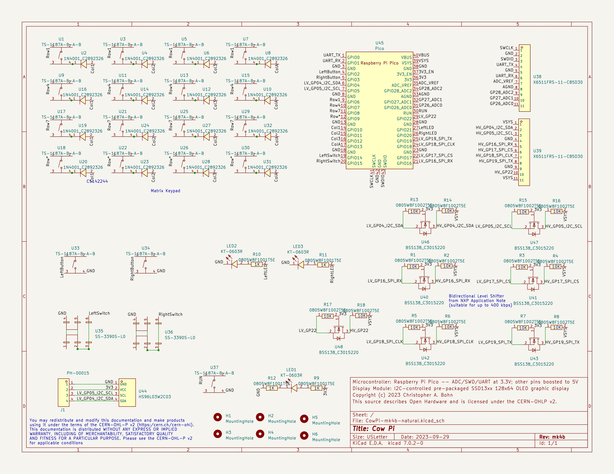

**************************************************************************************************************
Cow Pi mark 4b Assembly Instructions (Raspberry Pi Pico, SSD1306 OLED graphic display via |i2c| communication)
**************************************************************************************************************

This is a minimal set of instructions but should be sufficient if you are using a fully-populated Cow Pi mk4b.
A more detailed set of instructions that include other options will be available soon.

..  contents::
    :depth: 2

----

Prepare to Assemble the Cow Pi mark 4b
======================================

Required and Optional Components
--------------------------------

The components for a Cow Pi mk3c development board are:

-   One (1) Cow Pi mk4b printed circuit board, populated at a PCBA facility

    -   `Gerber files <https://github.com/DocBohn/CowPi_hardware/blob/main/mark-4/CowPi-mk4b-natural-gerber.zip>`_
    -   `BOM file <https://github.com/DocBohn/CowPi_hardware/blob/main/mark-4/CowPi-mk4b-natural.csv>`_ (optimized for JLCPCB)
    -   `Pick & Place file <https://github.com/DocBohn/CowPi_hardware/blob/main/mark-4/CowPi-mk4b-natural-top-pos.csv>`_ (optimized for JLCPCB)
    -   `KiCad files <https://github.com/DocBohn/CowPi_hardware/tree/main/mark-4/CowPi-mk4b-natural>`_

-   One (1) Raspberry Pi Pico with headers

    -   Shown are a Raspberry Pi Pico H, which has the headers pre-attached, and an original Raspberry Pi Pico, which does not have the headers pre-attached.
        This is to illustrate the two options;
        you only need one Pico, not two.

-   Six (6) PCB "feet", or adhesive rubber or silicone "bumper pads"

-   One (1) mini-breadboard with adhesive backing

Tools
-----

-   Diagonal cutters or end cutters

Final Assembly Instructions
===========================

:\:[   ]: The display module's header pins extend a few millimeters beyond the backside of the PCB.
        Using the diagonal cutters or end cutters, trim the display module's header pins so that they are shorter than the PCB feet or bumper pads.

:\:[   ]: Attach the PCB feet or bumper pads:

        -   If you have PCB feet, insert them into the mounting holes.

        -   If you have rubber or silicone adhesive bumper pads, attach four of them on the backside of the PCB near the corner mounting holes.
            Attach the remaining two bumper pads longitudinally center, near the edges of the PCB; you can use the through-holes that run along the edges of the Raspberry Pi Pico as a guide.

:\:[   ]: Remove the covering from the mini-breadboard's adhesive backing

:\:[   ]: Place the mini-breadboard in the rectangle labeled "Mini-Breadboard"

You have now finished assembling the Cow Pi mark 4b.

|

..  _mk4bSchematic:

    The schematic diagram of the Cow Pi mark 4b.