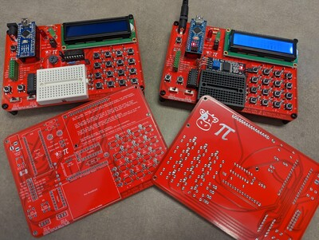
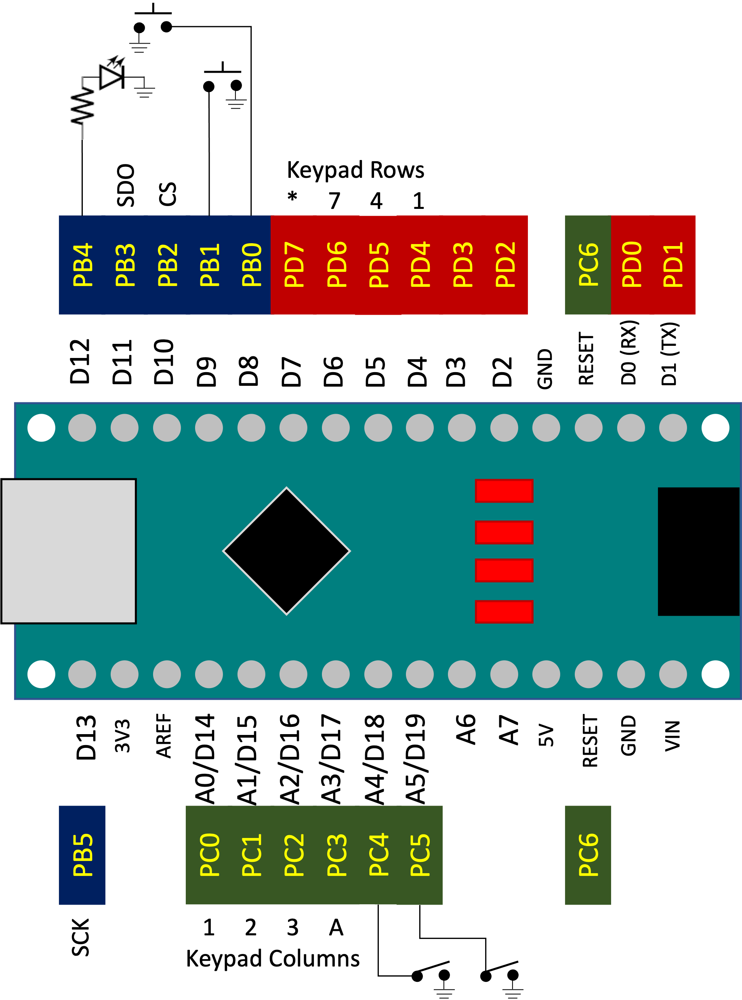
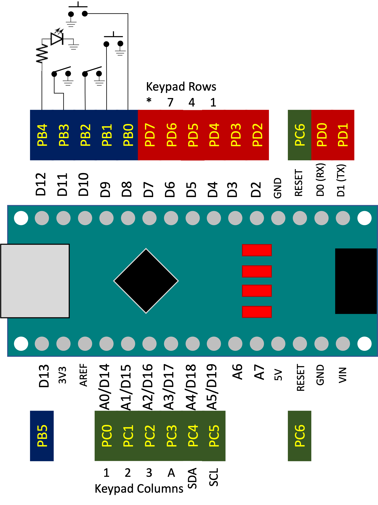

.. |i2c| replace:: :math:`\mathrm{I}^2\mathrm{C}`

**********************
Hardware [#copyright]_
**********************

This section describes the Cow Pi development boards, describes the theory of operation for its components, and summarizes the features of its display module.

.. IMPORTANT::
    If you need to construct a Cow Pi development board, see the :doc:`construction`.

Cow Pi Development Board Overview
=================================

The Cow Pi development board consists of:

- a microcontroller board, such as an Arduino Nano, an Arduino Uno, or a Raspberry Pi Pico
- a display module, such as a MAX7219-driven 8-digit/7-segment display, an HD44780-driven LCD character display, or an SSD1306-driven OLED graphic display
- a :math:`4 \times 4` matrix keypad
- two momentary buttons
- two toggleable switches, and
- at least two LEDs

Cow Pi mk1 boards are assembled on solderless breadboards:

.. image:: hardware/mk1a.jpg
    :height: 3cm
    :alt: yada
.. image:: hardware/mk1d.jpg
    :height: 3cm
    :alt: yada

Cow Pi mk2 boards are assembled on perfboards:

.. image:: hardware/mk2a.jpg
    :height: 3cm
    :alt: yada
.. image:: hardware/mk2b-1.jpg
    :height: 3cm
    :alt: yada
.. image:: hardware/mk2c.jpg
    :height: 3cm
    :alt: yada

Cow Pi mk3 boards are assembled on through-hole PCBs:

Cow Pi mk4 boards are assembled on surface-mount PCBs.

*(no image available)*

The toggleable switches are referred to as the **left switch** and the **right switch**, and each can be positioned in the left or right position.
When a switch is in the right position, its logic value is high, by way of a pull-up resistor.
When a switch is in the left position, the switch is grounded, and its logic value is low.

The momentary buttons are referred to as the **left button** and the **right button**, and each can be pressed (alternatively, in the down position) or unpressed (alternatively, in the up position).
The buttons are normally-open, and so when a button is unpressed, its logic value is high, by way of a pull-up resistor.
When a button is pressed, the button is grounded, and its logic value is low.

The LEDs are referred to as the **left LED** and the **right LED**.
An LED will illuminate when the corresponding microcontroller output is high, and it will deluminate when the corresponding microcontroller output is low.
Most of the microcontroller boards incorporated into Cow Pi designs have an LED mounted on the microcontroller board itself, which we refer to as the **internal LED**.
The internal LED on Arduino boards also serves as the left LED.
The internal LED on Raspberry Pi Pico boards are a distinct, third LED.

The matrix keypad is designed to be scanned using the conventional approach of selectively setting the rows’ logic values and reading the columns’ resulting logic values.

.. WARNING::
    The matrix keypads used in the Cow Pi mk1 designs and the mk2a & mk2b designs cannot safely have multiple keys simultaneously pressed.
    Certain key combinations will result in a short circuit.
.. IMPORTANT::
    The matrix keypad used in the Cow Pi mk2c design cannot reliably read more than two simultaneously-pressed keys.
    Certain key combinations will result in unpressed keys falsely being detected as pressed.
.. NOTE::
    The matrix keypad used in the Cow Pi mk3 & mk4 designs use general-purpose diodes to isolate the keys.
    Any combination of up to 16 simultaneously-pressed keys can safely and reliably be read on Cow Pi *mk3 & mk4 designs only*.

The microcontroller communicates with the display module using either
the Serial Peripheral Interface (SPI) protocol or
the Inter-Integrated Circuit (|i2c| or IIC) protocol, also known as the Two-Wire Interface (TWI) protocol.

These figures show which input or output is connected to each of the unknown’s pins,
as well as which general-purpose input/output register bit corresponds to each pin:

    Pinout for the mk1c Cow Pi development board using Arduino Nano and the SPI serial communication protocol.

    Pinout for the mk1d Cow Pi development board using Arduino Nano and the |i2c| serial communication protocol.

.. toctree::

    hardware/boards
    hardware/inputs
    hardware/outputs

..  [#copyright]
    | Cow Pi hardware design ©2021–23, Christopher A. Bohn, and licensed under the `CERN-OHLP v2 <https://cern.ch/cern-ohl>`_ License.
