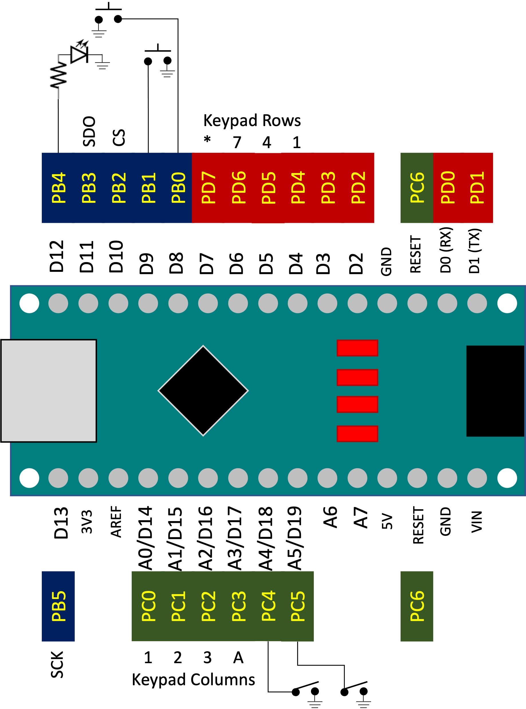
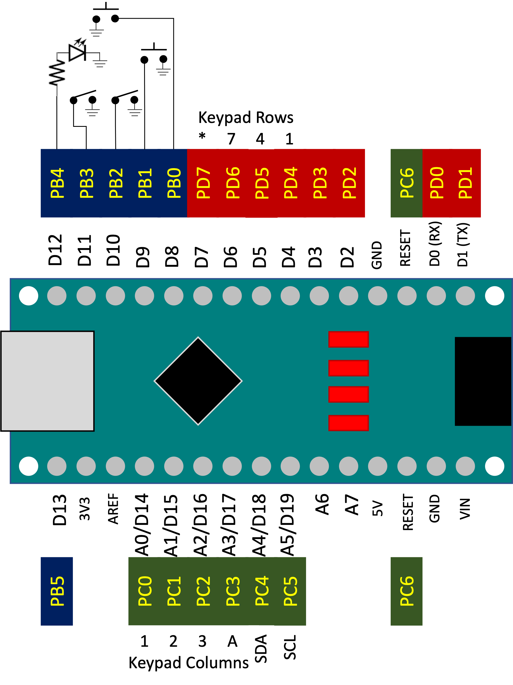
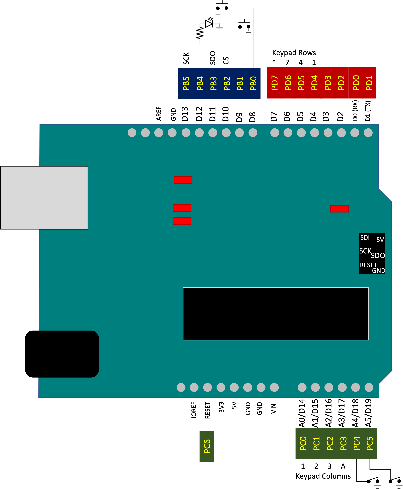
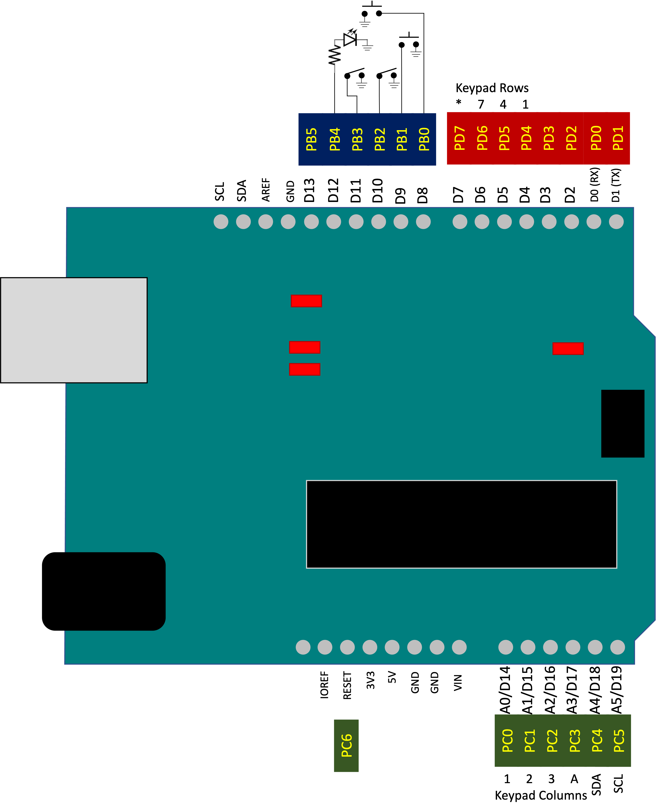
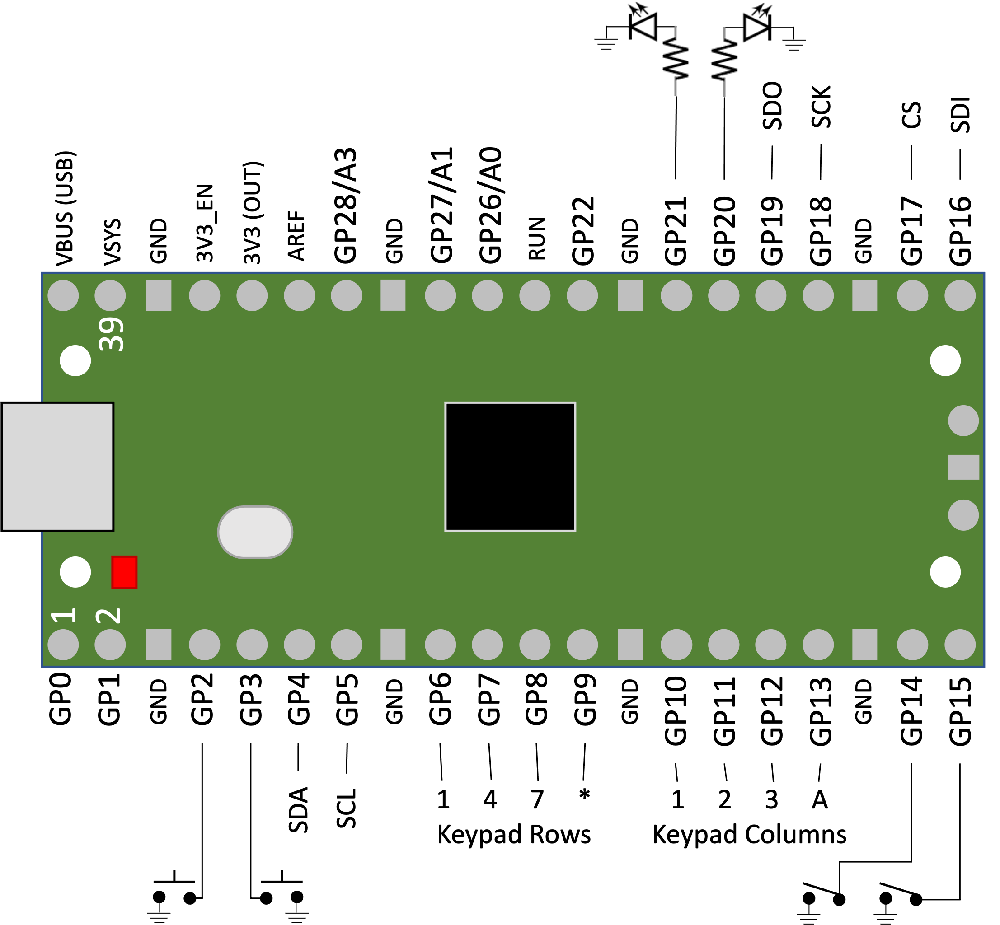

Microcontroller Boards
======================

A microcontroller, such as the ATMega328P on the Arduino Nano, or the RP2040 on the Raspberry Pi Pico, is a very simple processor when compared to a microprocessor designed for general-purpose computing.
At the same time, a microcontroller has some features not present on a microprocessor, such as built-in analog-to-digital converters (ADCs).
A small amount of built-in SRAM, flash memory, and a conventional EEPROM are also common.

A microcontroller board, such as the Arduino Nano or Raspberry Pi Pico, combines the microcontroller with other components in a form factor convenient for experimentation.
These additional components probably include a USB interface, a voltage regulator, one or more :ref:`LEDs`, and a crystal oscillator (though some boards use microcontroller features to omit the oscillator and reduce costs if precise timing isn't critical).
Other components might include a Wifi/Bluetooth radio, a gyroscope, a microphone, and other sensors.

There are Cow Pi designs that make use of the Arduino Nano family (Nano, Nano Every, Nano 33 IOT, Nano 33 BLE), the Arduino Uno, the Arduino Mega 2560, and the Raspberry Pi Pico.
Designs that use other microcontroller boards may exist in the future.
For the purposes of lab assignments that use the Cow Pi, we focus on the microcontroller; any additional components are treated as :doc:`../expansion`.

Microcontrollers are Simple Processors
--------------------------------------

We noted that microcontrollers are simple processors when compared to general-purpose microprocessors.
Many "basic" optimizations in microprocessors are eschewed in lower-end microcontrollers (and for many embedded systems, lower-end microcontrollers are quite sufficient).
The drive is to make microcontrollers simple, small, power-efficient, able to work with very limited memory, and inexpensive.

For example, though we are well past the peak of the megahertz/gigahertz wars when we saw microprocessors with 30 or more stages in their pipelines, 8-12 stage pipelines are still fairly common for microprocessors.
Many microcontrollers have but two or three stages in their pipelines.
Microprocessors typically have virtually-addressed memories with gigabytes of DRAM for main memory and three cache layers SRAM.
In a microcontroller, you can expect to see kilobytes of physically-addressed SRAM for memory.
Instead of a using a branch prediction scheme even as simple as "predict taken", microcontrollers often have "predict not taken"
-- which is usually wrong but is very, very simple to implement
-- or leave a branch delay slot that the compiler can fill with an instruction that doesn't depend on the branch's outcome.

While variable-length instructions are usually more memory-efficient, microcontrollers (along with microprocessors) designed in the past 40 years generally have gravitated to RISC designs, including fixed-length instructions.
They reduce the size of the program image by using 16-bit instruction words instead of the more-common 32-bit instruction words that you would see in a RISC microprocessor design.

Pinout Diagrams
---------------

These figures show which input or output is connected to each of the microcontroller boards' pins for the current Cow Pi designs,
as well as which general-purpose input/output microcontroller register bit corresponds to each pin:

..  _NanoPinoutSPI:

    Pinout for the mk1e and mk3a Cow Pi development board using the Arduino Nano and the SPI serial communication protocol.

..  _NanoPinoutI2C:

    Pinout for the mk1f and mk3a Cow Pi development board using the Arduino Nano and the |i2c| serial communication protocol.

..  _UnoPinoutSPI:

    Pinout for the mk3b Cow Pi development board using the Arduino Uno and the SPI serial communication protocol.

..  _UnoPinoutI2C:

    Pinout for the mk3b Cow Pi development board using the Arduino Uno and the |i2c| serial communication protocol.

..  _PicoPinout:

    Pinout for the mk3c Cow Pi development board using the Raspberry Pi Pico.

