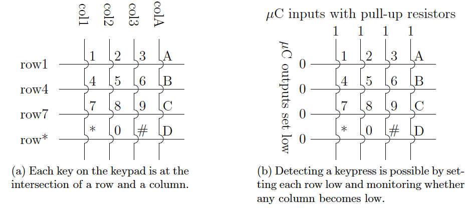
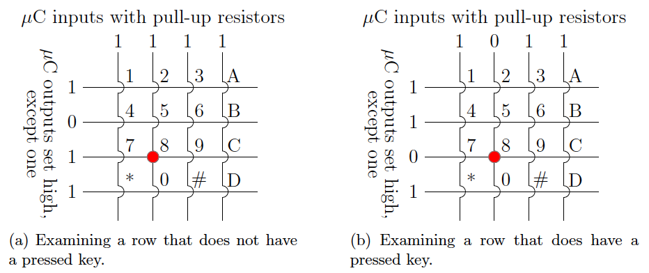

Input Devices
=============

TODO

Switches and Buttons
--------------------

TODO

Theory of Operation
^^^^^^^^^^^^^^^^^^^

TODO

Reading the Devices' Positions
^^^^^^^^^^^^^^^^^^^^^^^^^^^^^^

TODO

Matrix Keypad
-------------

TODO

Theory of Operation
^^^^^^^^^^^^^^^^^^^

Each key on a matrix keypad is a normally-open, momentary button that resides at the intersection of a row and a column;
see :numref:`prepareToDetect`\ (a).
When pressed, the key closes an electrical connection between that row and column.
On the Cow Pi, each row is connected to an output pin on the microcontroller, and each column is connected to an input pin with a pull-up resistor.

Because the input pins that the columns are connected to use pull-up resistors, the logic value on these pins will normally read high (boolean 1).
A column will read as logic low (boolean 0) only when it is electrically connected to a row that is set low.
An application developer can take advantage of this by setting all of the rows' pins to logic low (boolean 0);
see :numref:`prepareToDetect`\ (b).
When a key is pressed, its column will then become low.

.. _prepareToDetect:

    Preparing a matrix keypad to detect keypresses.

A keypress, thus, can be detected based on the values read from the columns' pins.
An application programmer can poll the four columns' pins.
If, collectively, they produce the bit vector 0xF, then no key is being pressed;
however, if the bit vector is anything other than 0xF, then at least one key is being pressed.
As an alternative to polling, a pin-change interrupt that is triggered by a change on the columns' pins can be used to indicate that a key has been pressed (see Section `5 <#sec:Interrupts>`__).

Once it has been determined that a key is pressed, code that scans the keypad should execute.
If every row is made logic-high *except* for one row, then the code can determine whether the key that was pressed is in that row.
For example, as shown in
:numref:`scanningKeypad`\ (a), if the "8" key is pressed and "row4" is the only logic-low row, then the column bit vector is 0xF, and so the pressed key is not in that row.
But, as shown in :numref:`scanningKeypad`\ (b), if "row7" is the only logic-low row, then the column bit vector is not 0xF, and so the pressed key is in that row; moreover, because "col2" is now logic-low, the code can establish that the pressed key is at the intersection of "row7" and "col2," *i.e.*, the "8" key.

.. _scanningKeypad:

    Scanning a matrix keypad.
    The red dot indicates which key is being pressed.

After the code has determined which row and column the pressed key is on, it can return a value or assign a value to a variable accordingly.
This might be a ``char`` corresponding to the character on the key's face, as is the case for **``cowpi_get_keypress``** (Section `2.4 <#subsec:ScannedInputs>`__).
Or this might be an ``int`` corresponding to the value of the numeral on the key's face.
Or this might even be some value unrelated to whatever is printed on the key's face.

Scanning the Keypad
^^^^^^^^^^^^^^^^^^^

There are a few options for obtaining the value corresponding to a key that is pressed on the keypad.
The most efficient for a simple application is to use a lookup table.
For example, if you need to return a character that corresponds to the face value of the key that was pressed, then the lookup table would be:

.. math::

    keys :=
        \left(\begin{array}{cccc}
            '1' & '2' & '3' & 'A' \\
            '4' & '5' & '6' & 'B' \\
            '7' & '8' & '9' & 'C' \\
            '*' & '0' & '\#' & 'D'
        \end{array}\right)

If the keypad is wired to the microcontroller such that four contiguous output pins are connected to the rows and four contiguous input pins are connected to the columns (as is the case for the Cow Pi), then this pseudocode will scan the keypad and determine which key, if any, is pressed.

.. code-block::
    :linenos:

    ∀row:
        row_bit_vector := 0b1111    (* set all rows to 1 *)
        row_bit_vector(row) := 0    (* except the row we're currently examining *)
        wait at least one microcontroller clock cycle
        ∀column:
            if (column_bit_vector(column) = 0):
                key_pressed := keys(row,column)
    row_bit_vector := 0b0000        (* set all rows to 0 to detect the next keypress *)

.. NOTE::
    This pseudocode will report at most one key pressed;
    it would have to be modified to report multiple keys pressed.

    This software limitation is not a limitation for mark 1 Cow Pis, as mark 1 Cow Pis have a hardware limitation:
    their keypads have no protection against shorting power to ground when two keys are pressed simultaneously.

The delay shown in line 4 is sometimes, but not always necessary.
There is a slight delay between setting a pin's output value and being able to detect the change by reading a different pin's input value.
Some realizations of the pseudocode attempt to read the change before it can be read reliably;
this usually manifests as one of the keypad's columns not being readable.
The fix is to introduce a delay of at least one clock cycle (strictly speaking, one clock cycle is more than enough, but a shorter delay is not possible).
For our purposes, this should be managed by introducing a 1\ :math:`\mu`\ s delay using the Arduino core library's **``delayMicroseconds()``**.
