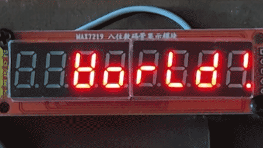

Output Devices
==============

Unless implementing :doc:`../expansion`, the Cow Pi circuit's output devices are simple light emitting diodes and a display module, described here.

..  contents:: \
    :depth: 4

..  _LEDs:

Light Emitting Diodes (LEDs)
----------------------------

An idealized diode allows current to flow in only one direction,\ [#reverseCurrent]_ which is why we keep track of which end is tha anode and which is the cathode.

..  _diode:
..  tikz:: In a diode, conventional current flows from the anode to the cathode (or, equivalently, electrons enter through the cathode and leave through the anode).
    :align: center

    \begin{tikzpicture}[x=.05in, y=.05in]
        \draw (5,0) -- (2,0);
        \draw (-5,0) -- (-2,0);
        \draw (-2,2) -- (-2,-2) -- (2,0) -- (-2,2);
        \draw (2,2) -- (2,-2);
        \draw (8.8,0) node {\tiny cathode};
        \draw (-8,0) node {\tiny anode};
    \end{tikzpicture}

A light emitting diode, or LED, is a diode designed to emit light.\ [#goodName]_

..  _led:
..  tikz:: A light emitting diode emits light when current flows
    :align: center

    \begin{tikzpicture}[x=.05in, y=.05in]
        \draw (5,0) -- (2,0);
        \draw (-5,0) -- (-2,0);
        \draw (-2,2) -- (-2,-2) -- (2,0) -- (-2,2);
        \draw (2,2) -- (2,-2);
        \draw (1,2) -- ++(1,1) -- ++(.25,-.25) -- ++(.25,.75) -- ++(-.75,-.25) -- ++(.25,-.25);
        \draw (.1,2.5) -- ++(1,1) -- ++(.25,-.25) -- ++(.25,.75) -- ++(-.75,-.25) -- ++(.25,-.25);
    \end{tikzpicture}

Theory of Operation
^^^^^^^^^^^^^^^^^^^

A full discussion of the material science behind semiconductors is beyond the scope of this datasheet.
The short version is that when making solid state electronics, the extrinsic semiconductor metal is *doped* with impurities.
Some dopants cause the semiconductor material to have excess electrons in the valent shell, creating a region with excess negative charge ("N-type").
Other dopants cause the semiconductor material to a shortage of electrons in the valent shell -- typically expressed as an excess of *holes* -- creating a region with excess positive charge ("P-type").

In a diode, when the voltage at the anode is sufficiently higher than the voltage at the cathode, electrons in the N region are able to leave the valent shell, cross the depletion region at the PN junction, and fill a hole.
Meanwhile, new electrons enter through the cathode, replacing those that crossed the PN junction, and electrons leave through the anode, causing new holes to replace those that were filled.
The mental image is of electrons moving away from the cathode toward the PN junction, and of holes moving away from the anode toward the PN junction.

Because of the quantum nature of electron shells, light will *always* be emitted when an electron fills a hole.
In ordinary diodes, we don't see this light because it might not be in the visible spectrum, most of the light is "lost" to internal reflection in the semiconductor material, and the opaque casing blocks what little light might be emitted.
In LEDs, the dopants are selected to cause the emission to be at a very particular frequency.\ [#blueLED]_
Additional material is added to the semiconductor material to reduce internal reflection at that frequency.
And, of course, the casing is translucent.

To avoid damaging the LED, the amount of current flowing through it must be limited -- each LED's datasheet specifies the maximum forward current.
A very conventional approach, which is used in the Cow Pi circuit, is to add a current limiting resistor.
Ohm's Law allows us to determine the minimum resistance needed: :math:`R \geq \frac{V_{CC}}{I_{f_{max}}}`
Your actual choice of resistance strikes a balance between the desired brightness, not stressing the microcontroller's ability to dissipate heat at the pins, and not dipping too deep into your electrical current budget. [#currentBudget]_

Illuminating/Deluminating an LED
^^^^^^^^^^^^^^^^^^^^^^^^^^^^^^^^

If you have an external power source other than the microcontroller board's voltage regulator, then using a transistor to enable and disable current flow through the LED is a good way to reduce the current at the microcontroller's pins to a few microamps.
If all current is sourced from a USB cable through the microcontroller board, then using a transistor in that manner only adds to the circuit's complexity while offering little benefit.
For this reason, we drive the LEDs directly from the microcontroller board's pins.

There are advantages to designing the circuit so that placing the pin at logic high causes the LED to illuminate,
and there are advantages to designing the circuit so that placing the pin at logic low causes the LED to illuminate.
In the end, we chose to be consistent with the built-in LEDs on the microcontroller boards used for the Cow Pi:
logic high (boolean 1) causes the LED to illuminate, and logic low (boolean 0) causes the LED to deluminate.

The CowPi library's :func:`cowpi_setup` function configures the pins that drive the LEDs as output pins, along with other configuration settings.
That done, illuminating/deluminating an LED is as simple as setting the pin's logic value.
If you are not writing code using memory-mapped I/O, then you would do this with Arduino's ``digitalWrite()`` function or the Raspberry Pi SDK's ``gpio_put()`` function.
If you are writing code using memory-mapped I/O, then you would set the pin's bit in the I/O bank's output register, as described in the :doc:`../microcontroller` Section.
If the LED should be dark, then set the bit to 0.
If the LED should be lit up, then set the bit to 1.

..  NOTE::
    When using the Arduino Nano or Arduino Uno microcontroller board, the pin used for the internal LED (the Cow Pi's left LED) is also used as the clock pin for SPI communication.
    If you are making frequent updates to the display module through SPI, this will likely render the left LED unusable.
    You can safely assume that any lab assignments will take this into account.

..  NOTE::
    When using the Arduino Nano or Arduino Uno microcontroller board, the pin used for the Cow Pi's right LED is also used as the data pin for the Controller-In/Peripheral-Out SPI mode.
    Unless needed for one of the :doc:`../expansion`, we will not use this particular SPI mode.
    However, when SPI is enabled, the SPI hardware overrides that pin's settings, changing it to an input pin.

    As described in the :ref:`atmega328pSPI` Section for the ATmega328P, the CowPi_stdio library handles this by enabling SPI only long enough to transmit data to the display module, and disabling SPI immediately thereafter.
    You may notice the right LED briefly dimming when you send updates to the display module through the SPI.

To Learn More
^^^^^^^^^^^^^

Adafruit and SparkFun have pages where you can learn more about LEDs:

-   `All About LEDs <https://learn.adafruit.com/all-about-leds?view=all>`_ at Adafruit
-   `Light-Emitting Diodes (LEDs) <https://learn.sparkfun.com/tutorials/light-emitting-diodes-leds>`_ at SparkFun

|

Display Modules
---------------

While it is possible to perform textual output (and input) through the serial terminal, we find it more interesting -- and usually more meaningful -- to provide textual and numerical output on a display module in the Cow Pi circuit, leaving the serial terminal for debugging and logging purposes.
While the :doc:`../stdio` provides functions for fine-grained control of the display modules, we recommend using the higher-level interface that makes use of C file streams.

Each of the display modules described below makes use of the Serial-Parallel Interface (SPI) and/or the Inter-Integrated Circuit (|i2c|) protocol to send data to the display modules using as few wires as possible.
We have found that an interesting memory-mapped I/O exercise is to manipulate the registers for these communication protocols to send data to the display modules.

Specific Display Modules
^^^^^^^^^^^^^^^^^^^^^^^^

The overall Cow Pi hardware design is largely flexible for the choice of display module.
We generally assume there is only one display module in the circuit, but this is not a hard-and-fast requirement.
The CowPi_stdio library, however, only supports a limited number of display modules --
those currently available are so either because we have used them in lab assignments (such as the 8-digit/7-segment display and the LCD character display)
or because they are relatively low-hanging fruit from earlier efforts put into the library (such as the LED matrix display).

|

..  _hd44780:

HD44780-driven LCD Character Display
""""""""""""""""""""""""""""""""""""

..  image:: ../CowPi_stdio/img/lcd1602.gif
    :alt: An LCD character display demonstrating the uses of ASCII control characters.

..  seealso::
    :doc:`../CowPi_stdio/lcd_character`

The |hd44780Reference|_ "dot-matrix liquid crystal display controller and driver LSI displays alphanumerics, Japanese kana characters, and symbols."
It can receive updates with 12 bits (4 control bits plus a byte to be acted upon) or with 8 bits (4 control bits plus a halfbyte to be acted upon).
While these display modules *can* be driven directly from a microcontroller, Cow Pi circuits use a serial adapter (either a |74hc595Reference|_ or |74ahct595Reference|_ shift register for SPI, or a |pcf8574Reference|_, or an |adafruitAdapterReference|_).

The CowPi_stdio :func:`add_display_module` function (which is called by the CowPi :func:`cowpi_setup` function) configures a HD44780-based display module so that it can be controlled with 8 bits in parallel.
One of the tradeoffs is that each character or command byte must be transmitted as two halfbytes.
The CowPi_stdio library takes care of dividing the full byte into two halfbytes and passing each halfbyte to :var:`cowpi_hd44780_send_halfbyte` in the appropriate order.

..  IMPORTANT::
    When a halfbyte is passed to :var:`cowpi_hd44780_send_halfbyte`, it will be in the lower 4 bits of the ``halfbyte`` argument, regardless of which of the two halfbytes it is.

The serial adapter converts the serial data coming from the microcontroller into the parallel data that the display module requires.
For this to be effective, the function must pack the bits in the order that the serial adapter expects.

Data Byte for LCD1602 Display Module
''''''''''''''''''''''''''''''''''''

The ``COWPI_DEFAULT`` bit order is described in :numref:`tableHD44780Bits`.
When constructing a byte to place in the SPI or |i2c| Data Register:

..  _tableHD44780Bits:
..  flat-table:: The ``COWPI_DEFAULT`` mapping of |i2c| data bits to HD44780 bits.
    :stub-columns: 1
    :align: center

    *   -   Data Register
        -   Bit7
        -   Bit6
        -   Bit5
        -   Bit4
        -   Bit3
        -   Bit2
        -   Bit1
        -   Bit0
    *   -   HD44780 Bit
        -   D7
        -   D6
        -   D5
        -   D4
        -   BT
        -   EN
        -   RW
        -   RS
    *   -   Bit source
        -   :cspan:`3` ``halfbyte << 4``
        -   backlight on/off
        -   latch data
        -   read/write
        -   ``!is_command``

Bits 7..4
    The upper four bits are the ``halfbyte`` argument passed to **COWPI_HD44780_SEND_HALFBYTE()**, left-shifted four places.

Bit 3
    Bit 3 is a 1 if you want the display module's backlight to illuminate, or 0 if you want it deluminated.\ [#backlight]_

Bit 2
    As described below, bit 2 is used to send a pulse to the HD44780 that instructs the display module that it should latch-in the halfbyte that it has received.

Bit 1
    Bit 1 informs the HD44780 whether data is being sent to it, or if a data request is being made of it;
    while it is possible to query the display module's memory, the CowPi_stdio library does not support this feature, and bit 1 should always be 0.

Bit 0
    Bit 0 informs the HD44780 whether the halfbyte that it receives is part of a command or is part of a character;
    if the ``is_command`` argument passed to **COWPI_HD44780_SEND_HALFBYTE()** is ``true``, then bit 0 should be 0; otherwise, bit 0 should be 1.

Data Byte Sequence
''''''''''''''''''

..  IMPORTANT::
    If you are going to write code to transmit data to a display module, see the :doc:`../microcontroller` for the specific mechanism to transmit a data byte for your particular microcontroller.

When the function executes the SPI Controller-Out/Peripheral-In sequence or the |i2c| controller-transmitter sequence (see the pseudocode in the :ref:`atmega328pControllerTransmitterSequence` Section), it will have three (3) data bytes to transmit.

#.  First, the halfbyte needs to be sent *without* yet instructing the display module to latch-in the halfbyte:

    ..  code-block:: pascal

        bitwise_or(
            (halfbyte << 4),
            ((1 if backlight_on else 0) << 3),
            (0 << 2), (* not yet latching halfbyte *)
            (0 << 1),
            ((0 if is_command else 1) << 0)
        )

#.  Second, the start of the "latch pulse" needs to be sent:

    ..  code-block:: pascal

        bitwise_or(
            (halfbyte << 4),
            ((1 if backlight_on else 0) << 3),
            (1 << 2), (* latch the halfbyte *)
            (0 << 1),
            ((0 if is_command else 1) << 0)
        )

    -   **The pulse needs to stay active for at least 0.5𝜇s.**
        While there is a low-level `AVR-libc function <https://www.nongnu.org/avr-libc/user-manual/group__util__delay.html>`_ that can introduce a delay of nearly exactly 0.5𝜇s,
        we recommend introducing a 1𝜇s delay using the |delayMicroseconds|_, which is portable across all devices using the Arduino framework.

#.  Third, the end of the "latch pulse" needs to be sent:

    ..  code-block:: pascal

        bitwise_or(
            (halfbyte << 4),
            ((1 if backlight_on else 0) << 3),
            (0 << 2), (* complete the latch *)
            (0 << 1),
            ((0 if is_command else 1) << 0)
        )

|

MAX7219-driven 8-Digit/7-Segment Display
""""""""""""""""""""""""""""""""""""""""

..  seealso::
    :doc:`../CowPi_stdio/seven_segment`

The `MAX7219 <https://www.analog.com/media/en/technical-documentation/data-sheets/max7219-max7221.pdf>`_ is "serial input/output common-cathode display drivers that interface microprocessors (µPs) to 7-segment numeric LED displays of up to 8 digits, bar-graph displays, or 64 individual LEDs."
The MAX7219 receives data from the microcontroller exclusively via the SPI protocol.
It has a 2-byte shift register (though only the lower 12 bits are used), so the microcontroller transmits two bytes between setting the chip select line low and setting it high.
The MAX7219 expects the word to arrive most significant bit first, which means that the most significant byte needs to be the first of the two bytes that are transmitted.

The MAX7219's word consists of:

..  _sevenSegmentTable:
..  flat-table:: The bits required by the MAX7219.
    :stub-columns: 1
    :align: center

    *   -   Shift Register
        -   Bit15
        -   Bit14
        -   Bit13
        -   Bit12
        -   Bit11
        -   Bit10
        -   Bit9
        -   Bit8
        -   Bit7
        -   Bit6
        -   Bit5
        -   Bit4
        -   Bit3
        -   Bit2
        -   Bit1
        -   Bit0
    *   -   Usage
        -   :cspan:`3` :rspan:`1` (unused)
        -   :cspan:`3` :rspan:`1` Address
        -   :rspan:`1` Decimal Point
        -   Segment A
        -   Segment B
        -   Segment C
        -   Segment D
        -   Segment E
        -   Segment F
        -   Segment G
    *   -   Segment Location
        -   Top
        -   Upper Right
        -   Lower Right
        -   Bottom
        -   Lower Left
        -   Upper Left
        -   Middle

The rightmost (least significant) digit on the display maps to address 1,
and the leftmost (most significant) digit on the display maps to address 8.
Addresses 9-15 are used to control functions such as the brightness level and BCD decode mode (for these control functions, the lower 8 bits serve a different purpose than specifying digit segments).

..  _sevenSegmentFigure:
..  tikz:: 8 digit/7 segment display's digit addresses and segment identifiers
    :align: center

    \begin{tikzpicture}[x=2mm, y=2mm]
        \draw[line width = 0.25mm, red, fill=red]
            (0,0)           -- ++(1.5,0)    node[black] {\small A}  -- ++(1.5,0)
            ++(.25,-.25)    -- ++(0,-1.5)   node[black] {\small B}  -- ++(0,-1.5)
            ++(0,-.5)       -- ++(0,-1.5)   node[black] {\small C}  -- ++(0,-1.5)
            ++(-.25,-.25)   -- ++(-1.5,0)   node[black] {\small D}  -- ++(-1.5,0)
            ++(-.25,.25)    -- ++(0,1.5)    node[black] {\small E}  -- ++(0,1.5)
            ++(0,.5)        -- ++(0,1.5)    node[black] {\small F}  -- ++(0,1.5)
            ++(.25,-3.25)   -- ++(1.5,0)    node[black] {\small G}  -- ++(1.5,0)
            ++(1,-3) circle (.25) ++(0,-.75) node[black] {\tiny DP};
        \draw[line width = 0.25mm, red, fill=red]  (6,0) -- ++(3,0) ++(.25,-.25) -- ++(0,-3) ++(0,-.5) -- ++(0,-3) ++ (-.25,-.25) -- ++(-3,0) ++(-.25,.25) -- ++(0,3) ++(0,.5) -- ++(0,3) ++(.25,-3.25) -- ++(3,0) ++(1,-3) circle (.25);
        \draw[line width = 0.25mm, red, fill=red] (12,0) -- ++(3,0) ++(.25,-.25) -- ++(0,-3) ++(0,-.5) -- ++(0,-3) ++ (-.25,-.25) -- ++(-3,0) ++(-.25,.25) -- ++(0,3) ++(0,.5) -- ++(0,3) ++(.25,-3.25) -- ++(3,0) ++(1,-3) circle (.25);
        \draw[line width = 0.25mm, red, fill=red] (18,0) -- ++(3,0) ++(.25,-.25) -- ++(0,-3) ++(0,-.5) -- ++(0,-3) ++ (-.25,-.25) -- ++(-3,0) ++(-.25,.25) -- ++(0,3) ++(0,.5) -- ++(0,3) ++(.25,-3.25) -- ++(3,0) ++(1,-3) circle (.25);
        \draw[line width = 0.25mm, red, fill=red] (24,0) -- ++(3,0) ++(.25,-.25) -- ++(0,-3) ++(0,-.5) -- ++(0,-3) ++ (-.25,-.25) -- ++(-3,0) ++(-.25,.25) -- ++(0,3) ++(0,.5) -- ++(0,3) ++(.25,-3.25) -- ++(3,0) ++(1,-3) circle (.25);
        \draw[line width = 0.25mm, red, fill=red] (30,0) -- ++(3,0) ++(.25,-.25) -- ++(0,-3) ++(0,-.5) -- ++(0,-3) ++ (-.25,-.25) -- ++(-3,0) ++(-.25,.25) -- ++(0,3) ++(0,.5) -- ++(0,3) ++(.25,-3.25) -- ++(3,0) ++(1,-3) circle (.25);
        \draw[line width = 0.25mm, red, fill=red] (36,0) -- ++(3,0) ++(.25,-.25) -- ++(0,-3) ++(0,-.5) -- ++(0,-3) ++ (-.25,-.25) -- ++(-3,0) ++(-.25,.25) -- ++(0,3) ++(0,.5) -- ++(0,3) ++(.25,-3.25) -- ++(3,0) ++(1,-3) circle (.25);
        \draw[line width = 0.25mm, red, fill=red] (42,0) -- ++(3,0) ++(.25,-.25) -- ++(0,-3) ++(0,-.5) -- ++(0,-3) ++ (-.25,-.25) -- ++(-3,0) ++(-.25,.25) -- ++(0,3) ++(0,.5) -- ++(0,3) ++(.25,-3.25) -- ++(3,0) ++(1,-3) circle (.25);
        \draw[blue] (1.75,-10) node {8} ++(6,0) node {7} ++(6,0) node {6} ++(6,0) node {5} ++(6,0) node {4} ++(6,0) node {3} ++(6,0) node {2} ++(6,0) node {1};
        \draw[black] (-4,-9) node {\tiny MAX7219 address};
    \end{tikzpicture}

Data Byte Sequence
''''''''''''''''''

..  IMPORTANT::
    If you are going to write code to transmit data to a display module, see the :doc:`../microcontroller` for the sequence used to transmit a data byte using SPI for your particular microcontroller.

When the function executes the SPI Controller-Out/Peripheral-In sequence (see the pseudocode in the :ref:`atmega328pCOPISequence` Section), it will have two (2) data bytes to transmit: the digit's address and the segment pattern.

..  code-block:: pascal
    :lineno-start: 8

            (* signal the peripheral to receive data *)
    set_pin(select_pin, 0);
            (* send the data that the peripheral needs *)
    spi->data := digit_address
    busy_wait_while(bit 7 of i2c->status = 0)
    spi->data := segment_bit_vector
    busy_wait_while(bit 7 of i2c->status = 0)
    set_pin(select_pin, 1);

|

MAX7219-driven LED Matrix
"""""""""""""""""""""""""

..  image:: ../CowPi_stdio/img/ledmatrix.gif

..  seealso::
    :doc:`../CowPi_stdio/led_matrix`

The `MAX7219 <https://www.analog.com/media/en/technical-documentation/data-sheets/max7219-max7221.pdf>`_ is "serial input/output common-cathode display drivers that interface microprocessors (µPs) to 7-segment numeric LED displays of up to 8 digits, bar-graph displays, or 64 individual LEDs."
The MAX7219 receives data from the microcontroller exclusively via the SPI protocol.
It has a 2-byte shift register (though only the lower 12 bits are used), so the microcontroller transmits two bytes between setting the chip select line low and setting it high.
The MAX7219 expects the word to arrive most significant bit first, which means that the most significant byte needs to be the first of the two bytes that are transmitted.

The MAX7219's word consists of:

..  _ledMatrixTable:
..  flat-table:: The bits required by the MAX7219.
    :stub-columns: 1
    :align: center

    *   -   Shift Register
        -   Bit15
        -   Bit14
        -   Bit13
        -   Bit12
        -   Bit11
        -   Bit10
        -   Bit9
        -   Bit8
        -   Bit7
        -   Bit6
        -   Bit5
        -   Bit4
        -   Bit3
        -   Bit2
        -   Bit1
        -   Bit0
    *   -   Usage
        -   :cspan:`3` :rspan:`1` (unused)
        -   :cspan:`3` :rspan:`1` Row or Column Address
        -   :cspan:`7` LED pattern within that row or column

Unlike the 7-segment display, the MAX7219 datasheet does not pre-define the mapping of addresses to rows (or columns) nor of bits to the specific LEDs within each row or column.
We can safely assume, however, that whichever mapping is used, the rows or columns have sequential addresses, and the LEDs have sequential bits.
The CowPi_stdio library provides :enum:`orientations` and :enum:`flips` parameters to account for this variation so that when using a FILE stream, the display appears to be comprised of columns.
Within each apparent column, the bottommost LED corresponds to the column bit vector's most significant bit, and the uppermost LED corresponds to the column bit vector's least significant bit.

Addresses 9-15 are used to control functions such as the brightness level and how many rows (or columns) are displayed (for these control functions, the lower 8 bits serve a different purpose than specifying digit segments).

Data Byte Sequence
''''''''''''''''''

..  IMPORTANT::
    If you are going to write code to transmit data to a display module, see the :doc:`../microcontroller` for the sequence used to transmit a data byte using SPI for your particular microcontroller.

When the function executes the SPI Controller-Out/Peripheral-In sequence (see the pseudocode in the :ref:`atmega328pCOPISequence` Section), it will have two (2) data bytes to transmit: the row/column's address and the LED pattern.

..  code-block:: pascal
    :lineno-start: 8

            (* signal the peripheral to receive data *)
    set_pin(select_pin, 0);
            (* send the data that the peripheral needs *)
    spi->data := line_address
    busy_wait_while(bit 7 of i2c->status = 0)
    spi->data := LED_bit_vector
    busy_wait_while(bit 7 of i2c->status = 0)
    set_pin(select_pin, 1);

|

SSD1306-driven OLED Graphic Display
"""""""""""""""""""""""""""""""""""

..  TODO:: (Implement and) Describe SSD1306-driven OLED Graphic Displays

|

Communication Protocols
^^^^^^^^^^^^^^^^^^^^^^^

When a microprocessor or microcontroller needs to communicate with peripheral devices, the most straight-forward approach is to run all of the necessary lines in parallel.
Besides its simplicity, it should be clear that for a given signalling rate, the data rate is proportional to the number of data lines.
As a specific example, before the advent of USB, printers were typically connected to microcomputers using a 25-line parallel cable (8 lines for data, 4 for control, 5 for status, and the remainder as ground lines).
The problems in that type of application stem from susceptibility to external noise, and mutual inductance and capacitance between the lines.
These factors both limited the signalling rate and limited parallel cables' length to a few meters at most.

For our purposes, another problem with parallel lines is that we don't have that many pins available.
For example, an HD44780-driven LCD character display has 8 lines for data and four for control;
the HD44780 has a mode that can reduce the number of data lines to 4 --
so we would "\ *only*\ " need 8 of the pins on our microcontroller board, a *very* significant fraction.
If we moved all of the MAX 7219's control functions to software, we would still need 16 lines for an 8-digit/7-segment display or an LED matrix display.

The solution is serial communication protocols.
Some you are already familiar with, such as RS-232 or USB.
Two protocols commonly used to communicate with microcontrollers' peripherals are the Serial-Parallel Interface (SPI) protocol and the Inter-Integrated Circuit (|i2c|) protocol.

Serial-Parallel Interface (SPI)
"""""""""""""""""""""""""""""""

The |spiReference|_ protocol is a remarkably simple protocol.

SPI transmits and receives data using one or two data lines:
if data only travels in one direction then only one data line is needed;
if data travels in both directions, then two data lines are needed.
SPI also requires a clock line to synchronize transmission and reception.
Finally, each a "select" or "latch" line is required for each peripheral, to identify which peripheral is being addressed and to indicate when all data for a particular transmission have been sent.

In the case of the Cow Pi, in which data travels only from the controller to the peripheral, and in which there is a single peripheral, three lines are needed (not including power and ground).

Inter-Integrated Circuit (|i2c|)
""""""""""""""""""""""""""""""""

The |i2cReference|_ protocol is more complex than SPI but also more versatile.

|i2c| requires only two lines (not including power and ground), regardless of how many peripherals are being used: one for bi-directional data and one for a clock.
Where SPI uses "select" lines to identify which peripheral is being addressed, each |i2c| peripheral is addressed using a 7-bit address.
Unlike SPI, |i2c| permits multiple controllers to be present on the same |i2c| bus;
arbitration for control of the bus is handled through the transmission of START, RESTART, and STOP bits.
External pullup resistors on each of these two lines allow any device (whether it is a controller or a peripheral) on the |i2c| bus to generate signals on a line by grounding the line or letting it be pulled high by the resistor.

In the case of the Cow Pi, most of the |i2c|'s versatility is unused, but that doesn't make |i2c| any less useful for us.

|

----

..  |hd44780Reference|          replace:: HD44780
..  _hd44780Reference:          https://www.sparkfun.com/datasheets/LCD/HD44780.pdf

..  |74hc595Reference|          replace:: 74HC595
..  _74hc595Reference:          https://www.ti.com/lit/ds/symlink/sn74hc595.pdf

..  |74ahct595Reference|        replace:: 74AHCT595
..  _74ahct595Reference:        https://www.ti.com/lit/ds/symlink/sn74ahct595.pdf

..  |pcf8574Reference|          replace:: PCF8574-based |i2c| adapter
..  _pcf8574Reference:          http://www.handsontec.com/dataspecs/module/I2C_1602_LCD.pdf

..  |adafruitAdapterReference|  replace:: Adafruit I2C/SPI Adapter
..  _adafruitAdapterReference:  https://www.adafruit.com/product/292

..  |delayMicroseconds|         replace:: Arduino ``delayMicroseconds()`` function
..  _delayMicroseconds:         https://www.arduino.cc/reference/en/language/functions/time/delaymicroseconds/

..  |spiReference|              replace:: Serial-Parallel Interface
..  _spiReference:              https://www.nxp.com/docs/en/application-note/AN3020.pdf

..  |i2cReference|              replace:: Inter-Integrated Circuit
..  _i2cReference:              https://www.nxp.com/docs/en/user-guide/UM10204.pdf

..  [#reverseCurrent] In practice, diodes will almost always allow a few microamps of reverse current, and under the right conditions, diodes will allow significant current to flow in the reverse direction.
        For some types of diodes, reverse current is a feature and happens at relatively-low reverse voltages.
        For other types of diodes, the necessary reverse voltage is much higher, and the resulting reverse current will flow only briefly before no current can flow at all.
        Since we do not apply reverse voltages to any diodes in the Cow Pi, these are not concerning matters at the moment.

..  [#goodName] See? It *is* possible to come up with meaningful names.

..  [#blueLED] You may take it for granted that white LEDs exist, and that we have "LED lights" that can produce any visible color.
        LEDs that emit blue light that are inexpensive and sufficiently bright are a relatively recent development.
        "White LEDs" are actually three LEDs (red, green, and blue) in a single casing.
        Similarly, variable-color LED lights are comprised of red, green, and blue LEDs in which the current passing through each of the LEDs is adjusted to change its brightness;
        each color is the result of the relative contributions of each of the primary colors.

..  [#currentBudget] There are two considerations for how much current to allow.
        The first is that, if you are driving the LED directly from a microcontroller pin, there is an upper limit to the amount of current that a pin can safely source, and an upper limit to the amount of current that a pin can safely sink.
        The other consideration is that if your circuit has no power source other than a USB cable, you should expect no more than 500mA at 5V (or about 750mA at 3.3V if losslessly stepped-down) to be available for the microcontroller and all of the peripherals.

..  [#backlight]
    While the ``cowpi_hd44780_set_backlight()`` function can be used to turn the backlight on and off, bit 3 needs to preserve the appropriate setting.
