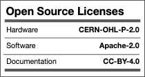

######
Cow Pi
######

The **Cow Pi** is the latest product line from Eclectic Electronics [#pretendLegal]_ and is guaranteed to bring you minutes of fun.
Whether you need a 4-function calculator to count your terror bird eggs before they hatch,
an electronic combination lock to secure your wildly-dangerous experimental robots,
or a motion alarm to protect yourself from zombie gourds,
using a Cow Pi development board is your best option.

.. toctree::
    :maxdepth: 2

    hardware
    library
    stdio
    microcontroller
    expansion
    construction
    troubleshooting/nano
    changelog
    acknowledgements

..  |cc-by| image:: cc-by.png
    :alt: Logo for the Creative Commons 4.0 Attribution International License
    :height: 25px

..  _cc-by: https://creativecommons.org/

..  _oshw: https://www.oshwa.org/

..  _osi: https://opensource.org/

.. ..    :align: right

| *Cow Pi      documentation*    ©2021–24, Christopher A. Bohn, and licensed under the `CC BY 4.0 <https://creativecommons.org/licenses/by/4.0/>`_ License.
|       |cc-by|_
| *Cow Pi      hardware designs* ©2021–23, Christopher A. Bohn, and licensed under the `CERN-OHLP v2 <https://cern.ch/cern-ohl>`_ License.
|       |oshw|_
| *CowPi       library*          ©2021–24, Christopher A. Bohn, and licensed under the `Apache 2.0 <https://www.apache.org/licenses/LICENSE-2.0>`_ License.
| *CowPi_stdio library*          ©2022–24, Christopher A. Bohn, and licensed under the `Apache 2.0 <https://www.apache.org/licenses/LICENSE-2.0>`_ License.
|       |osi|_

..  [#pretendLegal]
    | Eclectic Electronics is a joint subsidiary of The Pleistocene Petting Zoo, a Limited-Reality Corporation, and of Babbage’s Analytic Engines, a Frankly-Figmentary Partnership. [#fictionAdmission]_

..  [#fictionAdmission]
    | These are fictional companies imagined by Christopher Bohn for course assignments. You didn’t think they really existed, did you? Christopher Bohn, however, really does exist and can be contacted at bohn@unl.edu.